# Laporan Praktikum 2 - Pemrograman Berbasis Framework

**Nama:** Key Firdausi Alfarel  
**NIM:** 2341729186  

---

## Daftar Isi
- [Langkah-Langkah Praktikum](#langkah-langkah-praktikum)
  - [1. Menjalankan Project](#1-menjalankan-project)
  - [2. Membuat Catch-All Route](#2-membuat-catch-all-route)
  - [3. Pengujian Catch-All Route](#3-pengujian-catch-all-route)
  - [4. Optional Catch-All Route](#4-optional-catch-all-route)
  - [5. Validasi Parameter](#5-validasi-parameter)
  - [6. Membuat Halaman Login & Register](#6-membuat-halaman-login-register)
  - [7. Navigasi Imperatif (router.push)](#7-navigasi-imperatif-routerpush)
  - [8. Simulasi Redirect (Belum Login)](#8-simulasi-redirect-belum-login)
- [Tugas Mandiri](#tugas-mandiri)
  - [Tugas 1](#tugas-1)
  - [Tugas 2](#tugas-2)
  - [Tugas 3](#tugas-3)
- [F. Pertanyaan Evaluasi](#f-pertanyaan-evaluasi)

---

## Langkah-Langkah Praktikum

### 1. Menjalankan Project

### 2. Membuat Catch-All Route

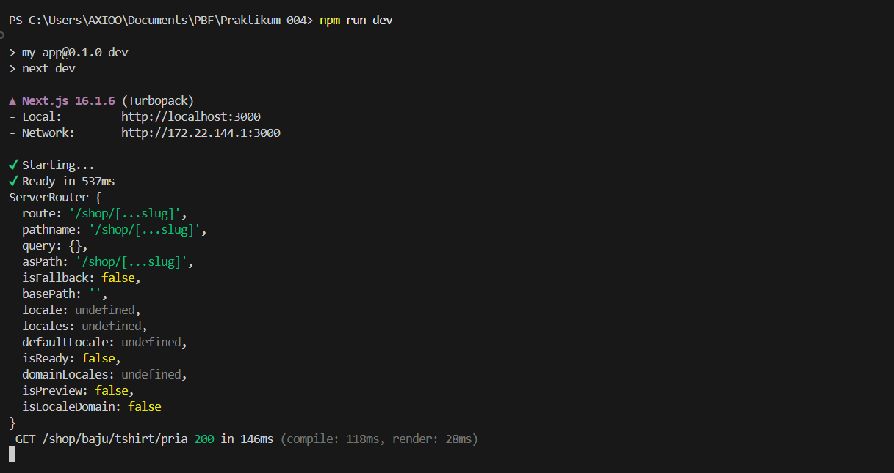

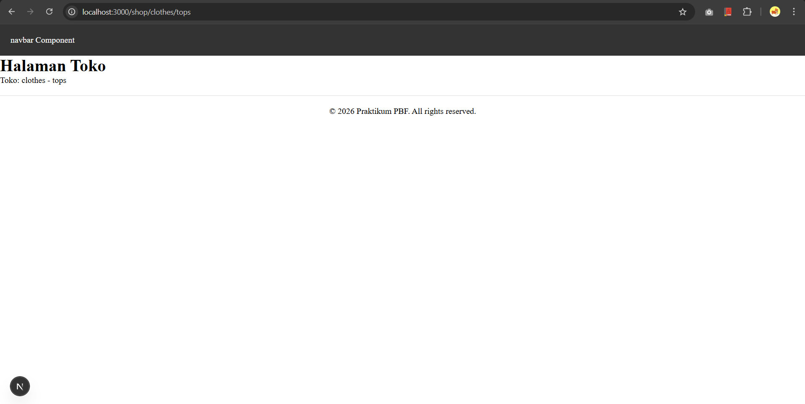

### 3. Pengujian Catch-All Route

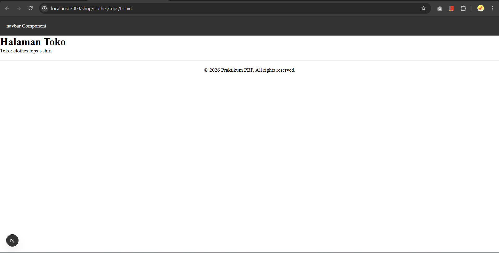

### 4. Optional Catch-All Route
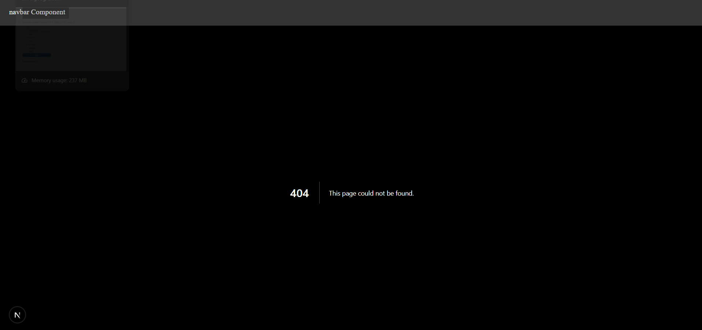
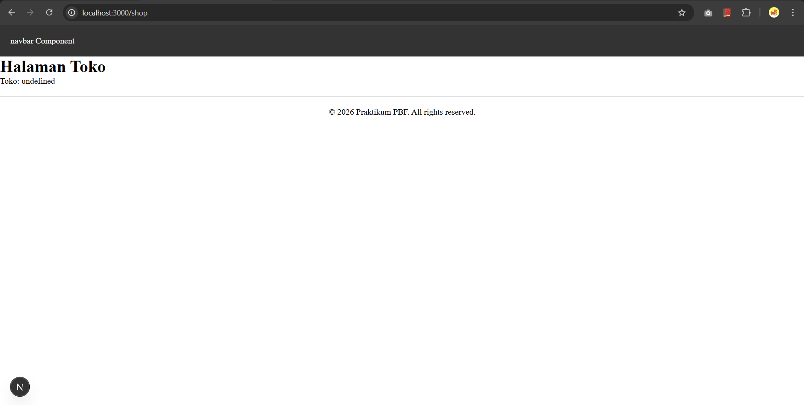

### 5. Validasi Parameter

### 6. Membuat Halaman Login & Register
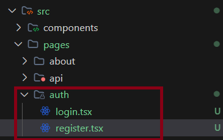
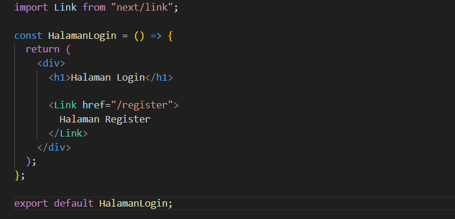
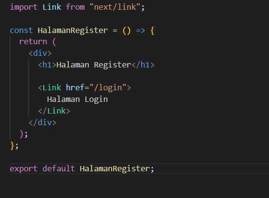

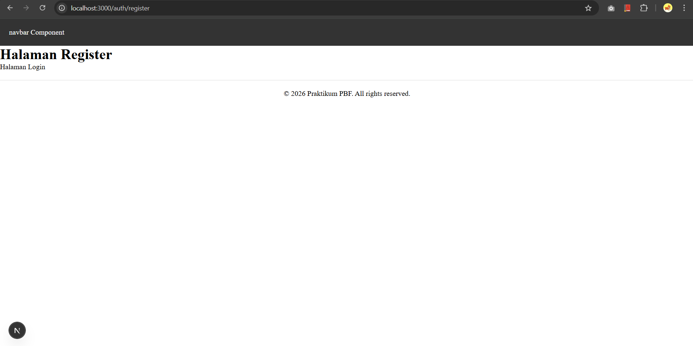

### 7. Navigasi Imperatif (router.push)
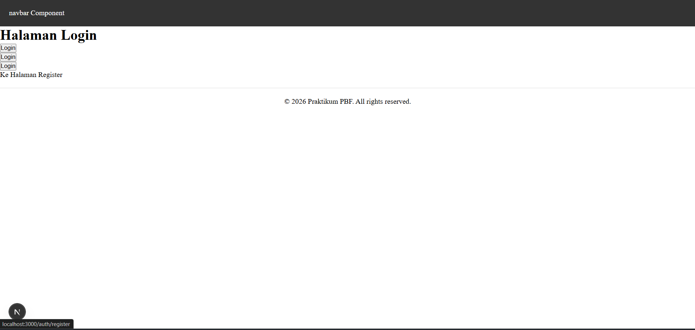

### 8. Simulasi Redirect (Belum Login)
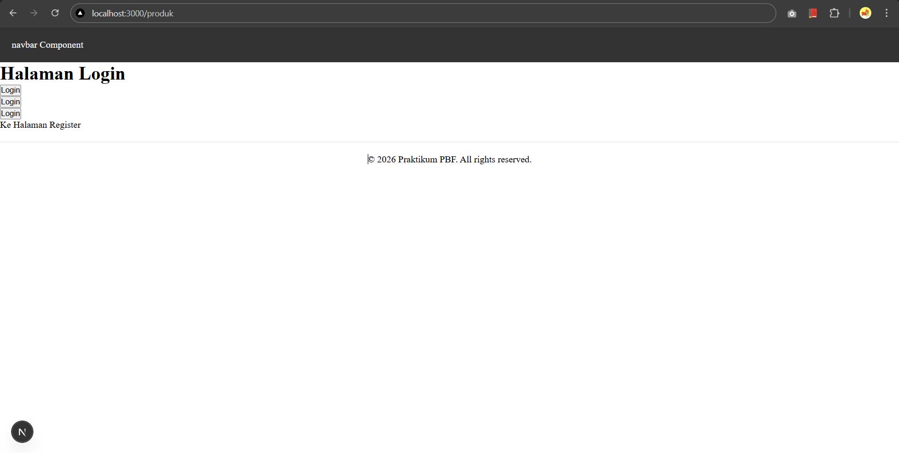
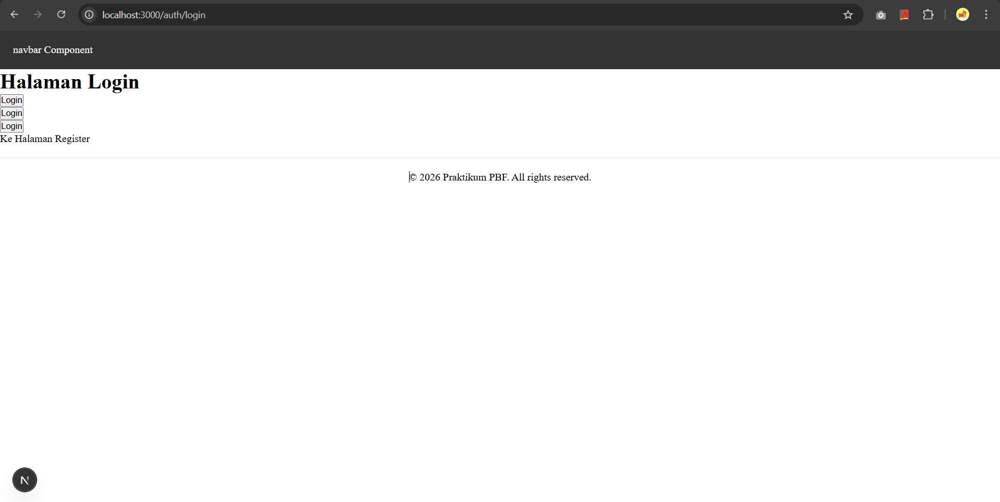

---

## Tugas Mandiri

### Tugas 1

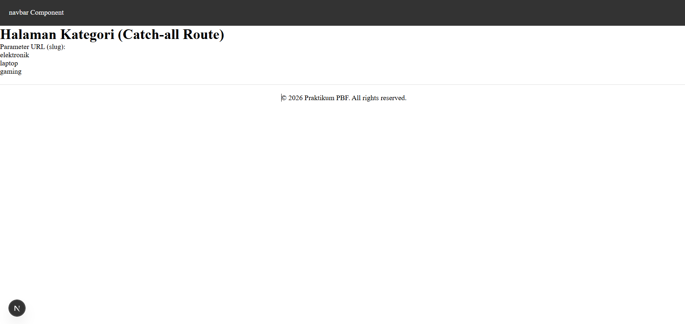

### Tugas 2

### Tugas 3
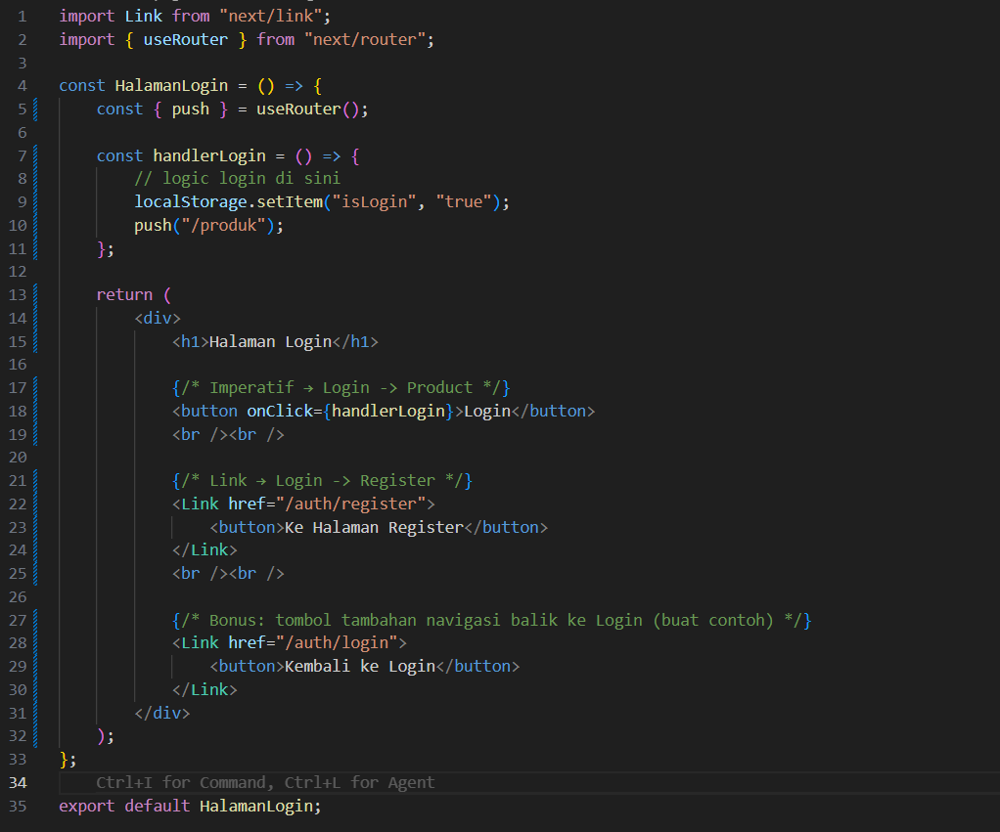
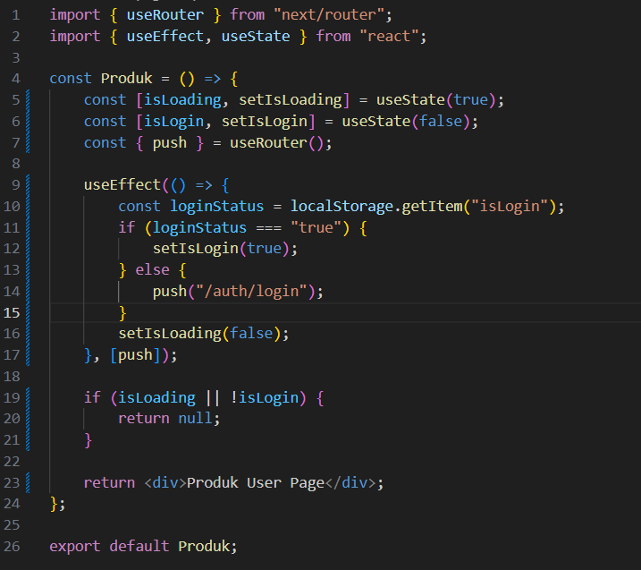

---

## F. Pertanyaan Evaluasi

1. **Apa perbedaan [id].js dan [...slug].js?**
   - `[id].js` adalah rute dinamis tunggal yang hanya menangkap satu segmen path (misalnya `/produk/1`).
   - `[...slug].js` adalah "catch-all route" yang dapat menangkap banyak segmen path sekaligus (misalnya `/category/elektronik/laptop/gaming`).

2. **Mengapa slug berbentuk array?**
   - Karena catch-all route dimaksudkan untuk menangkap beberapa segmen path. Next.js mengubah segmen-segmen tersebut menjadi elemen-elemen di dalam array agar mudah diakses dan diolah secara terprogram.

3. **Kapan sebaiknya menggunakan Link dan router.push()?**
   - Gunakan `Link` untuk navigasi standar antar halaman (deklaratif) karena lebih optimal untuk SEO dan performa.
   - Gunakan `router.push()` untuk navigasi yang dipicu oleh logika kode (imperatif), seperti setelah proses login berhasil atau setelah pengiriman formulir.

4. **Mengapa navigasi Next.js tidak me-refresh halaman?**
   - Next.js menggunakan *Client-side Routing*. Saat berpindah halaman, Next.js hanya mengunduh data dan komponen yang diperlukan tanpa melakukan refresh halaman total, sehingga memberikan pengalaman yang lebih cepat mirip dengan *Single Page Application* (SPA).
