# Laporan Praktikum 2 - Pemrograman Berbasis Framework

**Nama:** Key Firdausi Alfarel  
**NIM:** 2341729186  

---

## Daftar Isi
- [Langkah-Langkah Praktikum](#langkah-langkah-praktikum)
  - [1. Menjalankan Project](#1-menjalankan-project)
  - [2. Membuat Custom Document](#2-membuat-custom-document)
  - [3. Pengaturan Title per Halaman](#3-pengaturan-title-per-halaman)
  - [4. Membuat Custom Error Page (404)](#4-membuat-custom-error-page-404)
  - [5. Styling Halaman 404](#5-styling-halaman-404)
  - [6. Menampilkan Gambar dari Folder Public](#6-menampilkan-gambar-dari-folder-public)
- [Tugas Mandiri](#tugas-mandiri)
  - [Tugas 1](#tugas-1)
  - [Tugas 2](#tugas-2)
  - [Tugas 3](#tugas-3)
- [F. Pertanyaan Refleksi](#f-pertanyaan-refleksi)

---

## Langkah-Langkah Praktikum

### 1. Menjalankan Project

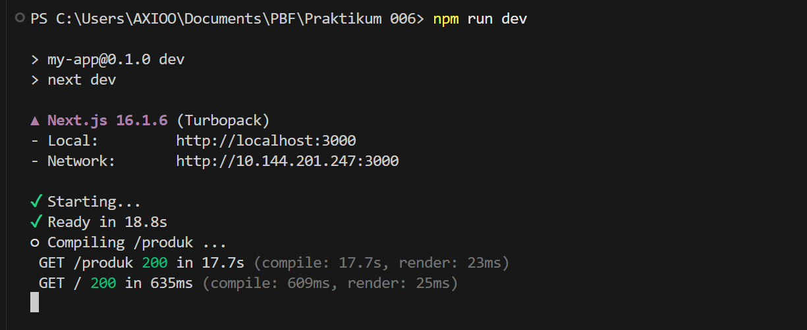
*run praktikum-006*

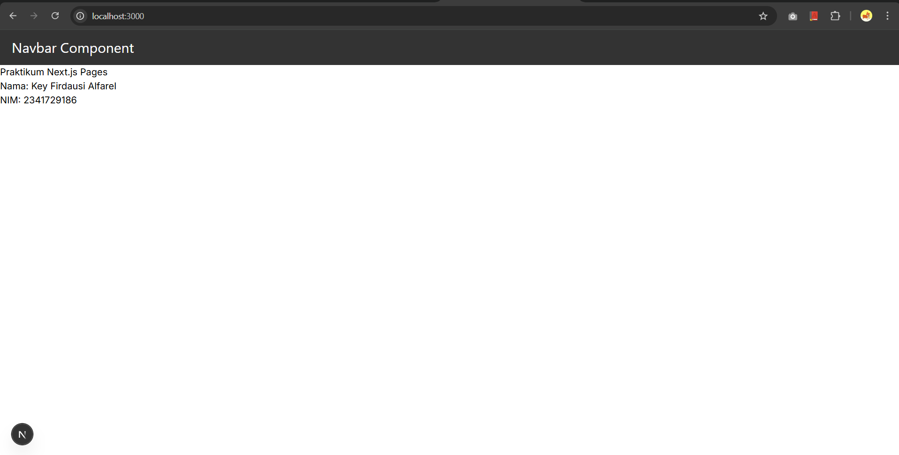
*home page UI*

### 2. Membuat Custom Document

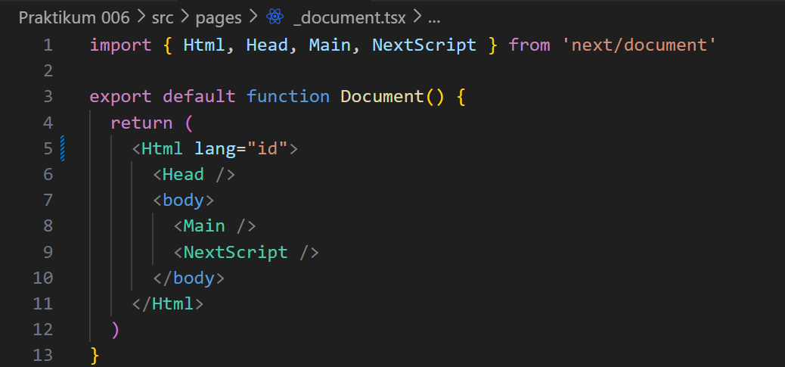
*modify document language*

### 3. Pengaturan Title per Halaman

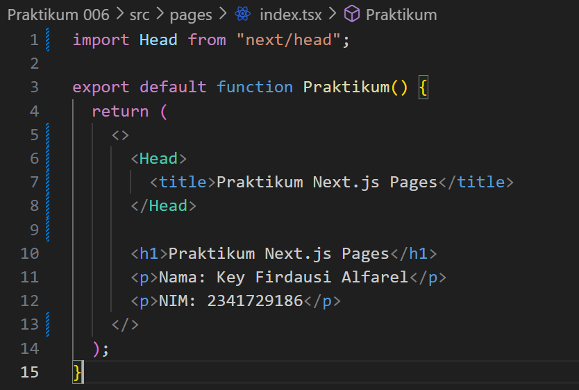
*update title index.tsx*

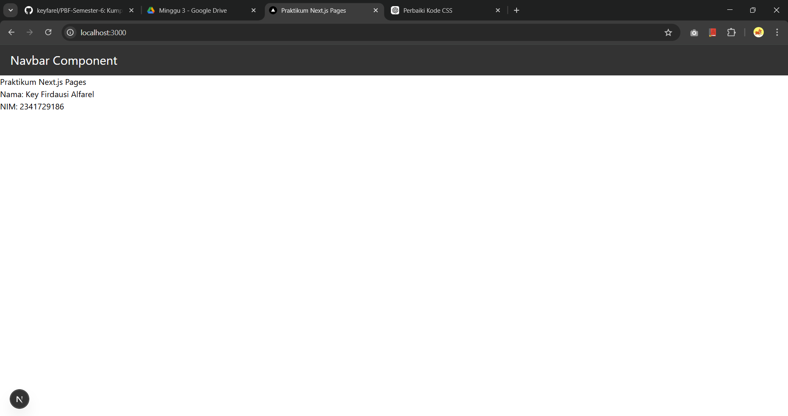
*hasil pengaturan home page*

### 4. Membuat Custom Error Page (404)

*membuat custom error page*

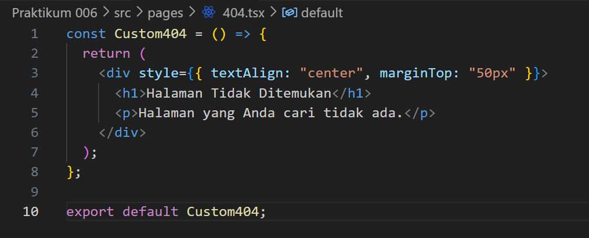
*membuat kode custom error page*

*hasil halaman 404*

### 5. Styling Halaman 404

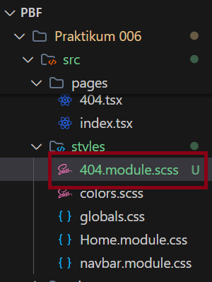
*membuat custom error style module*

*kode style module*

*kode halaman 404*

*hasil halaman 404*

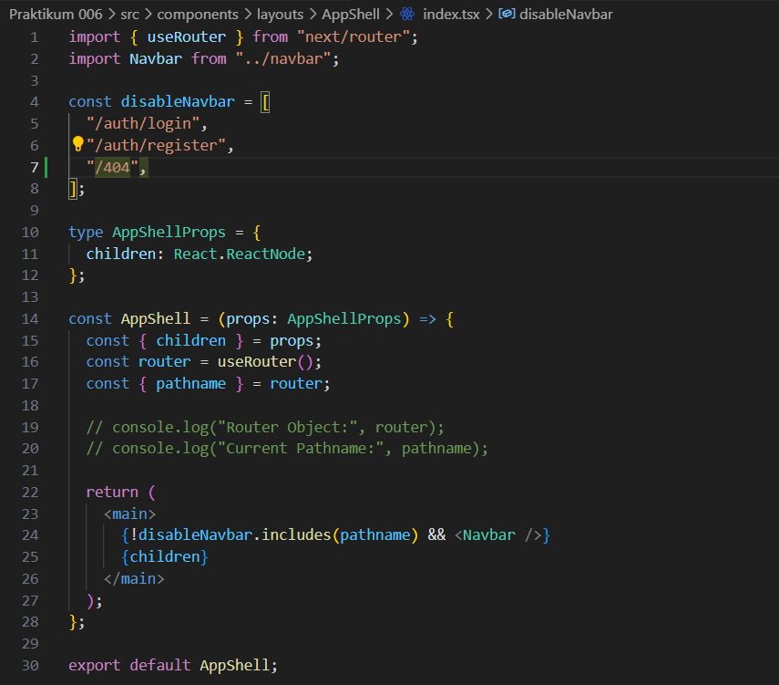
*disable navbar*

*hasil halaman 404*

### 6. Menampilkan Gambar dari Folder Public

*mengunduh gambar 404*

*meletakkan gambar di folder public*

*modifikasi kode custom error page*

*hasil halaman 404*

---

## Tugas Mandiri

### Tugas 1

*mengunduh gambar 404*

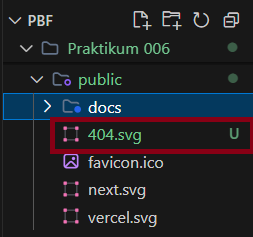
*meletakkan gambar di folder public*

*modifikasi kode custom error page*

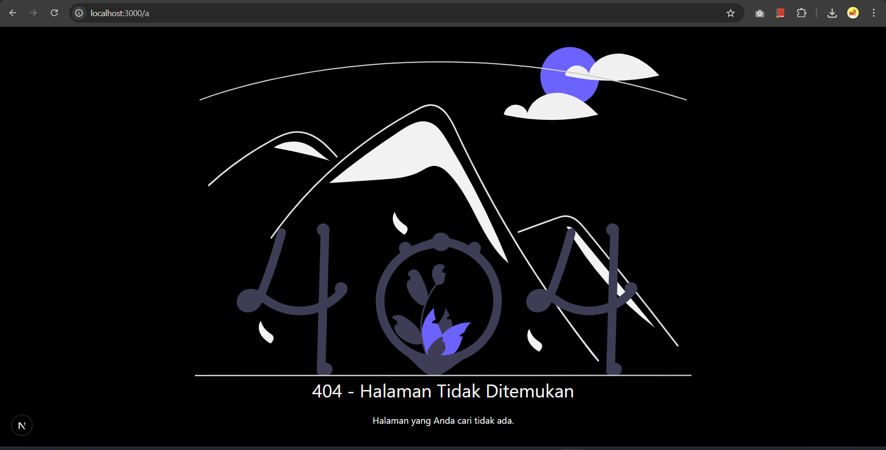
*hasil halaman 404*

### Tugas 2

*kode custom error page*

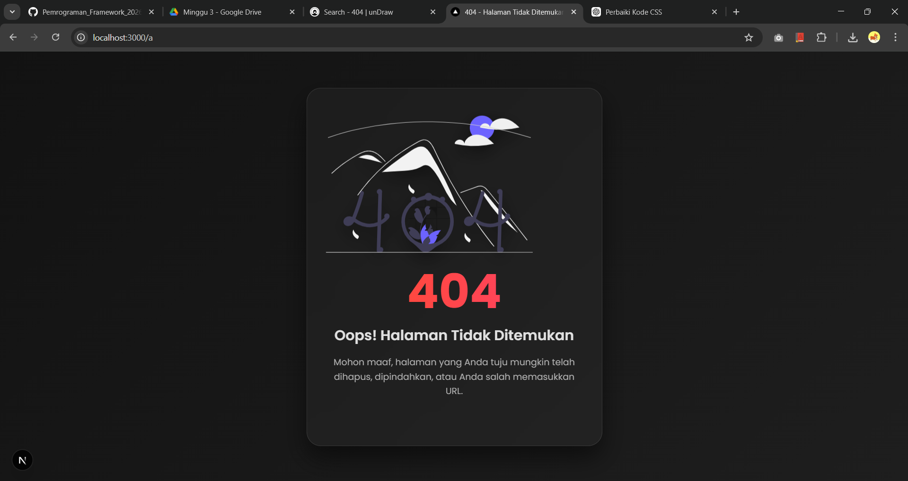
*hasil custom 404*

### Tugas 3

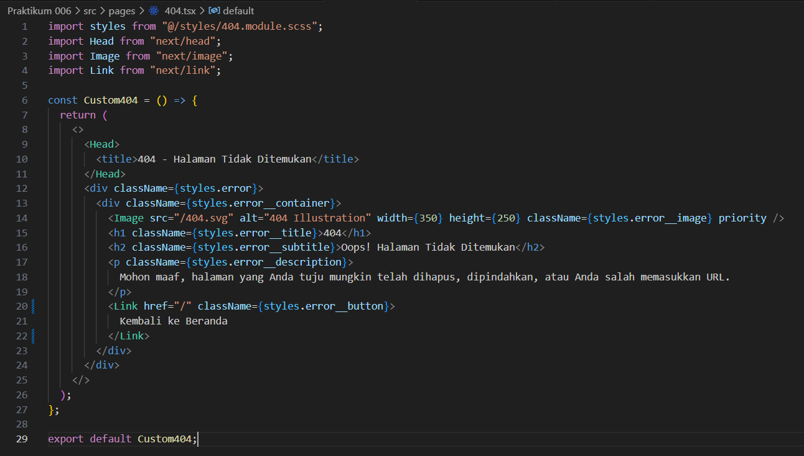
*kode custom error kembali ke beranda*

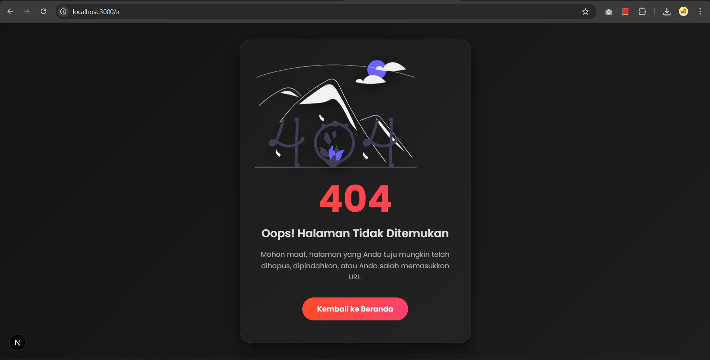
*hasil custom error kembali ke beranda*
---

## F. Pertanyaan Refleksi

**1. Apa fungsi utama `_document.js`?**
Fungsi utama `_document.js` (atau `.tsx`) pada Next.js adalah untuk melakukan kustomisasi pada struktur dasar dokumen HTML (seperti tag `<html>` dan `<body>`) yang membungkus seluruh aplikasi. `_document` hanya dirender di sisi server (Server-Side Rendering) sehingga tidak digunakan untuk *event handler* seperti `onClick` (client-side). File ini umumnya digunakan untuk memodifikasi pengaturan global, menambahkan atribut bahasa `lang` pada tag HTML, dan menyisipkan *script*, *stylesheet* global untuk seluruh aplikasi, atau mendukung *CSS-in-JS*.

**2. Mengapa `<title>` tidak disarankan di `_document.js`?**
Tag `<title>` mengandung judul spesifik untuk setiap halaman. Karena `_document.js` membungkus seluruh aplikasi dan bersifat global, memberikan `<title>` di dalamnya akan membuat semua rute/halaman memiliki judul yang sama dan statis, yang dapat berakibat buruk bagi *Search Engine Optimization* (SEO) dan *User Experience*. Praktik yang direkomendasikan adalah menggunakan komponen `<Head>` dari `next/head` pada masing-masing halaman individu agar judul bisa berubah secara dinamis berdasarkan halaman yang sedang aktif.

**3. Apa perbedaan halaman biasa dan halaman `404.js`?**
- **Halaman biasa** (seperti `pages/index.js` atau `pages/about.js`): Di-render saat *router* mendeteksi kecocokan dengan *path* (URL) yang didefinisikan secara eksplisit oleh *developer*.
- **Halaman `404.js`**: Adalah rute *fallback* berstatues *Error Page* bawaan Next.js. File ini akan dirender secara otomatis hanya ketika pengguna memasukkan atau menavigasi ke rute (URL) yang **tidak ditemukan** di dalam aplikasi.

**4. Mengapa folder `public` tidak perlu di-import?**
Di Next.js, setiap file yang diletakkan di dalam folder `public` akan diekspos secara otomatis sebagai aset statis di *root path* (`/`). Oleh karena itu, kita dapat mereferensikannya dengan *path absolute*, contohnya ``, tanpa harus meng-*import* (*require*) file tersebut ke dalam modul JavaScript. Hal ini karena Next.js menangani direktori `public` khusus untuk menyajikan file secara langsung (termasuk robots.txt, favicon, gambar) ke browser tanpa diproses lebih lanjut oleh *module bundler* seperti Webpack.
