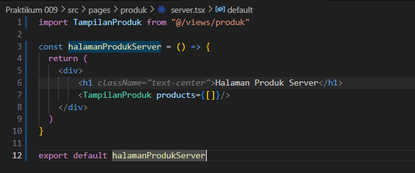
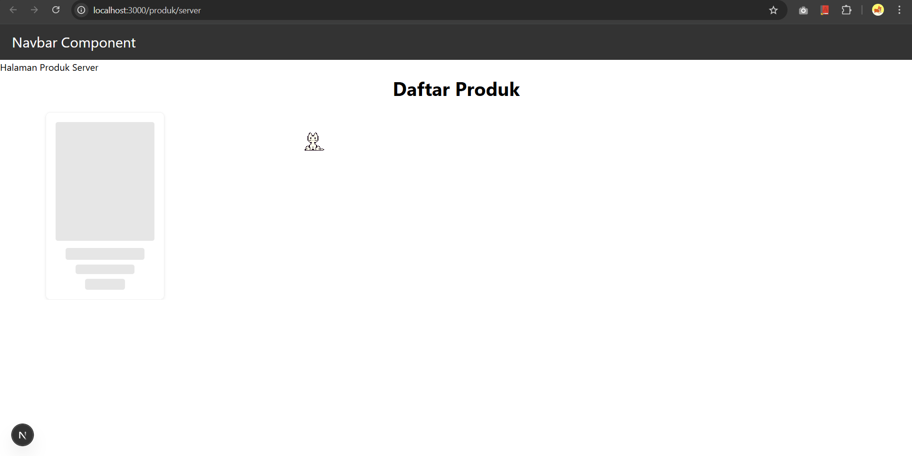
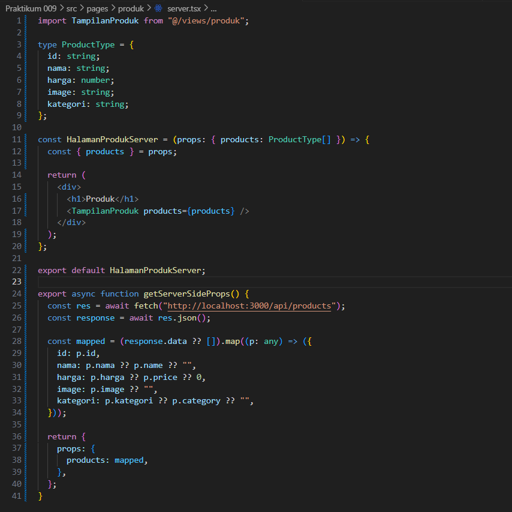
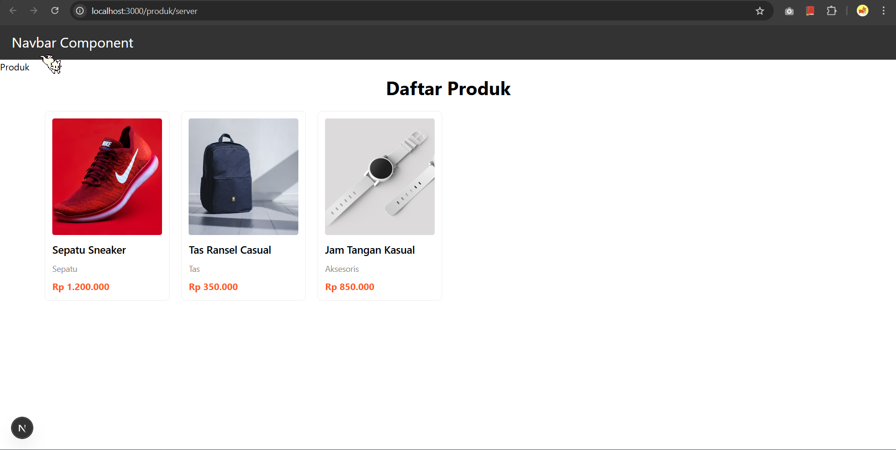
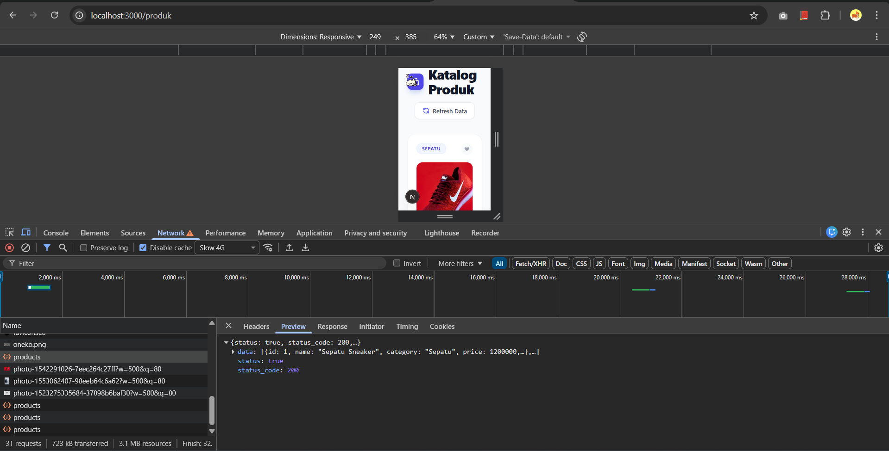
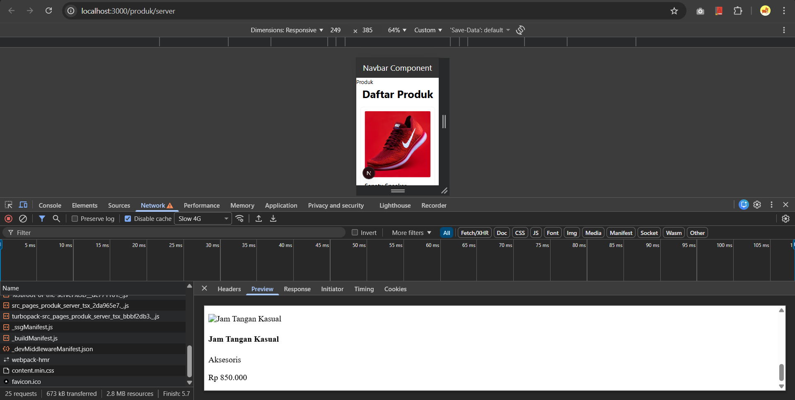
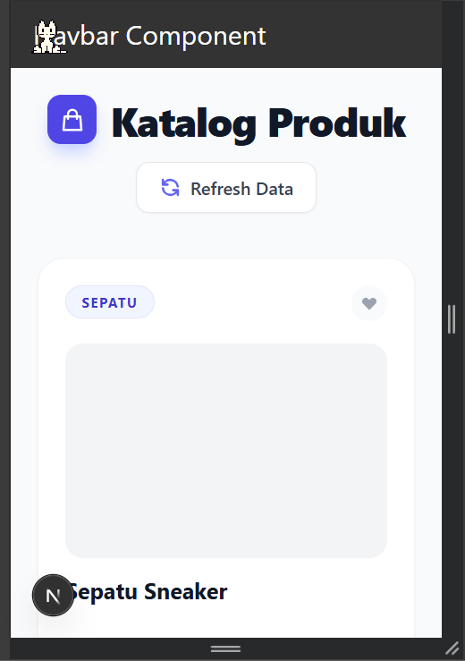
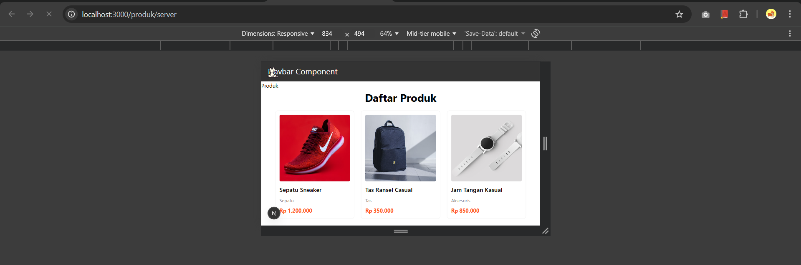

# Laporan Praktikum 9 - Pemrograman Berbasis Framework

**Nama:** Key Firdausi Alfarel  
**NIM:** 2341729186  

---

## Daftar Isi

- [Langkah-Langkah Praktikum](#langkah-langkah-praktikum)
  - [1. Setup Data Produk](#1-setup-data-produk)
  - [2. Implementasi getServerSideProps pada server.tsx](#2-implementasi-getserversideprops-pada-servertsx)
  - [3. Refactor Type ( produk type )](#3-refactor-type--produk-type-)
  - [4. Uji Perbedaan SSR vs CSR](#4-uji-perbedaan-ssr-vs-csr)
- [E. Studi Analisis](#e-studi-analisis)
---

## Langkah-Langkah Praktikum

### 1. Setup Data Produk

*pages/products/server.tsx*

*http://localhost:3000/produk/server*

*http://localhost:3000/produk*

### 2. Implementasi getServerSideProps pada server.tsx

*http://localhost:3000/produk/server*

*http://localhost:3000/produk*

### 3. Refactor Type ( produk type )

*membuat file types/Product.type.ts*

*http://localhost:3000/produk/server*

*http://localhost:3000/produk*

### 4. Uji Perbedaan SSR vs CSR

**Uji 1**

*Skeleton CSR Muncul*

*Skeleton SSR Tidak Muncul*

**Uji 2**

*Data Fetch di Network CSR muncul*

*Data Fetch di Network SSR tidak muncul*

**Uji 3**

*Muncul Skeleton dulu*

*Langsung muncul data*

---

## Tugas Praktikum

### **1. Jelaskan perbedaan:**

## E. Studi Analisis

**1. Mengapa SSR lebih baik untuk SEO?**
SSR (Server-Side Rendering) merender HTML halaman sepenuhnya di server sebelum dikirim ke browser. Crawler mesin pencari dapat dengan mudah membaca dan mengindeks konten HTML yang sudah jadi ini langsung dari response server. Berbeda dengan CSR (Client-Side Rendering) di mana konten sering kali bergantung pada eksekusi JavaScript di browser setelah halaman awal dimuat, yang kadang sulit atau lambat diindeks oleh beberapa crawler.

**2. Kapan sebaiknya menggunakan SSR?**
SSR sangat disarankan ketika:
- SEO (Search Engine Optimization) sangat penting untuk mempublikasikan konten ke publik (misal: web e-commerce, blog, situs berita).
- Membutuhkan waktu muat awal konten (Initial Load Time / First Contentful Paint) yang cepat agar pengguna dapat langsung melihat konten utama.
- Pengguna yang menjadi target memiliki koneksi internet yang bervariasi panjangnya atau menggunakan perangkat berspesifikasi rendah, karena beban komputasi/rendering UI dibebankan pada server, bukan pada perangkat klien pengguna.

**3. Apa kekurangan SSR dibanding CSR?**
Beberapa kekurangan SSR antara lain:
- **Beban Server Semakin Tinggi**: Beban pada server akan lebih tinggi karena server harus bekerja keras merender UI/HTML setiap kali ada request halaman baru dari setiap pengguna, yang mana memakan CPU resources yang cukup besar dan biaya infrastruktur seiring meningkatnya skala.
- **TTFB Lebih Lambat**: Waktu respon server (Time to First Byte/TTFB) bisa menjadi lebih lambat jika proses fetching data atau perakitan UI di sisi server sangat banyak/berat sebelum bisa dikembalikan ke user.
- **Lebih Kompleks dan Kurang Interaktif Sesaat**: Pengguna sudah melihat halamannya, namun butuh proses hydration (Client-side takeover) sebelum aplikasi sepenuhnya interaktif. Terkadang navigasi dari satu halaman ke yang lain terasa lebih kaku/meminta muatan dibandingkan navigasi mulus SPA di CSR murni.

**4. Mengapa skeleton tidak muncul pada SSR?**
Skeleton atau tampilan loading biasanya digunakan pada aplikasi metode render CSR untuk menunjukkan kepada user bahwa browser sedang meminta (fetching) data asinkron dari API setelah struktur halaman/layout dimuat agar user tidak melihat layar putih/kosong (Blank Screen). Pada tipe merender SSR, proses menyiapkan dan fetching parameter maupun data dilakukan sepenuhnya di server. Akibatnya HTML yang dihasilkan tidak akan dikirim ke layar browser user sampai proses fetching data tersebut selesai 100%. Oleh karena itu, klien (browser) sejak awal langsung menerima struktur halaman sekaligus beserta datanya yang komplit. Halaman langsung muncul dengan sempurna, melewati fase tunggu/menunggu, sehingga komponen kerangka visual untuk loading/skeleton state sama sekali tidak aktif/dipanggil.
