# Laporan Praktikum 11 - Pemrograman Berbasis Framework

**Nama:** Key Firdausi Alfarel  
**NIM:** 2341729186  

---

## Daftar Isi

- [Langkah-Langkah Praktikum](#langkah-langkah-praktikum)
  - [1. Membuat Dynamic Route](#1-membuat-dynamic-route)
  - [2. Implementasi CSR (Client Rendering)](#2-implementasi-csr-client-rendering)
  - [3. Implementasi SSR](#3-implementasi-ssr)
  - [4. Implementasi SSG](#4-implementasi-ssg)
- [Pengujian](#pengujian)
  - [Uji 1](#uji-1)
  - [Uji 2](#uji-2)
  - [Uji 3](#uji-3)
- [Perbandingan CSR, SSR, dan SSG](#perbandingan-csr-ssr-dan-ssg)
- [Pertanyaan Analisis](#pertanyaan-analisis)

---

## Langkah-Langkah Praktikum

### 1. Membuat Dynamic Route

*Modifikasi view Product*

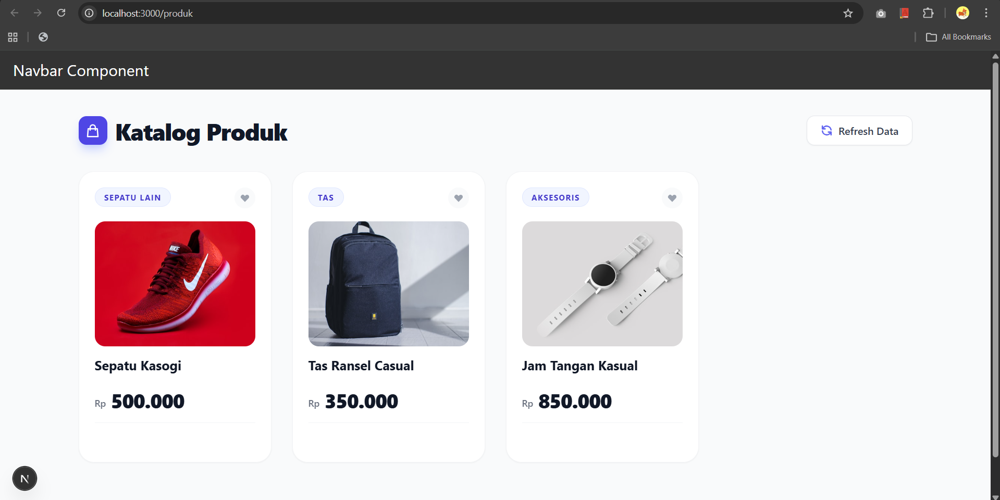

*Halaman /produk*

### 2. Implementasi CSR (Client Rendering)

![Modifikasi pages/produk/[produk].tsx](docs/praktikum-011/langkah-2a.png)

*Modifikasi pada file [produk].tsx pada folder src/pages/produk/*

![Modifikasi pages/api/[...produk].tsx](docs/praktikum-011/langkah-2b.png)

*Pada file produk.ts pada folder pages/api di rename menjadi [[...product]].ts*

![Modifikasi pages/api/[...produk].tsx](docs/praktikum-011/langkah-2c.png)

*Modifikasi file [[...produk]].ts pada folder pages/api*

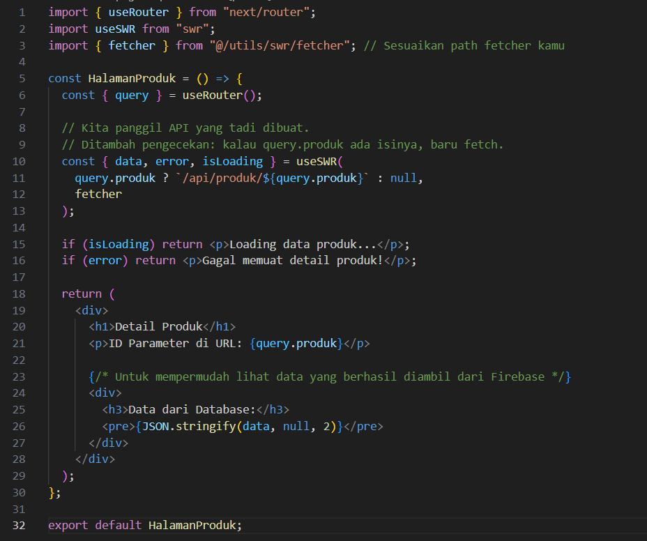

*Modifikasi file produk/index.tsx*

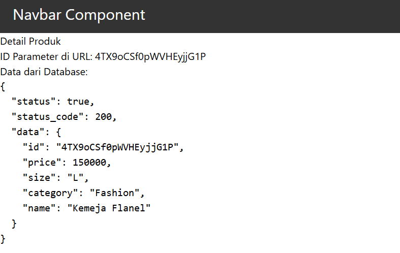

*Jalankan browser http://localhost:3000/produk/4TX9oCSf0pWVHEyjjG1P"*

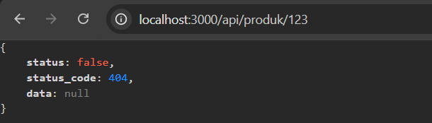

*Ketika alamat tidak ditemukan maka akan menampilkan status kode 404*

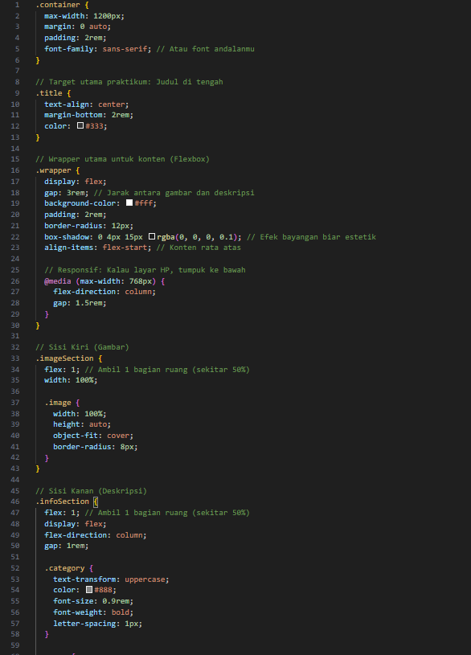

*Modifikasi file detailProduct.module.scss pada folder src/views/detailProduct*

![Modifikasi views/pages/produk/[product].tsx](docs/praktikum-011/langkah-2h.png)

*Modifikasi views/pages/produk/[product].tsx*

*Modifikasi pages/produk/index.tsx*

*Hasil Akhir*

### 3. Implementasi SSR

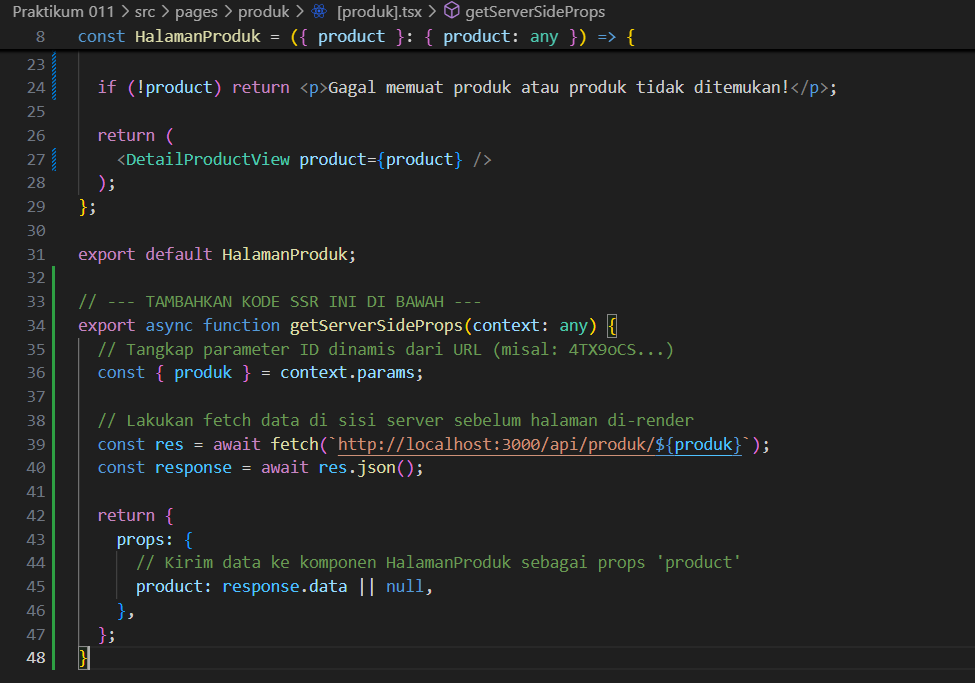

*Modifikasi pada file server.tsx pada folder src/pages/produk/*

*Hasil Halaman Produk*

*Hasil Halaman Produk detail*

### 4. Implementasi SSG

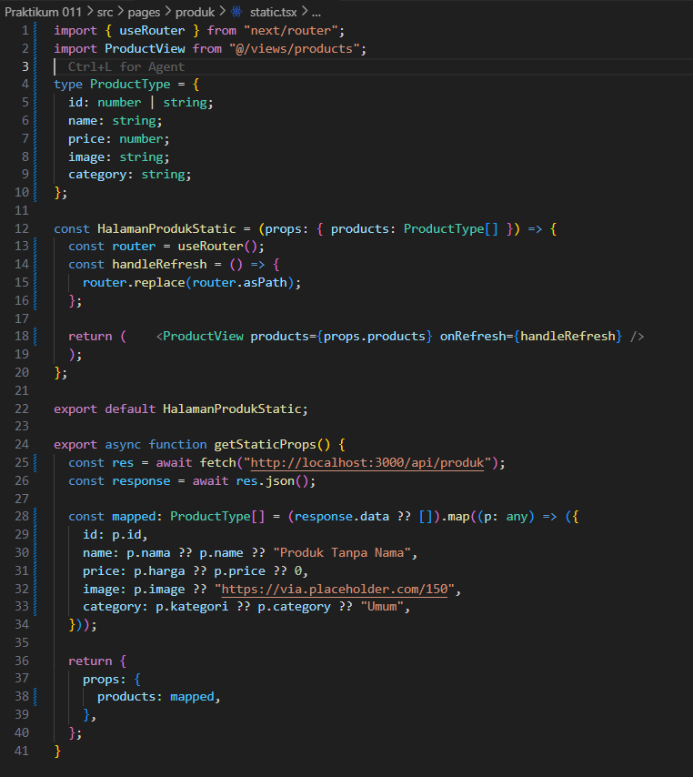

*Modifikasi pada file static.tsx pada folder src/pages/produk/*

![Modifikasi pada file [produk].tsx pada folder src/pages/produk/](docs/praktikum-011/langkah-4a.png)

*Modifikasi pada file [produk].tsx pada folder src/pages/produk/*

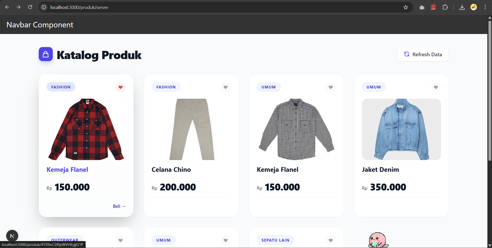

*Hasil Halaman Produk*

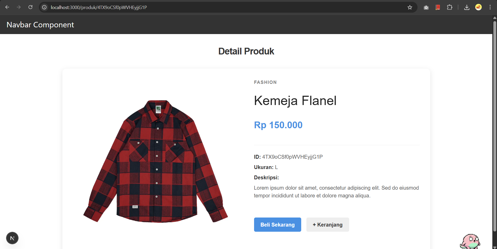

*Hasil Halaman Produk detail*

## Pengujian

### Uji 1

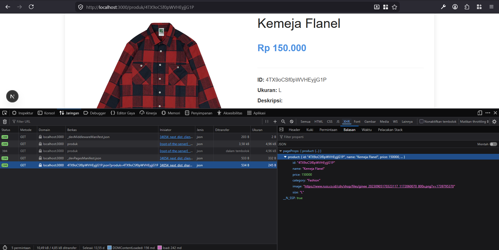

*Tampilan CSR*

### Uji 2

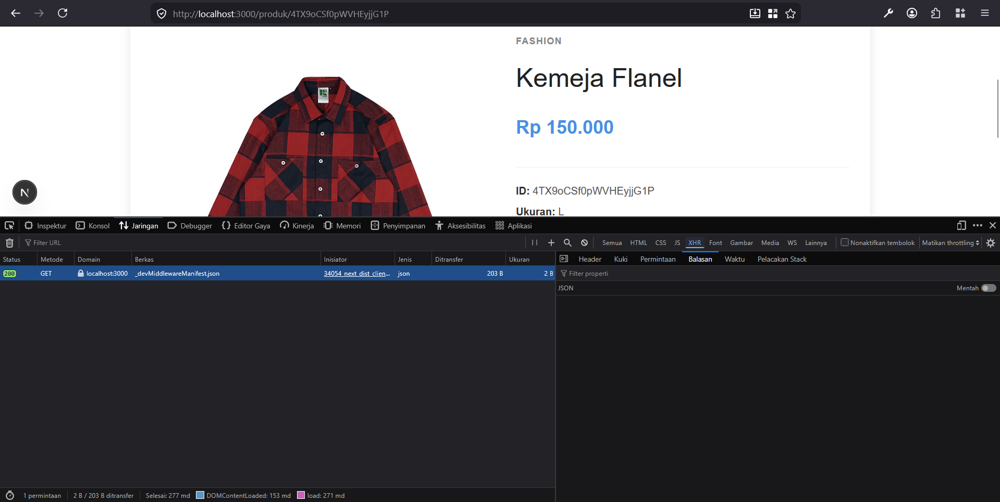

*Tampilan SSR*

### Uji 3

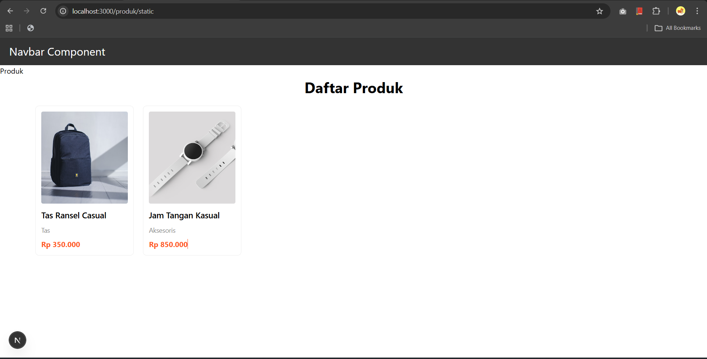

*Data Awal SSG*

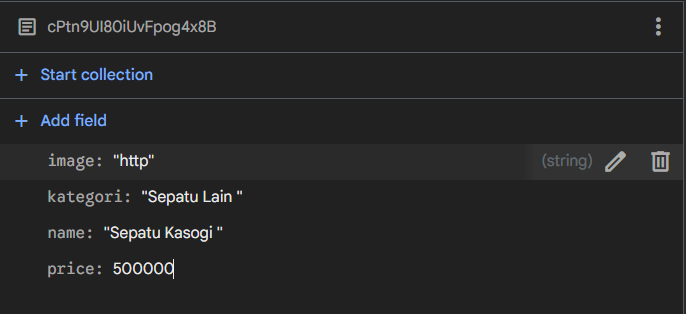

*Menambah Data Baru*

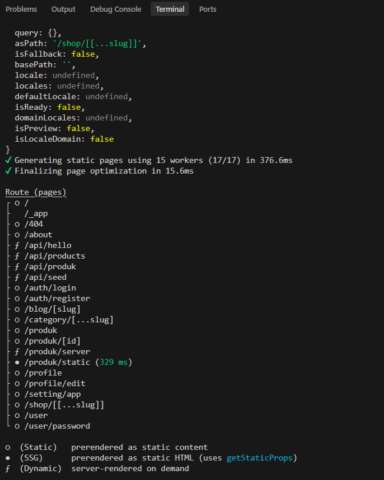

*Hasil Build*

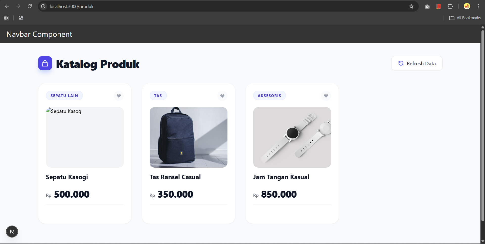

*Tampilan SSG*

---

## Perbandingan CSR, SSR, dan SSG

| Aspek | CSR (Client-Side Rendering) | SSR (Server-Side Rendering) | SSG (Static Site Generation) |
|-------|-----------------------------|-----------------------------|------------------------------|
| **Loading** | Waktu muat awal sedikit lebih lama (menunggu unduhan JS), namun perpindahan halaman web selanjutnya cepat. | Sedikit lebih lambat pada setiap *request* karena server harus merender HTML terlebih dahulu. | Sangat cepat karena HTML sudah di-generate dari awal pada saat proses *build*. |
| **Build Required** | Tidak perlu (cukup *build bundle* JS di awal). | Tidak perlu (dirender setiap kali ada permintaan dari *client*). | Ya (HTML harus di-generate saat *build time*). |
| **SEO** | Kurang optimal (beberapa *crawler* mesin pencari kesulitan membaca konten yang di-render oleh Javascript). | Sangat baik (HTML sudah lengkap saat dikirimkan dari server ke browser). | Sangat baik (HTML statis sudah siap sejak awal). |
| **Perubahan Data**| Langsung diperbarui secara *real-time* karena mengambil data melalui API dari sisi klien. | Langsung diperbarui secara *real-time* sesuai dengan data terbaru di server saat diakses. | Harus dilakukan proses *build* ulang agar halaman dapat diperbarui dengan data yang baru. |

## Pertanyaan Analisis

**1. Mengapa getStaticPaths wajib pada dynamic SSG?**  
Pada metode SSG, HTML dibuat pada tahap *build*. Next.js memerlukan fungsi getStaticPaths untuk mengetahui rute dinamis (*path*) apa saja yang harus dibuatkan file HTML-nya. Tanpa fungsi ini, Next.js tidak memiliki daftar halaman yang perlu dipersiapkan, sehingga akan menyebabkan *error* ketika pengguna mencoba mengakses rute dinamis tersebut.

**2. Mengapa CSR membutuhkan loading state?**  
Pada CSR, yang dikirim ke browser pada awalnya hanyalah struktur HTML kosong dan file JS. Aplikasi kemudian harus melakukan pengambilan (fetch) data dari API, yang mana membutuhkan waktu. *Loading state* (seperti animasi memuat atau *skeleton*) digunakan agar halaman tidak terlihat kosong atau seolah-olah mengalami *error* saat data sedang diambil. Hal ini memberikan indikasi kepada pengguna bahwa aplikasi sedang dalam proses memuat data.

**3. Mengapa SSG tidak menampilkan produk baru tanpa build ulang?**  
SSG men-generate halaman menjadi file HTML statis hanya satu kali, yaitu pada saat tahap awal proses *build*. Halaman tersebut hanya menyimpan data yang diambil pada saat *build* dijalankan. Oleh karena itu, jika ada penambahan produk baru ke dalam database setelah *build* selesai, halaman statis tersebut tidak akan otomatis mendeteksinya. Website harus di-*rebuild* agar Next.js dapat mengambil data terbaru kembali dan membuat ulang file HTML-nya.

**4. Mana metode terbaik untuk halaman detail e-commerce?**  
Untuk halaman detail e-commerce, metode yang paling sesuai umumnya adalah **SSR** atau variasinya yaitu **ISR**.
*   Dengan **SSR**, data seperti stok dan harga akan selalu akurat karena dirender pada setiap permintaan. Selain itu, optimisasi SEO-nya sangat baik sehingga produk mudah ditemukan di mesin pencari.
*   Jika mengutamakan kecepatan muat layaknya SSG namun data tetap dapat diperbarui secara otomatis, **ISR (Incremental Static Regeneration)** merupakan opsi terbaik. Metode ini menawarkan kecepatan muat file statis sekaligus mampu memperbarui data halaman secara *background* tanpa mengharuskan *rebuild* seluruh website secara manual.

**5. Apa risiko menggunakan SSG untuk produk yang sering berubah?**  
Risiko utamanya adalah menampilkan data yang sudah tidak akurat atau kedaluwarsa (*stale data*). Sebagai contoh, harga produk bisa jadi sudah naik atau produk tersebut telah habis terjual, namun pada halaman statis pembeli masih terlihat tersedia dengan harga lama. Hal ini dapat berakibat fatal pada alur transaksi e-commerce. Solusinya, pihak pengelola akan terpaksa melakukan *rebuild* website setiap kali terjadi perubahan data sekecil apa pun, yang mana proses tersebut sangat tidak efisien dan akan menghabiskan banyak sumber daya server jika skala aplikasinya besar.
