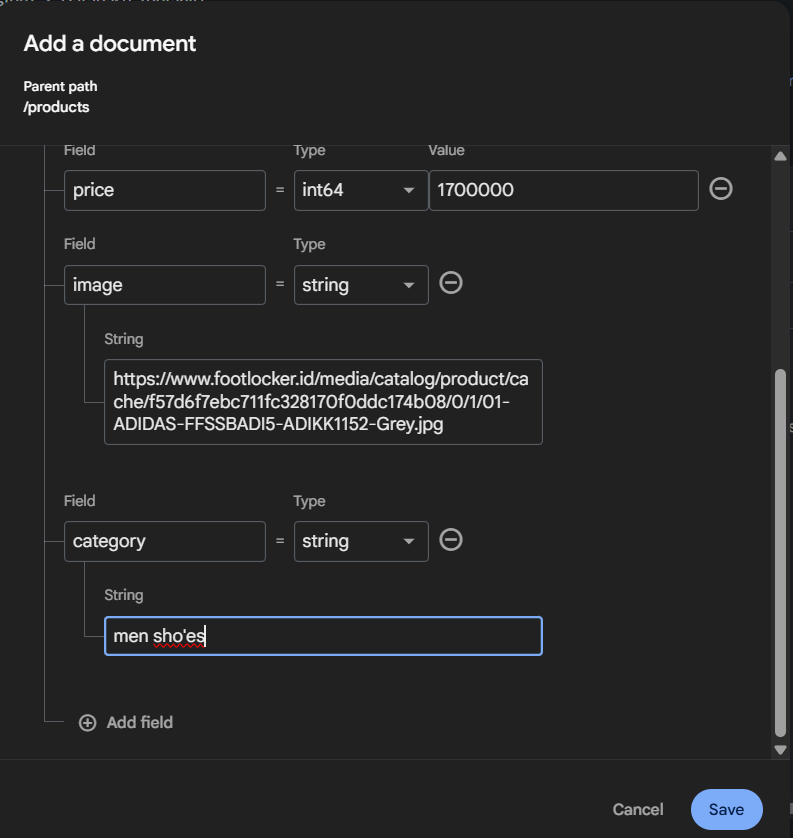
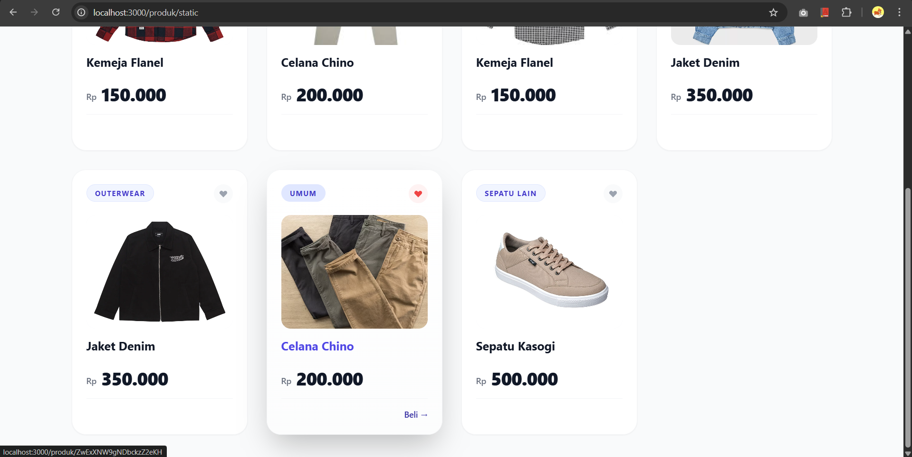
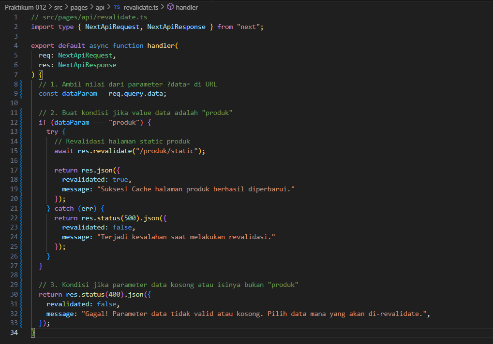
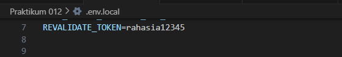
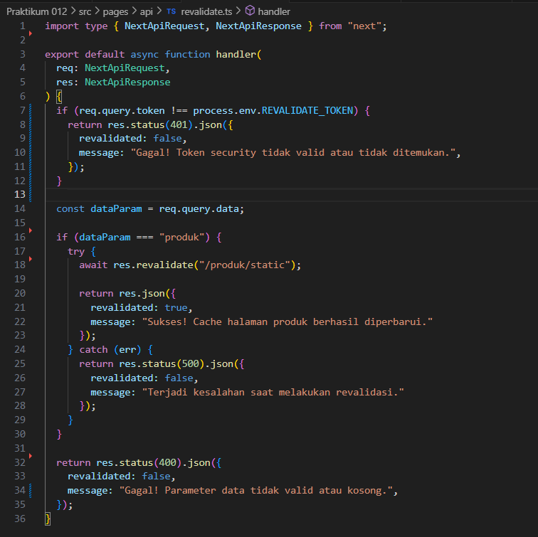
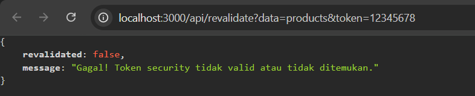
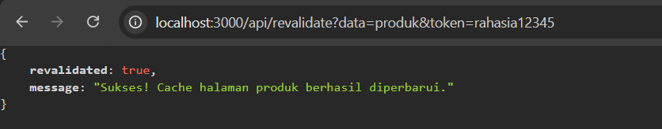

# Laporan Praktikum 12 - Pemrograman Berbasis Framework

**Nama:** Key Firdausi Alfarel  
**NIM:** 2341729186  

---

## Daftar Isi

- [Langkah-Langkah Praktikum](#langkah-langkah-praktikum)
  - [1. Tambahkan revalidate](#1-tambahkan-revalidate)
  - [2. Pengujian ISR](#2-pengujian-isr)
  - [3. Buat API Revalidate](#3-buat-api-revalidate)
  - [4. Tambahkan Parameter Data](#4-tambahkan-parameter-data)
  - [5. Tambahkan Token Security](#5-tambahkan-token-security)
  - [6. Uji Coba Token Security](#6-uji-coba-token-security)
- [Perbandingan SSG vs ISR](#perbandingan-ssg-vs-isr)
- [Pertanyaan Analisis](#pertanyaan-analisis)
---

## Langkah-Langkah Praktikum

### 1. Tambahkan revalidate

*Menambah revalidate*

### 2. Pengujian ISR

*npm build*

*Menambah data baru di firebase*

*Sebelum 10 detik*

*Setelah 10 detik dan direfresh*

### 3. Buat API Revalidate

*Buat API Revalidate*

### 4. Tambahkan Parameter Data

*Modifikasi API Revalidate*

*Revalidate Berhasil*

*Revalidate Gagal*

### 5. Tambahkan Token Security

*Tambah Token Revalidate*

*Modifikasi API Revalidate*

### 6. Uji Coba Token Security

*Uji Coba Token Berhasil*

*Uji Coba Token Gagal*

*Uji Coba Tanpa Token*

---

## Perbandingan SSG vs ISR

| Aspek | SSG | ISR |
| :--- | :--- | :--- |
| **Update Data** | Harus *build* ulang | Otomatis / Trigger |
| **Cache** | *Static* permanen | *Static* + *Refresh* |
| **Cocok untuk** | Konten tetap | Konten semi-dinamis |

---

## Pertanyaan Analisis

### 1. Mengapa ISR lebih fleksibel dibanding SSG?
ISR memungkinkan aplikasi memperbarui halaman statis yang telah dibuat sebelumnya tanpa perlu melakukan proses *build* ulang secara keseluruhan. Hal ini memberikan fleksibilitas untuk menyajikan data terbaru kepada pengguna sekaligus mempertahankan keunggulan performa penyajian halaman statis, berbanding terbalik dengan SSG yang memerlukan *build* ulang penuh untuk memunculkan perubahan data.

### 2. Apa perbedaan revalidate waktu dan on-demand?
- **Revalidate Waktu (Time-based Revalidation):** Memperbarui halaman secara teratur dan berkala di latar belakang berdasarkan interval waktu tertentu yang ditetapkan ketika terdapat permintaan masuk dari pengguna.
- **Revalidate On-Demand (On-demand Revalidation):** Memperbarui halaman secara instan (*real-time*) hanya ketika dipicu secara spesifik melalui pemanggilan *endpoint* API (contohnya ketika terjadi pembaruan data di *database* atau CMS).

### 3. Mengapa endpoint revalidation harus diamankan?
*Endpoint revalidation* perlu diamankan untuk mencegah akses oleh pihak yang tidak bertanggung jawab. Jika *endpoint* ini terbuka bebas, peretas dapat mengirimkan permintaan *revalidate* secara masif yang akan menyebabkan peningkatan beban komputasi dan kerja pada *server* (*Denial of Service*), sehingga dapat berdampak buruk pada performa keseluruhan aplikasi dan kelangsungan aplikasi.

### 4. Apa risiko jika token tidak digunakan?
Risiko utama tanpa adanya penggunaan autentikasi *token* adalah mekanisme revalidasi rentan disalahgunakan oleh pihak yang tak berwenang. Serangan dapat secara sengaja menghabiskan sumber daya *server* (*Resource Exhaustion*) akibat eksekusi proses pembuatan ulang halaman statis (*rebuild*) yang tidak pernah berhenti.

### 5. Kapan ISR lebih cocok dibanding SSR?
ISR lebih unggul dan cocok digunakan saat sebuah halaman web menampilkan konten semi-dinamis yang menginginkan kecepatan respons maksimal berkat fitur *pre-rendering* (statis) tetapi tetap memperbarui kontennya secara asinkron (misal: halaman daftar produk atau artikel). SSR (Server-Side Rendering) akan lebih diutamakan bila aplikasi menargetkan aliran data instan yang berelasi terikat spesifik dengan *session / user* (*login state*, *shopping cart*, dll) yang dikalkulasi ulang pada setiap pemuatan (*request*).
