# Laporan Praktikum 14 - Pemrograman Berbasis Framework

**Nama:** Key Firdausi Alfarel  
**NIM:** 2341729186  

---

## Daftar Isi

- [Langkah-Langkah Praktikum](#langkah-langkah-praktikum)
  - [1. Membuat Middleware](#1-membuat-middleware)
  - [2. Konfigurasi API Auth](#2-konfigurasi-api-auth)
  - [3. Tambahkan Secret](#3-tambahkan-secret)
  - [4. Tambahkan SessionProvider](#4-tambahkan-sessionprovider)
  - [5. Tambahkan Tombol Login & Logout](#5-tambahkan-tombol-login--logout)
  - [6. Menambahkan Data Tambahan (Full Name)](#6-menambahkan-data-tambahan-full-name)
  - [7. Proteksi Halaman Profile](#7-proteksi-halaman-profile)
- [Pengujian](#pengujian)
  - [Uji 1](#uji-1)
  - [Uji 2](#uji-2)
  - [Uji 3](#uji-3)
- [Pertanyaan Analisis](#pertanyaan-analisis)

---

## Langkah-Langkah Praktikum

### 1. Membuat Middleware

*install next-auth*

### 2. Konfigurasi API Auth

![Membuat file /api/auth/[...nextauth].ts](docs/praktikum-014/langkah-2a.png)

*Membuat file /api/auth/[...nextauth].ts*

![Modifikasi kode /api/auth/[...nextauth].ts](docs/praktikum-014/langkah-2b.png)

*Modifikasi kode /api/auth/[...nextauth].ts*

### 3. Tambahkan Secret

*Generate secret base64*

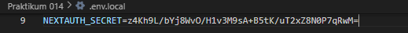

*Menambahkan secret di .env.local*

### 4. Tambahkan SessionProvider

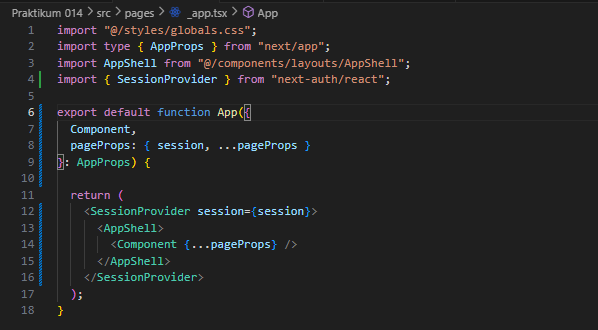

*Menambahkan session provider di _app.tsx*

### 5. Tambahkan Tombol Login & Logout

*Buka file /components/layouts/navbar/index.tsx*

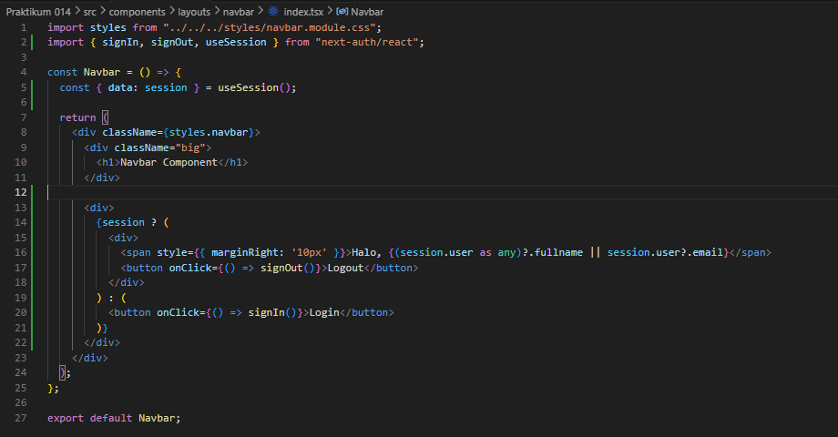

*Modifikasi file /components/layouts/navbar/index.tsx*

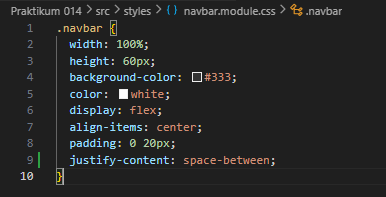

*Modifikasi file styles/navbar.module.css*

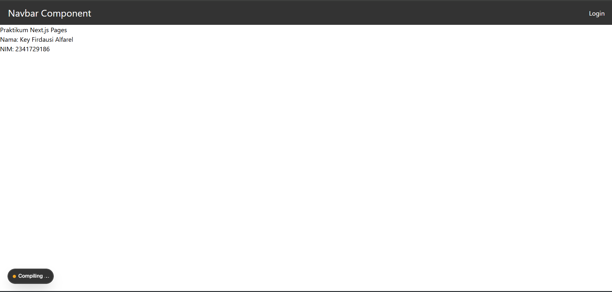

*Buka halaman /**

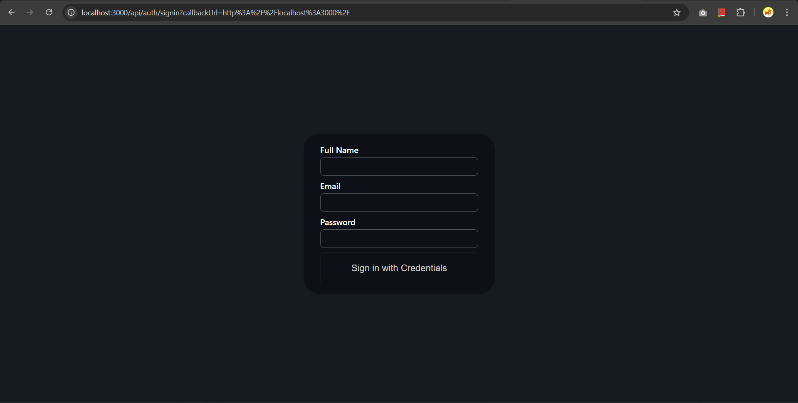

*Tampilan Halaman Login*

*Menambahkan session di file /components/layouts/navbar/index.tsx*

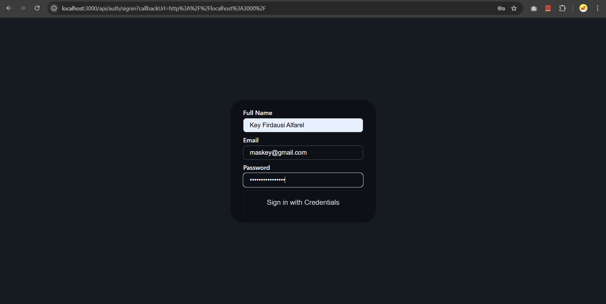

*Coba login*

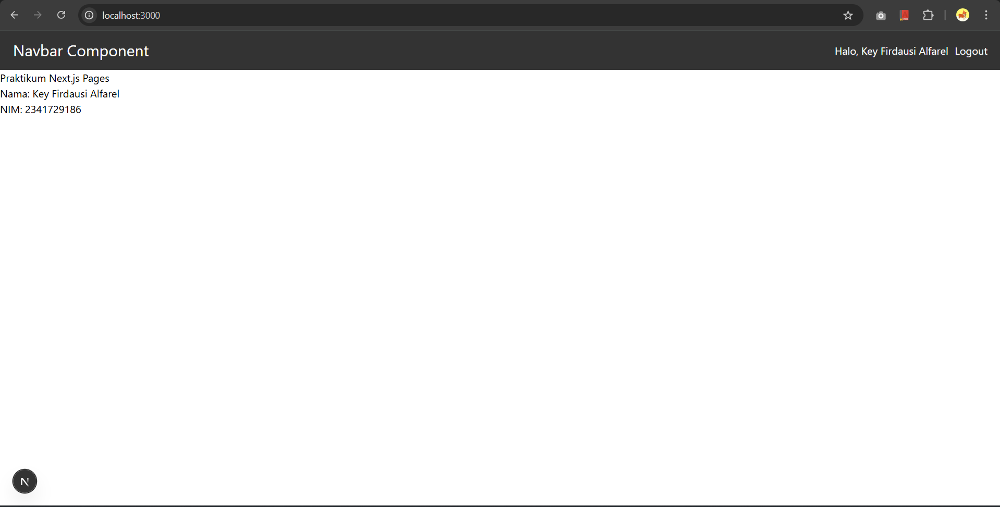

*Tampilan home page*

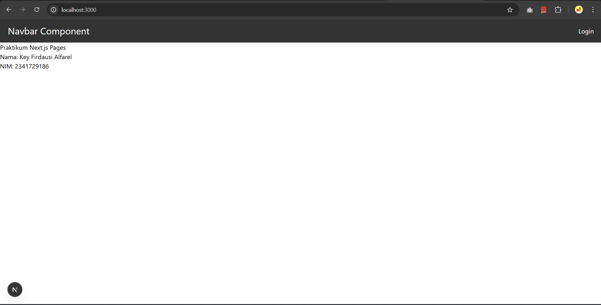

*Logout*

### 6. Menambahkan Data Tambahan (Full Name)

![Modifikasi file /pages/api/auth/[...nextauth].ts](docs/praktikum-014/langkah-6a.png)

*Modifikasi file /pages/api/auth/[...nextauth].ts*

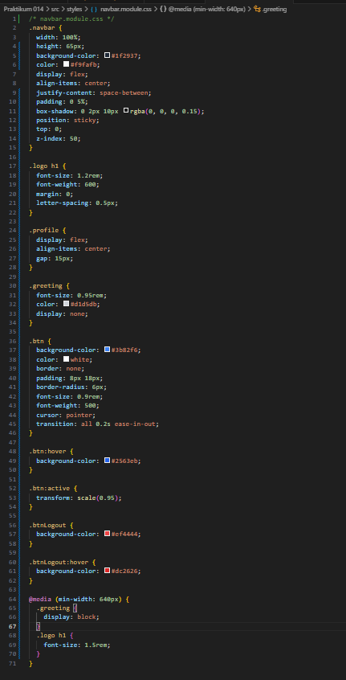

*Modifikasi file styles/navbar.module.css*

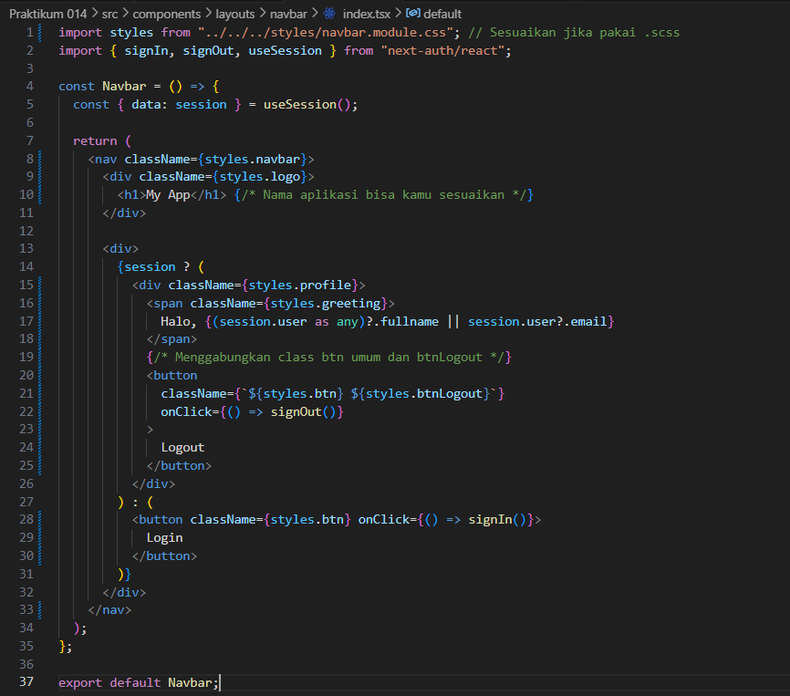

*Modifikasi file /components/layouts/navbar/index.tsx*

*Buka halaman /**

*Login*

*Home Page*

### 7. Proteksi Halaman Profile

*Buat file middleware/withAuth.ts*

*Modifikasi file middleware/withAuth.ts*

*Modifikasi file middleware.ts*

*Modifikasi file pages/profile/index.tsx*

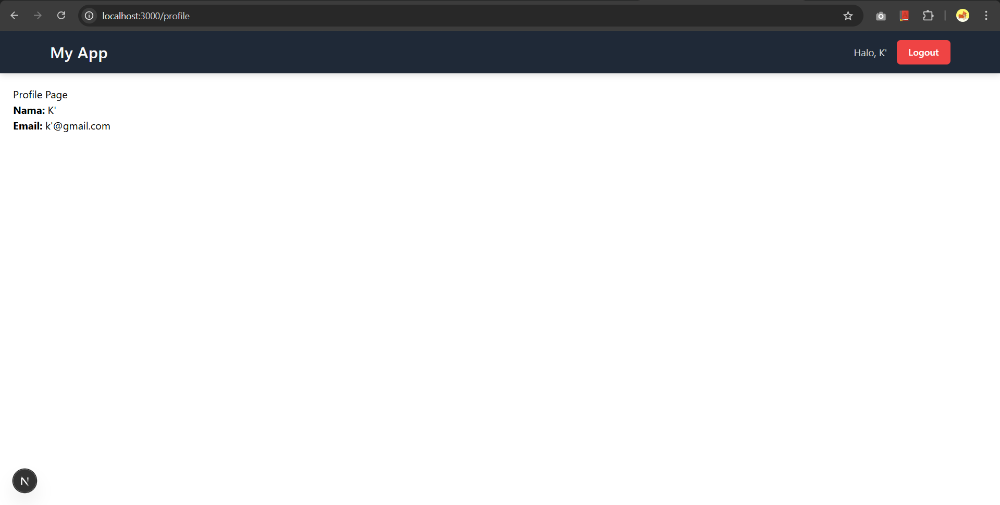

*Login dan akses /profile page*

## Pengujian

### Uji 1

*Sebelum Login*

### Uji 2

*Setelah Login*

### Uji 3

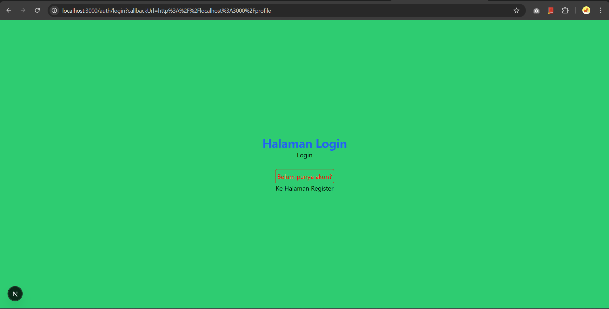

*Setelah Logout*

---

## Pertanyaan Analisis

1. **Mengapa session menggunakan JWT?**
   Penggunaan JWT (*JSON Web Token*) untuk manajemen *session* sangat umum digunakan pada aplikasi *framework* modern (termasuk Next.js) karena sifatnya yang *stateless*. Artinya, sisi server tidak perlu lagi menyimpan status *session* tersebut di dalam memori atau *database*, melainkan informasi *session* disandikan langsung menjadi sebuah token yang disimpan secara persisten di sisi *client* (seperti di dalam *cookies* browser). Pendekatan ini lebih ringan, cepat, efisien, dan serta mudah di-*scale* performanya. Selain itu, JWT tergolong aman karena telah memuat *signature* (tanda tangan digital) untuk membedakan keaslian token serta mencegah terjadinya manipulasi *payload* secara paksa dari luar sistem.

2. **Apa perbedaan authorize() dan callback jwt()?**
   - Fungsi `authorize()` bertugas untuk menangani proses awal ketika pengguna melakukan tahapan autentikasi (*login*). Pada masa ini, kredensial yang diinputkan dan dikirim oleh pengguna (*email* dan *password*) akan diperiksa kebenarannya sesuai dengan *database*. Jika diproses valid, fungsi ini akan mengembalikan atau menyetorkan data *user* tersebut ke sistem.
   - Fungsi *callback* `jwt()` akan berjalan kemudian di setiap kali token dicetak, diakses, atau dipanggil kembali ke depannya. Perannya adalah mengelola dan meneruskan data apa yang pertama kali diterima saat pengembalian fungsi `authorize()` (seperti ID, *email*, nama *fullname*), kemudian memilah *payload* apa saja yang benar-benar akan dimuat dan tersimpan secara menetap di dalam token JWT.

3. **Mengapa middleware perlu getToken()?**
   *Middleware* berjalan secara transparan di sisi server sesaat dan sebelum aplikasi benar-benar merender sebuah halaman untuk memeriksa masuknya suatu *request*. Fungsi `getToken()` kemudian dipanggil oleh kode *middleware* untuk membaca, mengakses, serta mengekstrak token JWT yang disisipkan di dalam lalu lintas *cookies request browser*. Dengan cara ini, *middleware* bisa secara instan mengenali apakah pengakses sudah memegang token yang masih valid (telah *login*) atau belum. Jika token luput, nil ataupun kadaluarsa, *middleware* dapat mengambil tindakan tegas secara sepihak untuk membatasi ruang dan memutus akses masuk ke rute yang bersifat protektif (seperti `/profile`), lalu otomatis me-*redirect* peminta menuju halaman akses *login* biasa.

4. **Apa risiko jika NEXTAUTH_SECRET tidak digunakan?**
   Variabel `NEXTAUTH_SECRET` digunakan sebagai kunci rahasia sentral (*secret key*) yang membungkus keseluruhan proses dalam mengenkripsi informasi di token JWT dan menyetujui validasi keaslian token secara *signature*. Hal ini bermakna apabila kunci ini dibiarkan kosong namun tidak diatur secara eksplisit tersembunyi (*environment secret*): tingkat keamanannya akan jadi begitu rentan. Pihak di luar pengelola dapat dengan sadar mendekripsikan atau membongkar kelemahan token yang lemah kriptografi, dan lebih buruknya lagi berpotensi memicu manipulasi *role* data, kemudian membajak peniruan *session* dan kredensial sembarang pengguna lain.

5. **Apa perbedaan autentikasi dan otorisasi dalam sistem ini?**
   - **Autentikasi (*Authentication*)** merupakan proses untuk memvalidasi dan membuktikan kebenaran suatu identitas pengguna itu sendiri. Proses ini terjadi ketika proses *Login* (memeriksa masukan kombinasi *email* dan *password* lalu dihadapkan verifikasi kepada rekam database). Secara singkatnya ini merupakan metode meyakinkan bahwa setiap *user* yang bersangkutan adalah 100% pengguna asli untuk akunnya.
   - **Otorisasi (*Authorization*)** adalah tahapan berlapis berikutnya setelah masuk (autentikasi). Proses otorisasi akan mengatur tingkat, sejauh manakah izin, hak dan wewenang pengguna tersebut setelah sistem merima mereka masuk. Pada konteks modul di praktikum ini: penerapannya dilimpahkan pada kode *middleware* yang mendeteksi peran *token*, yaitu memastikan bahwa hanya ia yang memang sudah *login* dengan tepat diperbolehkan menikmati akses masuk layanan dan antarmuka seperti di url `/profile` sehingga membatasi akses bagi pengguna *guess*.
