# Laporan Praktikum 16 - Pemrograman Berbasis Framework

**Nama:** Key Firdausi Alfarel  
**NIM:** 2341729186  

---

## Daftar Isi

- [Langkah-Langkah Praktikum](#langkah-langkah-praktikum)
  - [1. Custom Login Page](#1-custom-login-page)
  - [2. Handle Login di Frontend](#2-handle-login-di-frontend)
  - [3. Authorize di NextAuth (Database Login)](#3-authorize-di-nextauth-database-login)
  - [4. Tambahkan Role ke Token](#4-tambahkan-role-ke-token)
  - [5. Callback URL Logic](#5-callback-url-logic)
  - [6. Callback URL Logic](#6-callback-url-logic-1)
- [Pengujian](#pengujian)
  - [Uji 1 – Login Valid](#uji-1--login-valid)
  - [Uji 2 – Password Salah](#uji-2--password-salah)
  - [Uji 3 – Akses Admin sebagai User](#uji-3--akses-admin-sebagai-user)
  - [Uji 4 – Akses Admin sebagai Admin](#uji-4--akses-admin-sebagai-admin)
- [Pertanyaan Analisis](#pertanyaan-analisis)
  - [1. Mengapa password harus diverifikasi dengan bcrypt.compare?](#1-mengapa-password-harus-diverifikasi-dengan-bcryptcompare)
  - [2. Mengapa role disimpan di token?](#2-mengapa-role-disimpan-di-token)
  - [3. Apa fungsi callbackUrl?](#3-apa-fungsi-callbackurl)
  - [4. Mengapa middleware penting untuk security?](#4-mengapa-middleware-penting-untuk-security)
  - [5. Apa risiko jika role tidak dicek di middleware?](#5-apa-risiko-jika-role-tidak-dicek-di-middleware)

---

## Langkah-Langkah Praktikum

### 1. Custom Login Page

![Buka pages/api/auth/[..nextauth].ts](docs/praktikum-016/langkah-1a.png)

*Buka pages/api/auth/[..nextauth].ts*

![Modifikasi pages/api/auth/[..nextauth].ts](docs/praktikum-016/langkah-1b.png)

*Modifikasi pages/api/auth/[..nextauth].ts*

### 2. Handle Login di Frontend

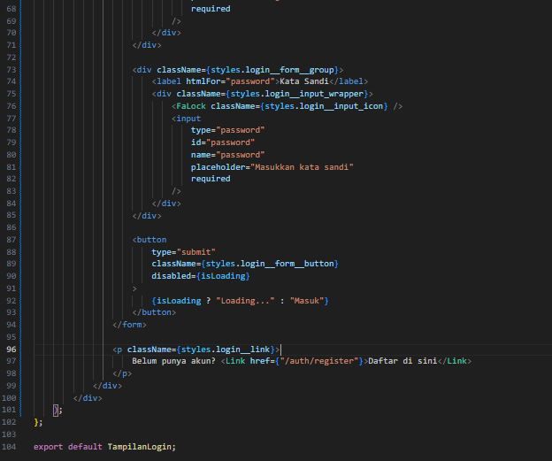

*Modifikasi view/auth/login/login.tsx*

*Modifikasi view/auth/login/login.module.scss*

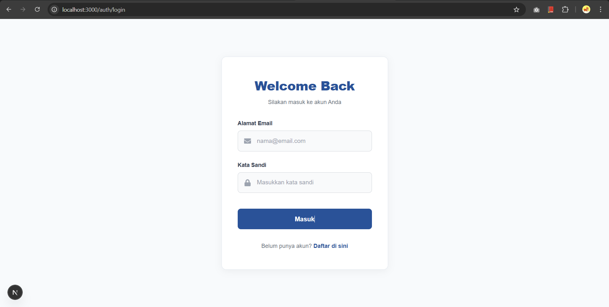

*Tampilan halaman login*

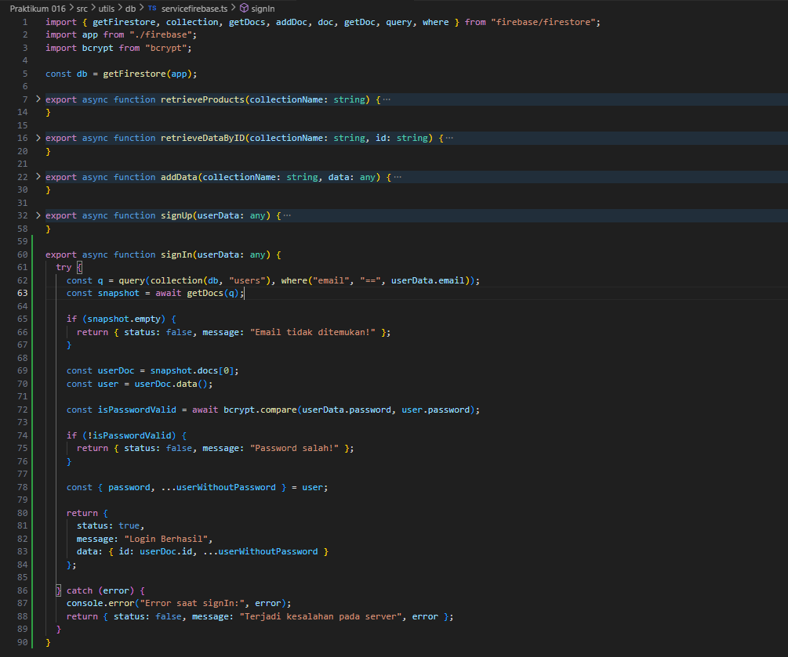

*Modifikasi file utils/db/servicefirebase.ts*

### 3. Authorize di NextAuth (Database Login)

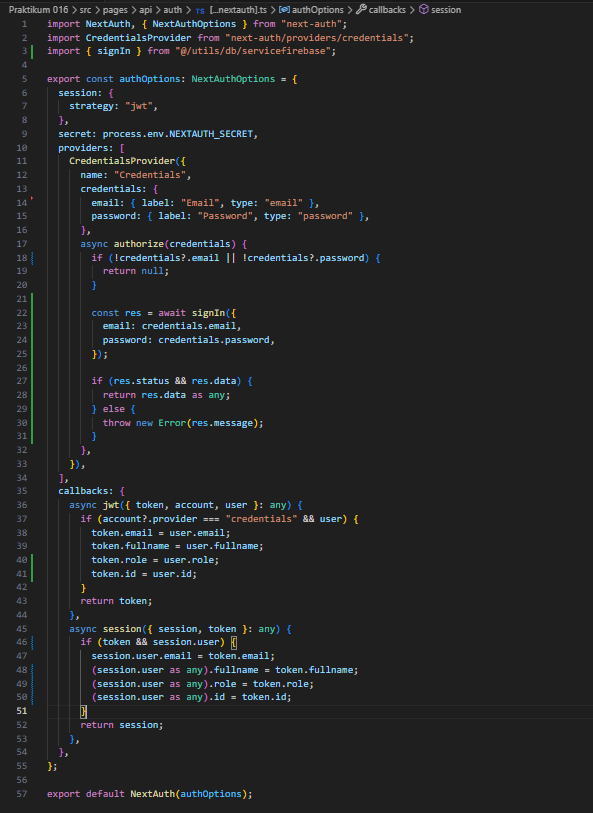

*Modifikasi file utils/db/servicefirebase.ts*

### 4. Tambahkan Role ke Token

![Modifikasi pages/api/auth/[..nextauth].ts](docs/praktikum-016/langkah-4a.png)

*Modifikasi pages/api/auth/[..nextauth].ts*

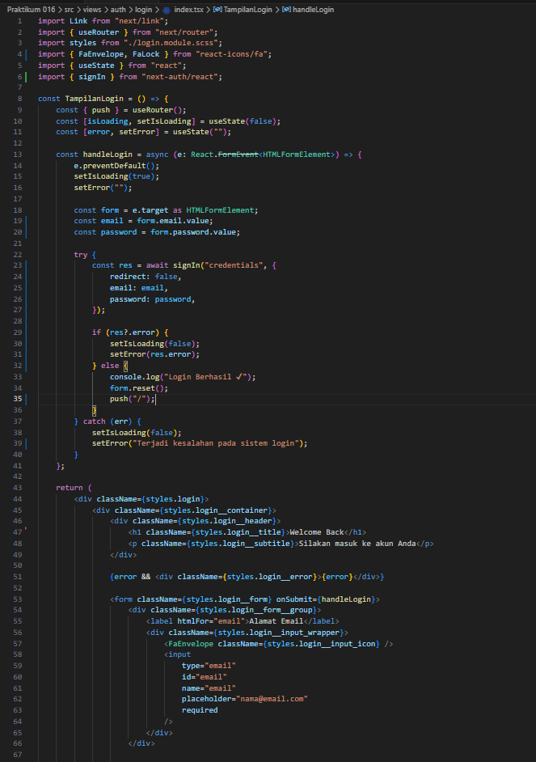

*Modifikasi view/auth/login/login.tsx*

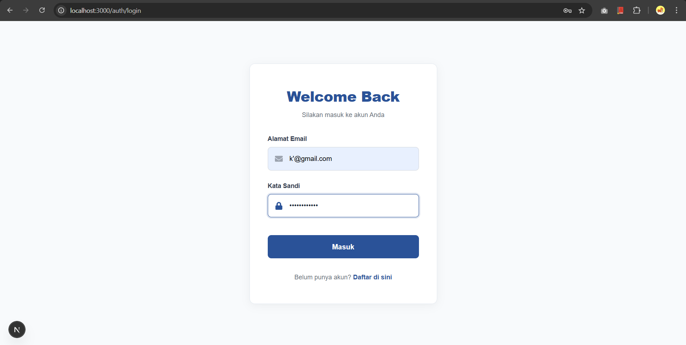

*Isi form login*

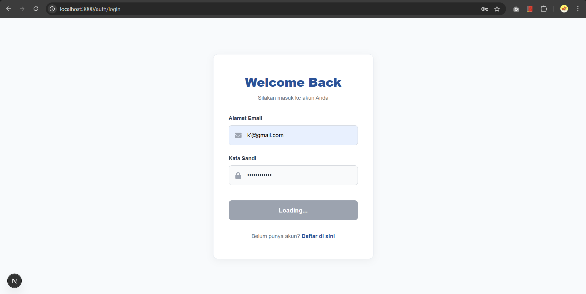

*Loading login*

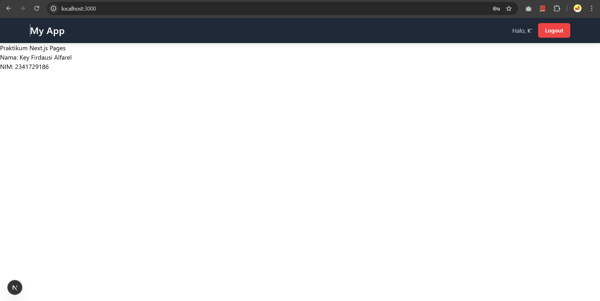

*Login berhasil dan masuk ke halaman utama*

### 5. Callback URL Logic

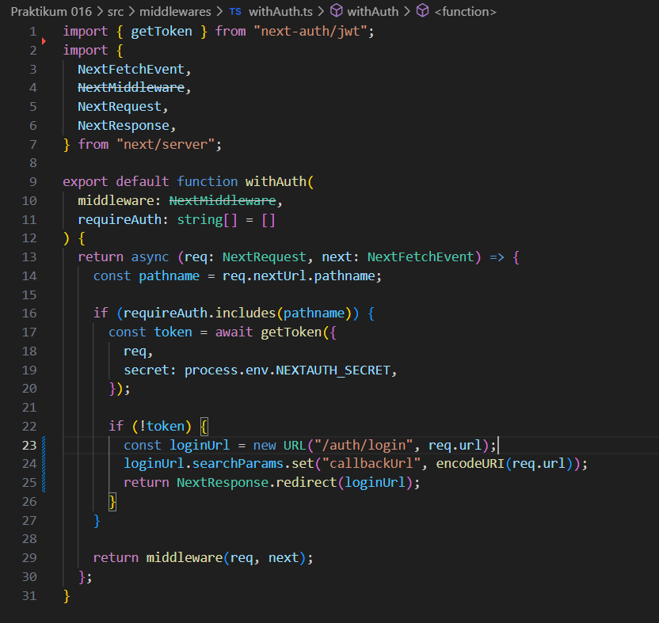

*Modifikasi middleware/withAuth.ts*

### 6. Callback URL Logic

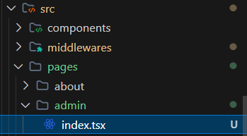

*Buat file pages/admin/index.tsx*

*Modifikasi pages/admin/index.tsx*

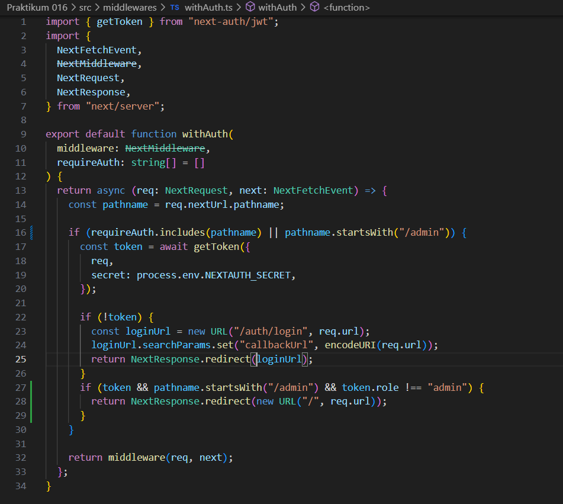

*Modifikasi middleware/withAuth.ts*

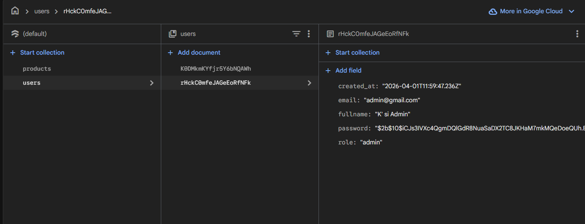

*Tambah admin di firestore users*

*Login dengan kredensial admin*

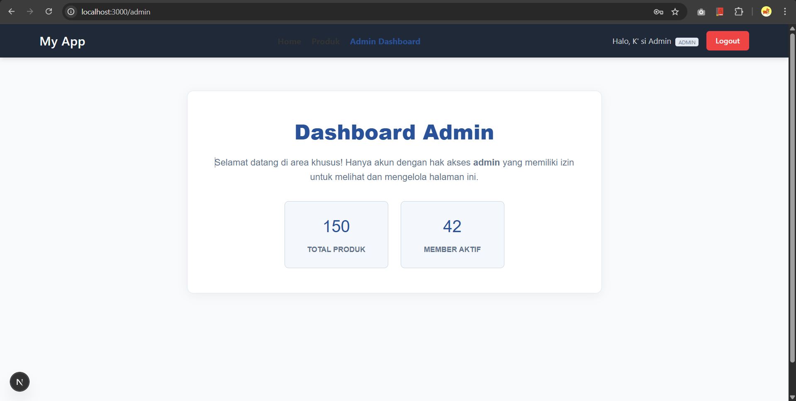

*Berhasil masuk ke dashboard admin*

## Pengujian

### Uji 1 – Login Valid

*Login dengan kredensial user*

*Login berhasil sebagai user*

### Uji 2 – Password Salah

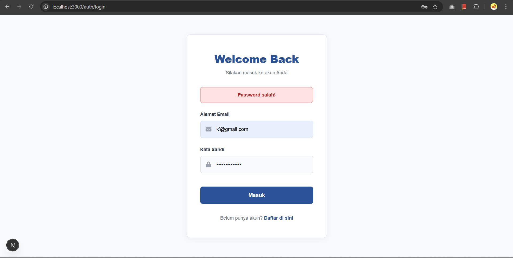

*Password salah*

### Uji 3 – Akses Admin sebagai User

*Login dengan kredensial user*

*Login berhasil sebagai user*

*Akses halaman /admin*

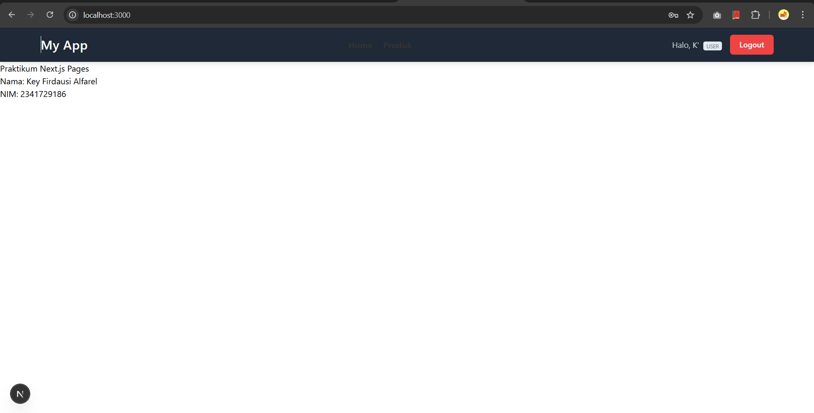

*Diredirect ke halaman home*

### Uji 4 – Akses Admin sebagai Admin

*Data admin di firestore*

*Login dengan kredensial admin*

*Berhasil masuk ke dashboard admin*

---

## Pertanyaan Analisis

### 1. Mengapa password harus diverifikasi dengan bcrypt.compare?
Password yang disimpan di database umumnya dalam bentuk *hash* (terenkripsi satu arah) dengan alasan keamanan agar password asli tidak diketahui siapa pun, termasuk dari sisi developer. Fungsi `bcrypt.compare` digunakan untuk membandingkan password teks biasa *plain text* yang dimasukkan pengguna saat *login* dengan *hash* password yang tersimpan di database. Proses ini memastikan validasi kecocokan password berjalan dengan aman tanpa perlu mengekspos bentuk *plain text* aslinya.

### 2. Mengapa role disimpan di token?
Menyimpan *role* di dalam token (seperti JWT) memungkinkan pemerikasaan hak akses (otorisasi) pengguna pada setiap *request* dilakukan dengan cepat tanpa perlu harus melakukan pencarian *query* ulang ke database secara terus-menerus. Hal ini sangat berguna dalam mengurangi beban *query* ke database, serta mempercepat proses validasi pengguna baik dari sisi peladen *server* maupun dari *middleware*.

### 3. Apa fungsi callbackUrl?
`callbackUrl` berfungsi menyimpan atau membawa alamat *URL* tujuan awal sebelum pengguna terhadang oleh proses autentikasi. Contohnya, ketika seseorang mencoba masuk ke `/admin` namun belum *login*, web akan mengarahkannya ke halaman *login* sambil menyimpan jejak `callbackUrl=/admin`. Setelah pengguna sukses *login*, sistem dapat membaca *URL* ini dan memulangkannya dengan otomatis ke halaman yang tertunda tadi.

### 4. Mengapa middleware penting untuk security?
*Middleware* berfungsi layaknya penjaga gerbang (*gatekeeper*) yang akan dieksekusi terlebih dahulu sebelum suatu *request* berhasil sampai pada *page* atau API sasaran. Dalam segi keamanan, hal ini memungkinkan kita mencegat pengguna yang tidak memenuhi syarat (seperti tidak memiliki token *login* atau tidak berstatus admin) dan langsung memblokir atau melakukan *redirect* sebelum konten berpotensi terekspos.

### 5. Apa risiko jika role tidak dicek di middleware?
Jika *role* tidak langsung dicek di *middleware* melainkan hanya bergantung di *frontend* saja, peretas masih dapat mencoba mencegat proses antarmuka atau merekayasa respons *API* untuk meretas masuk, sebuah serangan *privilege escalation*. Hal ini berisiko membocorkan *data fetching* atau fungsi sensitif (seperti menu ubah/hapus data admin) karena peladen menganggap permintaan tersebut sah meski si peminta merupakan pengguna biasa. Pengecekan pada level *middleware* menutup celah akses ke *endpoint* sejak awal.