# Laporan Praktikum 19 - Pemrograman Berbasis Framework

**Nama:** Key Firdausi Alfarel  
**NIM:** 2341729186  

---

## Daftar Isi

- [Langkah-Langkah Praktikum](#langkah-langkah-praktikum)
  - [1. Setup Jest di Next.js](#1-setup-jest-di-nextjs)
  - [2. Struktur Folder Testing](#2-struktur-folder-testing)
  - [3. Testing Halaman About](#3-testing-halaman-about)
  - [4. Coverage Report](#4-coverage-report)
  - [5. Konfigurasi Coverage Lengkap](#5-konfigurasi-coverage-lengkap)
  - [6. Testing dengan getByTestId](#6-testing-dengan-getbytestid)
  - [7. Testing Page dengan Router (Mocking)](#7-testing-page-dengan-router-mocking)
  - [8. Menangani Undefined Data](#8-menangani-undefined-data)
- [Tugas Praktikum](#tugas-praktikum)
  - [1. Buat unit test untuk Halaman Product](#1-buat-unit-test-untuk-halaman-product)
  - [2. Gunakan 1 Snapshot test, 1 toBe(), 1 getByTestId()](#2-gunakan-1-snapshot-test-1-tobe-1-getbytestid)
  - [3. Buat coverage minimal 50%](#3-buat-coverage-minimal-50)
  - [4. Lakukan mocking untuk router](#4-lakukan-mocking-untuk-router)
- [Pertanyaan Analisis](#pertanyaan-analisis)
  - [1. Mengapa unit testing penting sebelum production?](#1-mengapa-unit-testing-penting-sebelum-production)
  - [2. Mengapa branch coverage sulit mencapai 100%?](#2-mengapa-branch-coverage-sulit-mencapai-100)
  - [3. Apa itu mocking?](#3-apa-itu-mocking)
  - [4. Kapan snapshot test digunakan?](#4-kapan-snapshot-test-digunakan)
  - [5. Apakah semua file harus dites?](#5-apakah-semua-file-harus-dites)

---

## Langkah-Langkah Praktikum

### 1. Setup Jest di Next.js

*Buka terminal dan install dependencies jest*

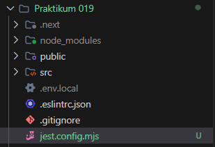

*Buat file jest.config.mjs*

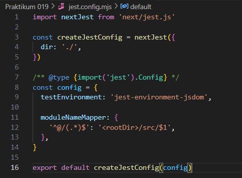

*Konfigurasi jest.config.mjs*

*Konfigurasi package.json*

### 2. Struktur Folder Testing

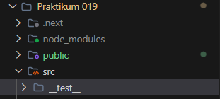

*Struktur folder testing*

### 3. Testing Halaman About

*Membuat file about.spec.tsx*

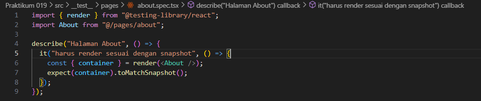

*Modifikasi file about.spec.tsx*

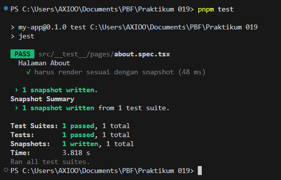

*Hasil testing*

*Snapshot folder*

### 4. Coverage Report

*Konfigurasi package.json*

*Jalankan command test:coverage*

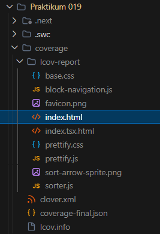

*Direktori hasil coverage*

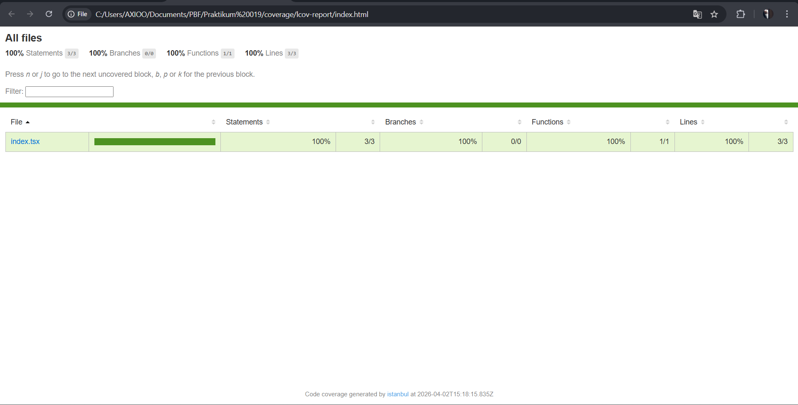

*Buka index.html dari folder coverage*

### 5. Konfigurasi Coverage Lengkap

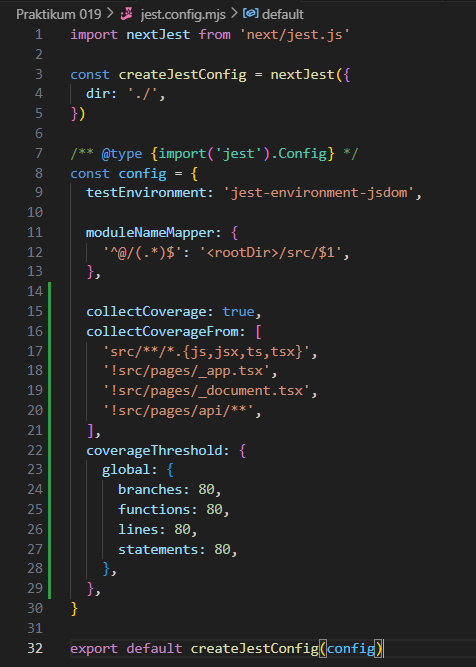

*Konfigurasi jest.config.mjs*

*Jalankan command test:coverage*

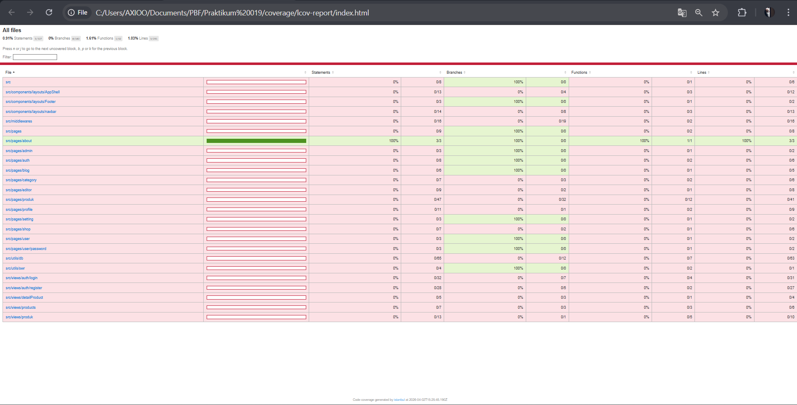

*Hasil coverage*

### 6. Testing dengan getByTestId

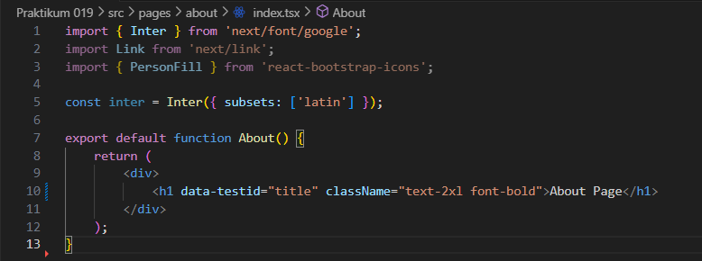

*Modifikasi file pages/about/index.tsx*

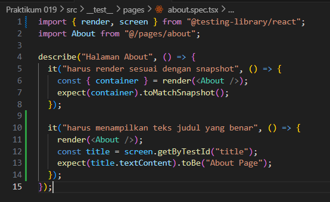

*Modifikasi file about.spec.tsx*

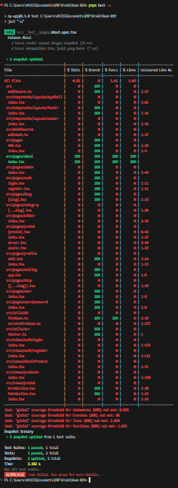

*Hasil coverage benar*

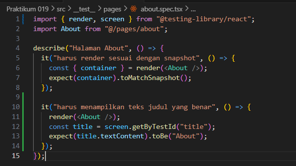

*Modifikasi file about.spec.tsx*

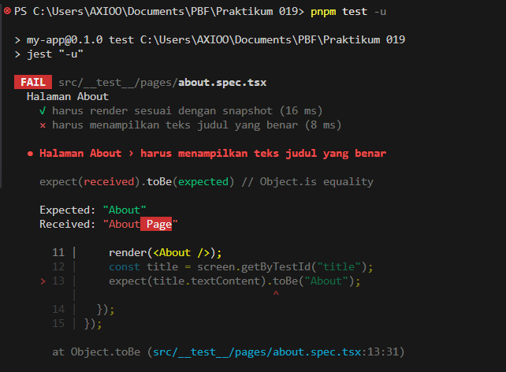

*Hasil coverage salah*

### 7. Testing Page dengan Router (Mocking)

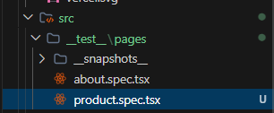

*Menambah file product.spec.tsx*

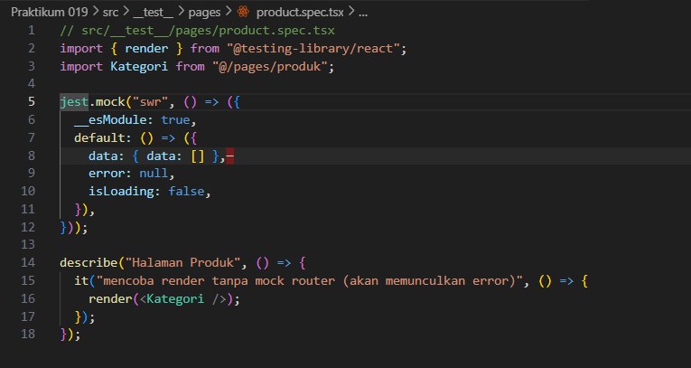

*Modifikasi file product.spec.tsx*

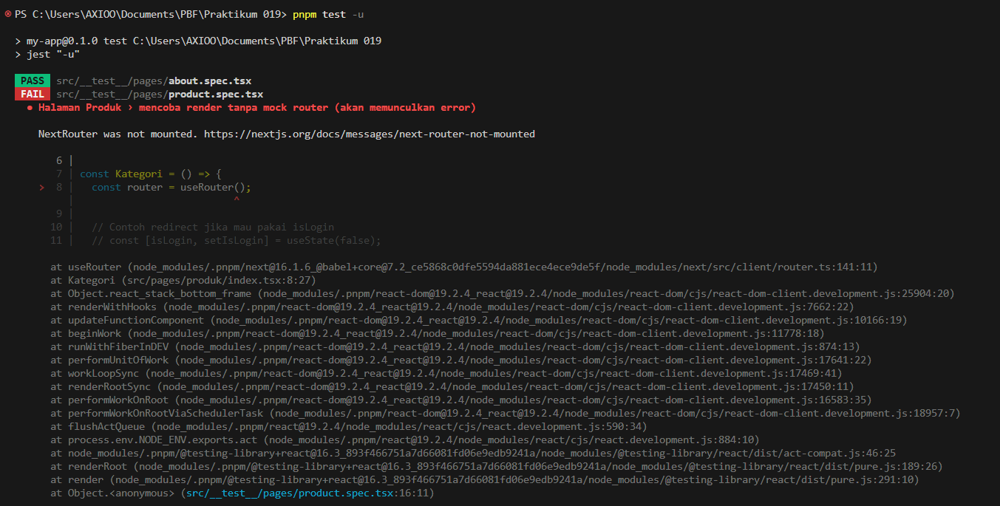

*Hasil coverage error*

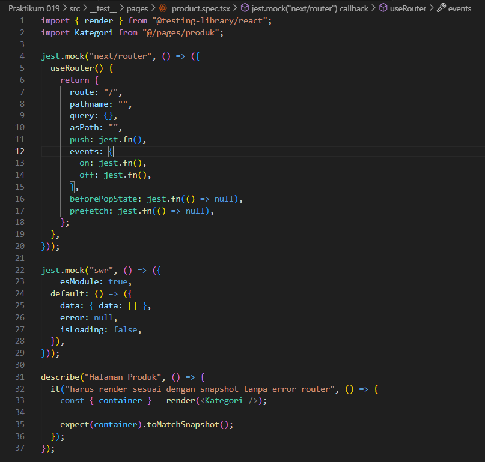

*Modifikasi file product.spec.tsx*

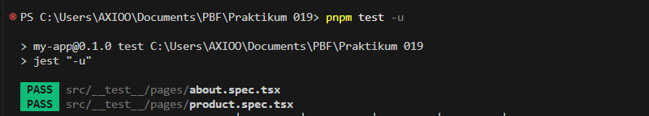

*Hasil coverage benar*

### 8. Menangani Undefined Data

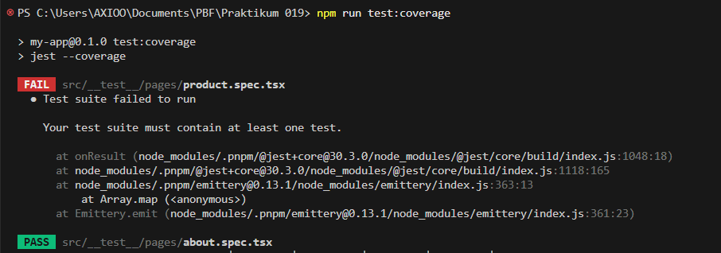

*Error saat menjalankan test:coverage*

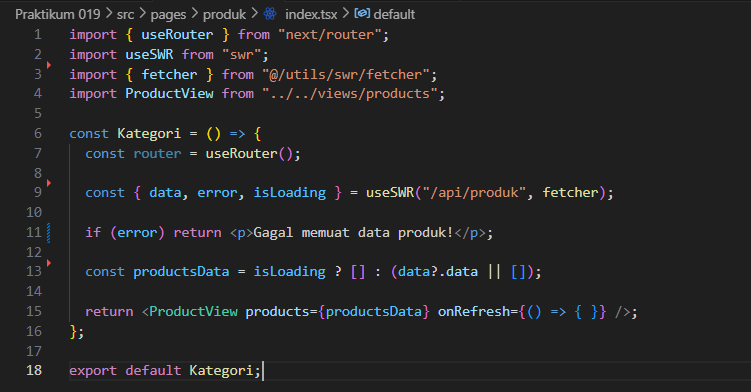

*Modifikasi file product.spec.tsx*

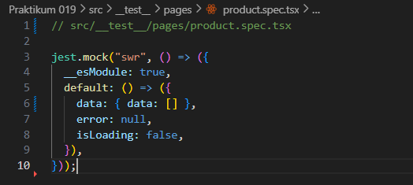

*Modifikasi file product/index.tsx*

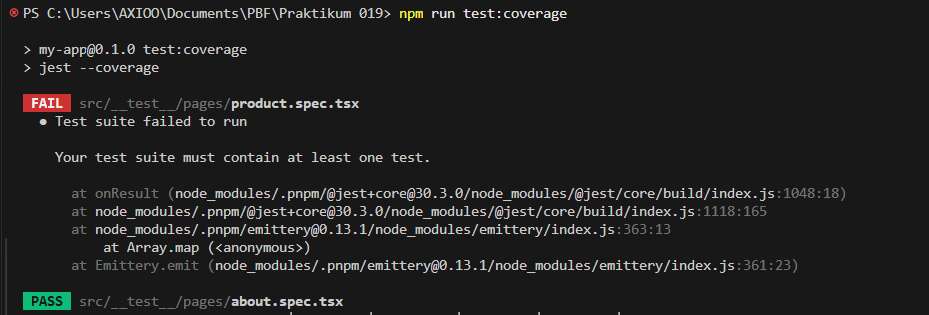

*Hasil masih error*

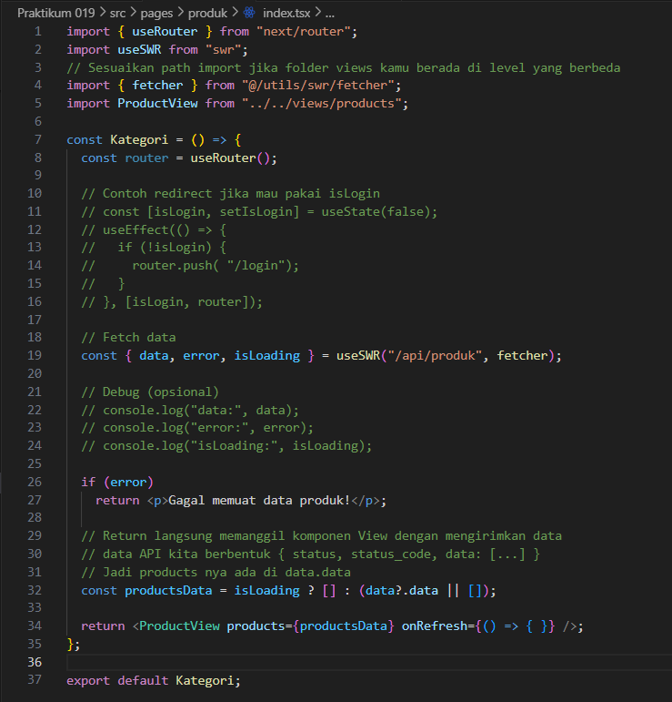

*Modifikasi file product.spec.tsx*

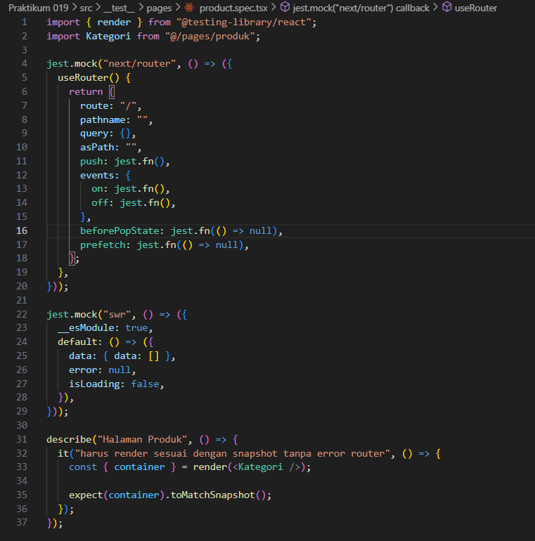

*Modifikasi file product/index.tsx*

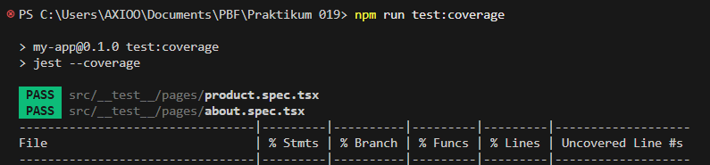

*Hasil coverage sudah pass*

## Tugas Praktikum

### 1. Buat unit test untuk Halaman Product

*Kode unit test pages/product/index.tsx*

### 2. Gunakan 1 Snapshot test, 1 toBe(), 1 getByTestId()

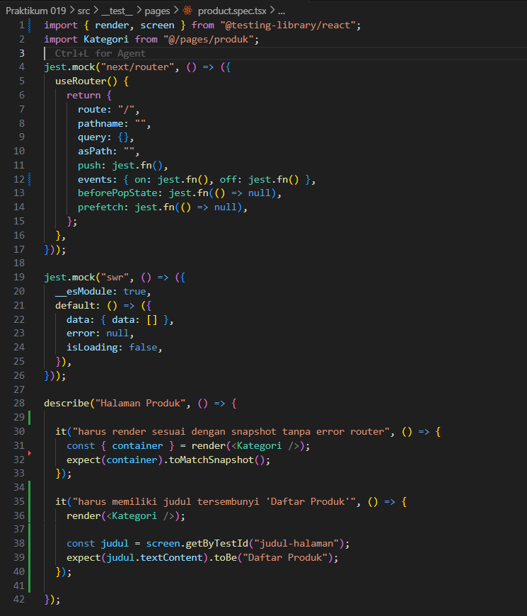

*Kode implementasi snapshot, toBe, getByTestId*

### 3. Buat coverage minimal 50%

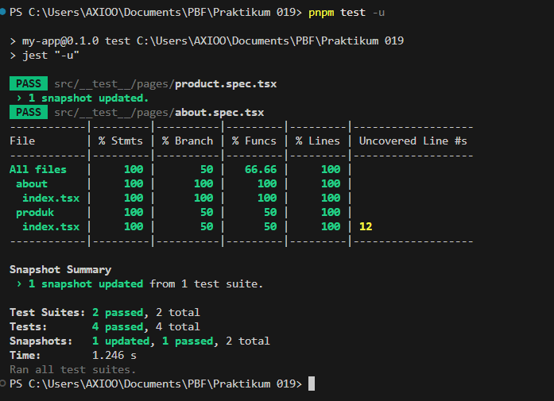

*Hasil coverage*

### 4. Lakukan mocking untuk router

*Mocking router*

---

## Pertanyaan Analisis

### 1. Mengapa unit testing penting sebelum production?
Unit testing penting dilakukan sebelum tahap production karena membantu memastikan setiap bagian kecil dari kode (unit) berfungsi sesuai dengan yang diharapkan. Dengan menemukan bug sedini mungkin pada proses pengembangan, kita bisa menghemat waktu dan biaya perbaikan di masa depan. Selain itu, unit test juga memberikan keamanan lebih bagi developer ketika melakukan update atau perbaikan kode (refactoring) tanpa takut merusak fitur yang sudah berjalan dengan baik.

### 2. Mengapa branch coverage sulit mencapai 100%?
Mencapai 100% branch coverage seringkali sulit karena sebuah aplikasi biasanya memiliki banyak skenario error atau kondisi tidak lazim (edge cases) yang sulit disimulasikan dalam test. Selain itu, terkadang ada kode defensif pelindung yang dalam skenario nyata mungkin tidak pernah tereksekusi. Usaha ekstra yang dikerahkan untuk mengejar persentase 100% tersebut terkadang kurang optimal memakan waktu dibandingkan nilai tambah yang didapatkan.

### 3. Apa itu mocking?
Mocking adalah teknik pengujian dengan menggantikan (isolasi) dependensi eksternal yang punya logika rumit atau memakan waktu (seperti panggilan ke database, routing aplikasi, dan request fetch ke server API) menjadi objek simulasi buatan (mock). Teknik ini membuat fungsi kita jadi independen dan lebih cepat, sehingga jika test-nya gagal, kita bisa tahu pasti kesalahannya karena error dari kode di dalamnya dan bukan karena server di luar sedang bermasalah.

### 4. Kapan snapshot test digunakan?
Snapshot testing sering digunakan saat kita ingin memastikan agar User Interface (UI) tidak mengalami perubahan visual atau struktur komponen tanpa disengaja. Test ini bekerja dengan menyimpan hasil "foto tampilan kode strukturnya" (snapshot) dari hasil yang stabil sebelumnya, untuk dibandingkan dengan struktur yang saat ini dirender sistem. Kalau terjadi perbedaan karena perubahan file UI yang diupdate, test snapshot ini akan error sehingga akan selalu memperingatkan developer untuk mengecek kembali dan menyimpan ulang rekam strukturnya bila memang diinginkan.

### 5. Apakah semua file harus dites?
Tidak semua baris kode harus dites (100% requirement), karena kita juga harus mengingat proporsi manajemen yang efisien terhadap waktu. Fokus utama sering diprioritaskan pada pengetesan fungsi logika bisnis utama (core features), keamanan data, rumus perhitungan, atau fungsionalitas kompleks. Pada file yang relatif statis misalnya config environment, deklarasi CSS konstanta, atau halaman tipe data sederhana biasanya jarang diberikan test yang intensif.
