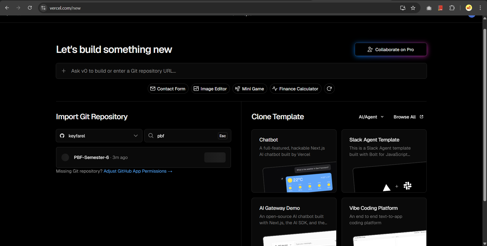
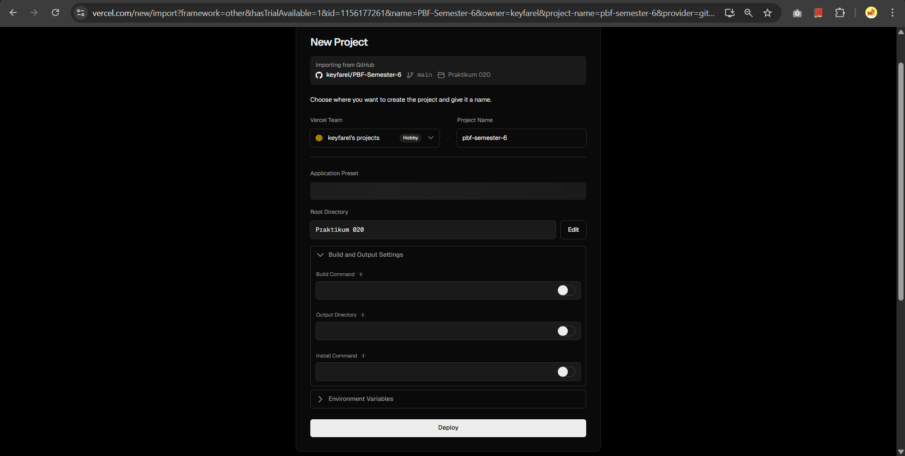
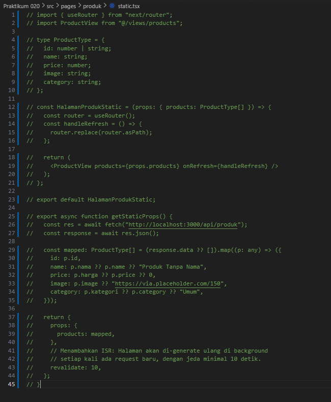
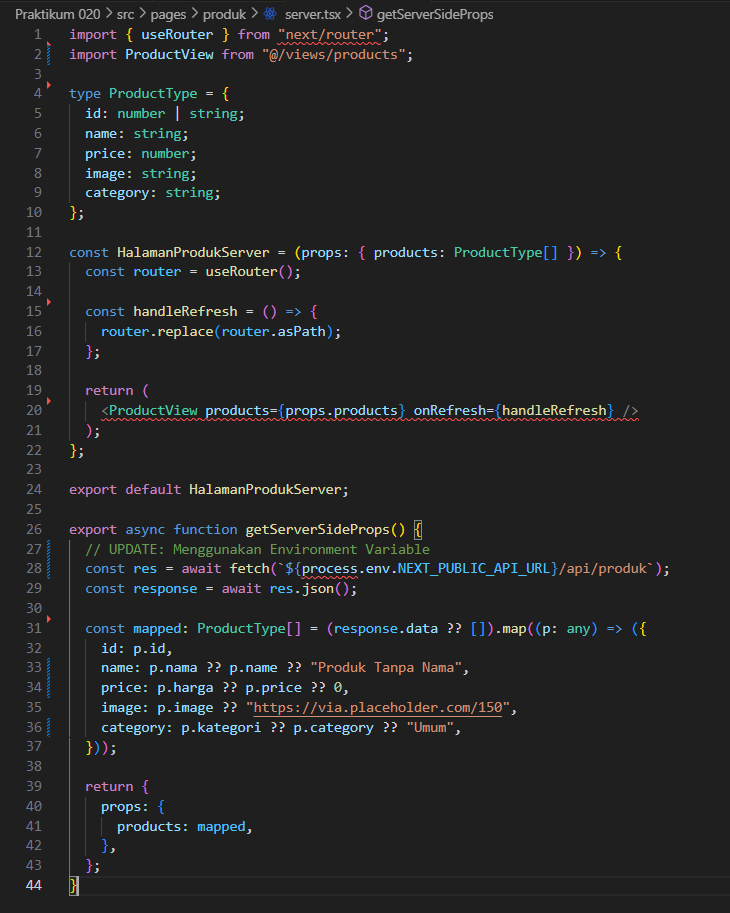
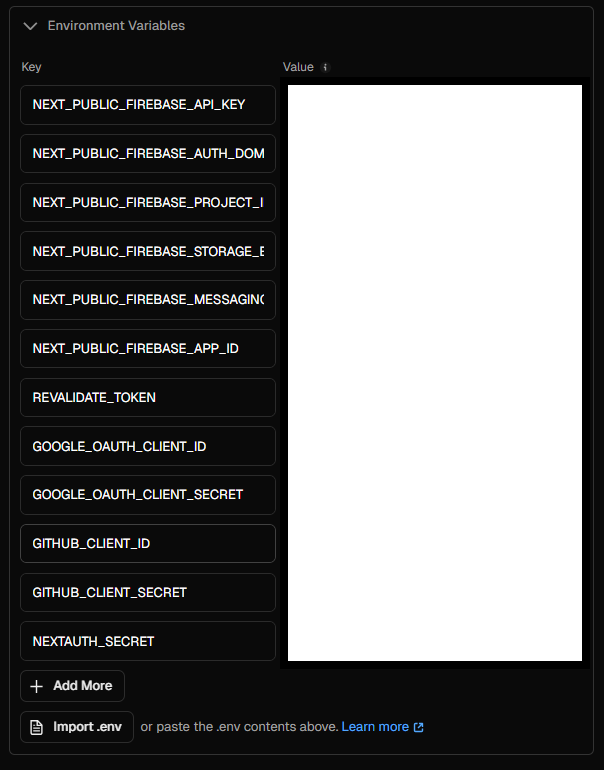
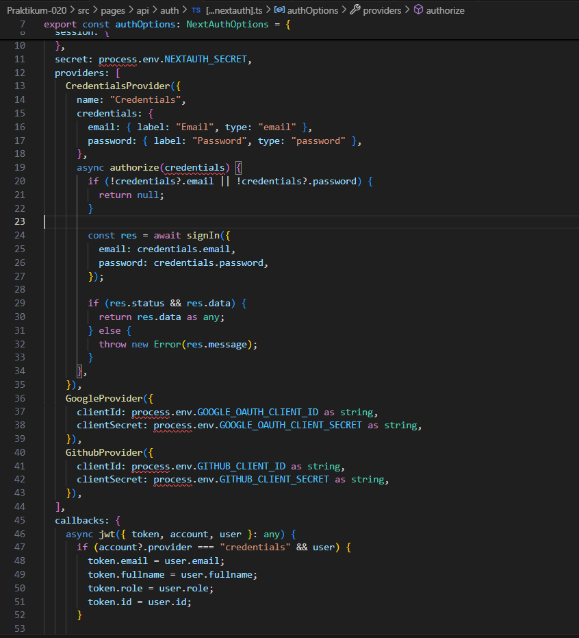
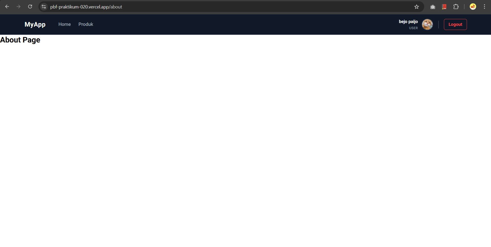
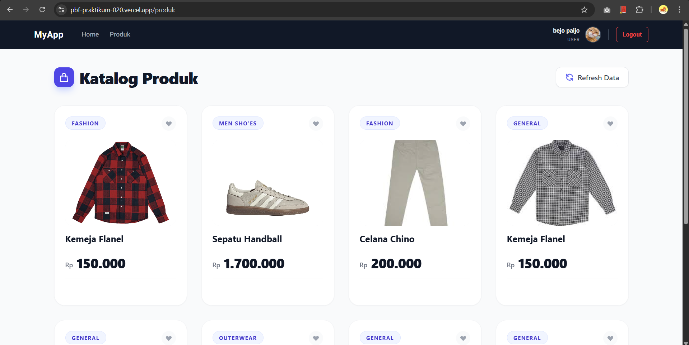
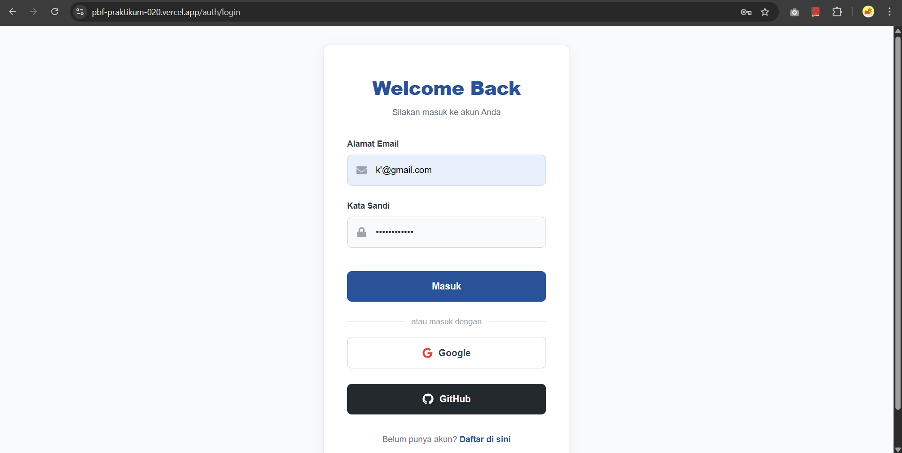

# Laporan Praktikum 20 - Pemrograman Berbasis Framework

**Nama:** Key Firdausi Alfarel  
**NIM:** 2341729186  

---

## Daftar Isi

- [Langkah-Langkah Praktikum](#langkah-langkah-praktikum)
  - [1. Membuat Repository GitHub](#1-membuat-repository-github)
  - [2. Deployment ke Vercel](#2-deployment-ke-vercel)
  - [3. Menambahkan Environment Variable di Vercel](#3-menambahkan-environment-variable-di-vercel)
  - [4. Konfigurasi Google OAuth Production](#4-konfigurasi-google-oauth-production)
  - [5. Pengujian Setelah Deployment](#5-pengujian-setelah-deployment)
- [Pertanyaan Analisis](#pertanyaan-analisis)
  - [1. Mengapa localhost tidak boleh digunakan di production?](#1-mengapa-localhost-tidak-boleh-digunakan-di-production)
  - [2. Mengapa SSG bisa gagal saat build?](#2-mengapa-ssg-bisa-gagal-saat-build)
  - [3. Apa perbedaan SSR dan SSG saat deployment?](#3-apa-perbedaan-ssr-dan-ssg-saat-deployment)
  - [4. Mengapa perlu redeploy setelah menambahkan environment?](#4-mengapa-perlu-redeploy-setelah-menambahkan-environment)
  - [5. Apa fungsi redirect URI pada OAuth?](#5-apa-fungsi-redirect-uri-pada-oauth)

---

## Langkah-Langkah Praktikum

### 1. Membuat Repository GitHub

*Cek username dan email*

*git add .*

*git commit -m "feat(praktikum-020): Initial commit"*

*git push -u origin main*

### 2. Deployment ke Vercel

*Pilih repository*

*Konfigurasi deployment*

*Comment src/pages/produk/static.tsx*

![Modifikasi src/pages/produk/[produk].tsx](docs/praktikum-020/langkah-2e.png)

*Modifikasi src/pages/produk/[produk].tsx*

*Modifikasi src/pages/produk/server.tsx*

### 3. Menambahkan Environment Variable di Vercel

*Menambahkan Environment Variable*

*Redeploy*

*Deploy berhasil*

### 4. Konfigurasi Google OAuth Production

*Ubah Google OAuth untuk production*

*Modifikasi kode dan redeploy*

*Login dengan google*

*Login berhasil*

### 5. Pengujian Setelah Deployment

*Akses halaman https://pbf-praktikum-020.vercel.app/*

*Akses halaman https://pbf-praktikum-020.vercel.app/about*

*Akses halaman https://pbf-praktikum-020.vercel.app/produk*

*Akses halaman https://pbf-praktikum-020.vercel.app/profile*

*Login dengan google*

*Berhasil login dengan google*

*Login dengan kredensial*

*Berhasil login dengan kredensial*

---

## Pertanyaan Analisis

### 1. Mengapa localhost tidak boleh digunakan di production?
Penggunaan `localhost` hanya ditujukan untuk server pengembangan lokal karena hanya merujuk pada alamat loopback perangkat itu sendiri (127.0.0.1). Di lingkungan production, server perlu diakses oleh publik (pengguna lain) melalui jaringan internet. Oleh karena itu, aplikasi harus menggunakan IP publik atau nama domain yang terekspos ke internet. Jika tetap memakai `localhost`, aplikasi hanya bisa dipanggil oleh mesin atau server pengelola itu sendiri.

### 2. Mengapa SSG bisa gagal saat build?
Proses SSG (Static Site Generation) bisa gagal di tahap *build* karena Next.js biasanya mengambil (fetching) data melalui API eksternal atau koneksi database di fungsi pre-rendering (seperti `getStaticProps` atau `getStaticPaths`). Jika API tersebut sedang *down*, *URL endpoint*-nya salah (misalnya masih mengarah ke *localhost* yang belum aktif), atau format data yang diterima tidak sesuai (misalnya undefined), maka Next.js akan *error* dan menghentikan keseluruhan proses berjalannya build / deploy.

### 3. Apa perbedaan SSR dan SSG saat deployment?
Perbedaan utamanya terletak pada **waktu kapan halaman HTML tersebut di-*generate***. Pada SSG (*Static Site Generation*), halaman secara utuh dibentuk (di-render) menjadi file statis *pada saat proses build* (build-time) di dalam platform deployment, sehingga ketika *user request*, halaman akan diakses dengan sangat cepat karena langsung diambil dari CDN. Sementara pada SSR (*Server-Side Rendering*), halaman akan selalu dibentuk ulang secara langsung *pada saat ada request masuk* dari *user*, sehingga server tersebut akan senantiasa melakukan komputasi terus-menerus menyesuaikan load kunjungan, yang biasanya memakan waktu respon sedikit lebih berlebih dibanding menyajikan file SSG.

### 4. Mengapa perlu redeploy setelah menambahkan environment?
*Environment variables* sering kali dibaca dan disuntikkan (*embedded*) ke dalam aplikasi JavaScript secara spesifik **pada fase *build*** (terutama *variable* yang diekspos ke sisi klien seperti `NEXT_PUBLIC_`). Memasukkan nilai baru di platform (seperti Vercel) tidak akan serta-merta mengganti nilai yang sudah "terpatri/terbakar" di build aplikasi kita yang sedang berjalan sekarang. Oleh karena itu, proses *redeploy* dibutuhkan agar sistem bisa melakukan siklus *re-build* dari awal yang diiringi dengan pembacaan *environment* dan pemakain nilai env yang terbaru.

### 5. Apa fungsi redirect URI pada OAuth?
Fungsi *Redirect URI* adalah mendefinisikan secara pasti URL atau alamat *callback* resmi dari aplikasi kita agar provider pihak ketiga (seperti Google / GitHub) dapat mengembalikan kembali *user* serta mem-passing token / kode otorisasi (*authorization code*) pasca *user* sukses melakukan login otentikasi. Ini merupakan standar pengamanan utama OAuth supaya *authorization provider* tidak sembarangan menyerahkan rahasia identitas ke URL yang bukan milik kita (*cross-site request forgery*), karena provider hanya mau meneruskannya ke list *redirect URI* yang sudah didaftarkan (whitelist).