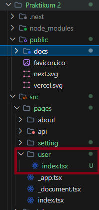
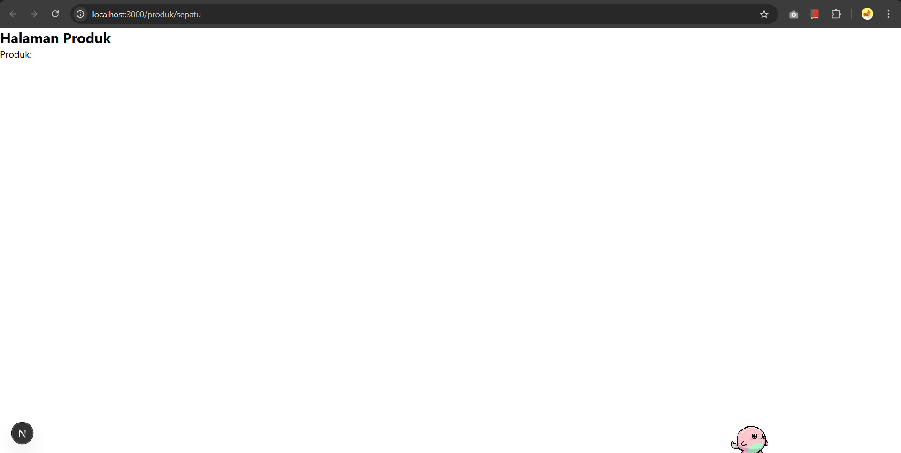
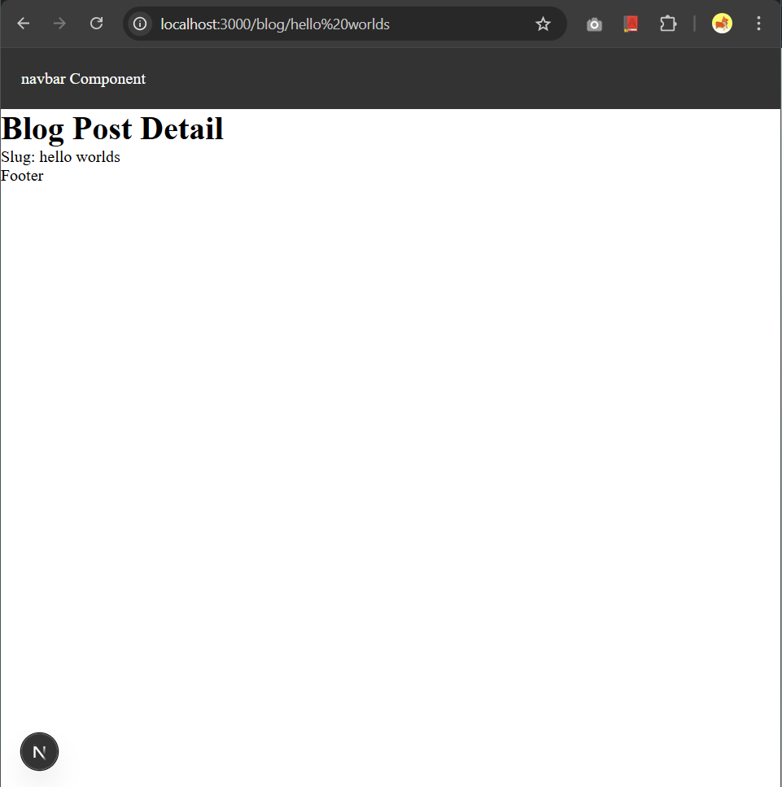
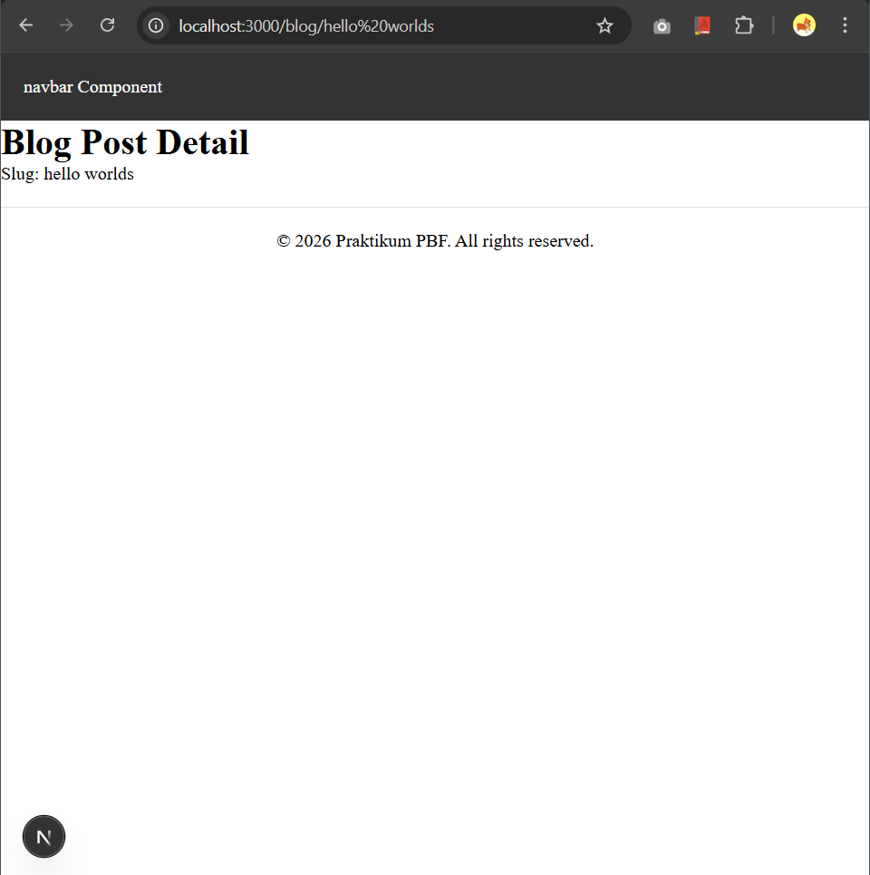
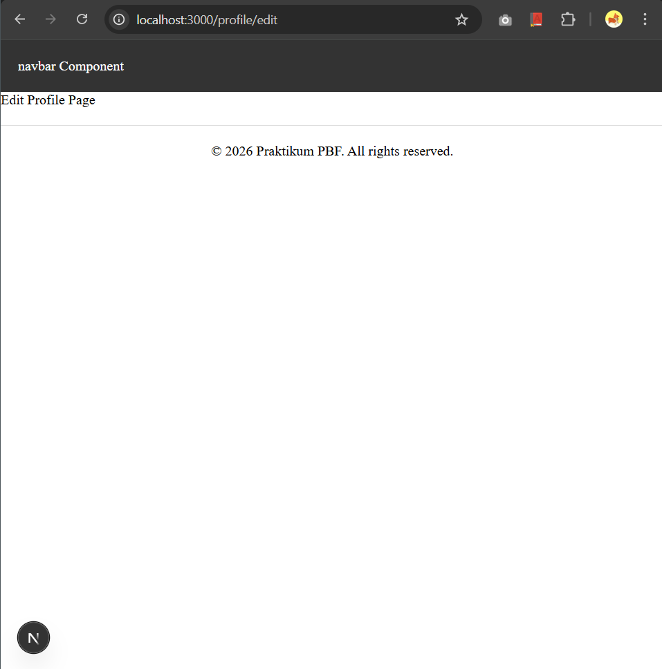

# Laporan Praktikum 2 - Pemrograman Berbasis Framework

**Nama:** Key Firdausi Alfarel  
**NIM:** 2341729186  

---

## Daftar Isi
- [Langkah-Langkah Praktikum](#langkah-langkah-praktikum)
  - [1. Routing Dasar](#1-routing-dasar)
  - [2. Routing Menggunakan Folder](#2-routing-menggunakan-folder)
  - [3. Nested Routing](#3-nested-routing)
  - [4. Dynamic Routing](#4-dynamic-routing)
  - [5. Membuat Komponen Navbar](#5-membuat-komponen-navbar)
  - [6. Membuat Layout Global (App Shell)](#6-membuat-layout-global-app-shell)
  - [7. Implementasi Layout di _app.tsx](#7-implementasi-layout-di-_apptsx)
- [Tugas Mandiri](#tugas-mandiri)
  - [Tugas 1 - Layouting](#tugas-1---layouting)
  - [Tugas 2 - Dynamic Routing](#tugas-2---dynamic-routing)
  - [Tugas 3 - Global Footer](#tugas-3---global-footer)
- [F. Pertanyaan Refleksi](#f-pertanyaan-refleksi)

---

## Langkah-Langkah Praktikum

### 1. Routing Dasar

### 2. Routing Menggunakan Folder

### 3. Nested Routing

### 4. Dynamic Routing

### 5. Membuat Komponen Navbar

### 6. Membuat Layout Global (App Shell)

### 7. Implementasi Layout di _app.tsx

---

## Tugas Mandiri

### Tugas 1 - Layouting

### Tugas 2 - Dynamic Routing

### Tugas 3 - Global Footer

---

## F. Pertanyaan Refleksi

### 1. Apa perbedaan routing berbasis file dan routing manual?
- **File-based Routing** (seperti di Next.js): Rute otomatis ditentukan dari struktur file dan folder di dalam direktori `pages` atau `app`. Developer tidak perlu menulis kode konfigurasi router secara manual.
- **Manual Routing** (seperti React Router): Developer harus mendaftarkan rute secara eksplisit dalam kode (misalnya menggunakan elemen `<Route />`) dan menentukan komponen mana yang harus dirender untuk path tertentu.

### 2. Mengapa dynamic routing penting dalam aplikasi web?
Dynamic routing sangat penting karena memungkinkan satu template halaman (seperti `[slug].tsx`) untuk menangani ribuan rute unik secara dinamis. Hal ini krusial untuk aplikasi seperti blog, e-commerce, atau dashboard user di mana kontennya bersifat arbitrer dan banyak, sehingga tidak efisien jika harus membuat file rute manual untuk setiap item.

### 3. Apa keuntungan menggunakan layout global dibanding memanggil komponen satu per satu?
- **Konsistensi UI**: Memastikan elemen yang selalu ada (seperti Navbar dan Footer) tetap terlihat seragam di seluruh halaman.
- **Efisiensi Kode (DRY)**: Mengurangi pengulangan kode karena logika layout hanya ditulis sekali di satu tempat.
- **Kemudahan Pemeliharaan**: Jika ada perubahan pada struktur global (misalnya menambah link di Navbar), kita cukup mengubah satu file layout dan perubahannya akan langsung berlaku di seluruh aplikasi.