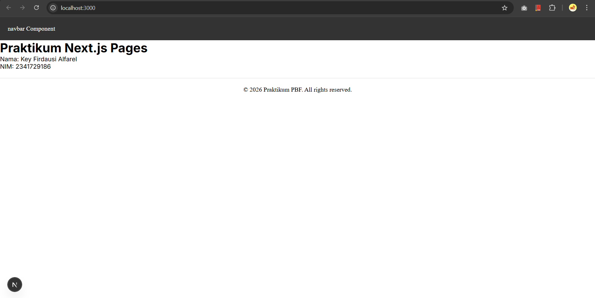
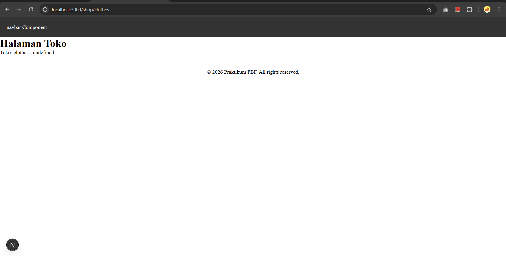
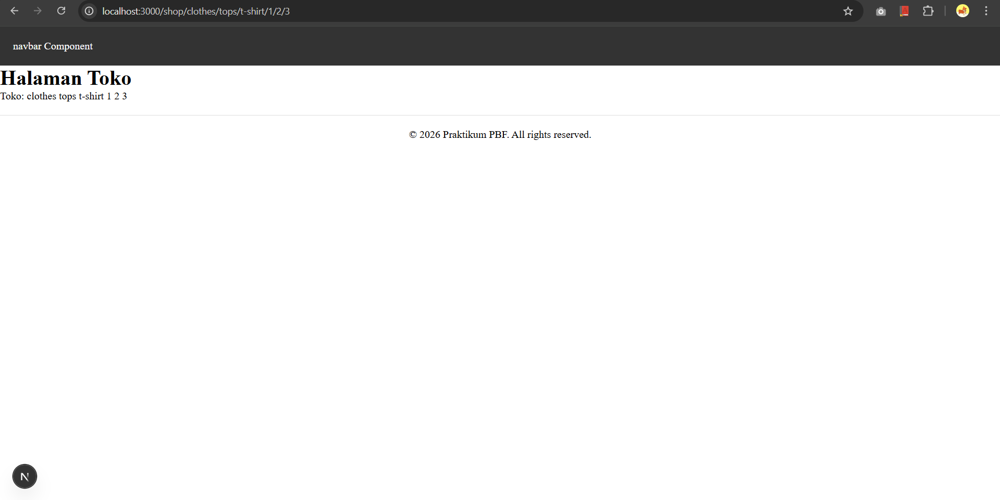

# Laporan Praktikum 2 - Pemrograman Berbasis Framework

**Nama:** Key Firdausi Alfarel  
**NIM:** 2341729186  

---

## Daftar Isi
- [Langkah-Langkah Praktikum](#langkah-langkah-praktikum)

- [Tugas Mandiri](#tugas-mandiri)

- [F. Pertanyaan Refleksi](#f-pertanyaan-refleksi)

---

## Langkah-Langkah Praktikum

### 1. Menjalankan Project

### 2. Membuat Catch-All Route

---

## Tugas Mandiri

---

## F. Pertanyaan Refleksi

