# Laporan Praktikum 2 - Pemrograman Berbasis Framework

**Nama:** Key Firdausi Alfarel  
**NIM:** 2341729186  

---

## Daftar Isi
- [Langkah-Langkah Praktikum](#langkah-langkah-praktikum)
- [Tugas Mandiri](#tugas-mandiri)
- [F. Pertanyaan Evaluasi](#f-pertanyaan-evaluasi)

---

## Langkah-Langkah Praktikum

### 1. Global CSS

### 2. CSS Module (Local Scope)

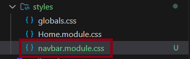

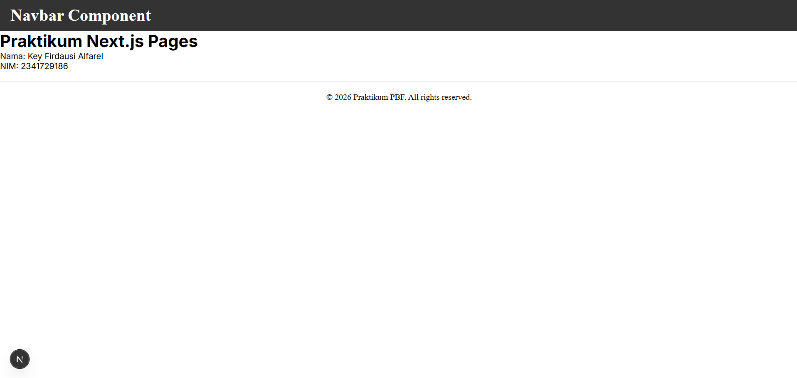

### 3. Styling untuk Pages (CSS Module)

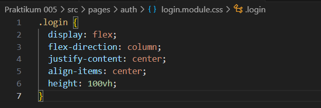
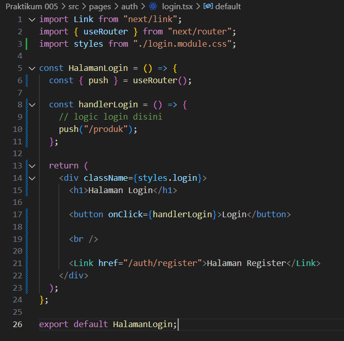

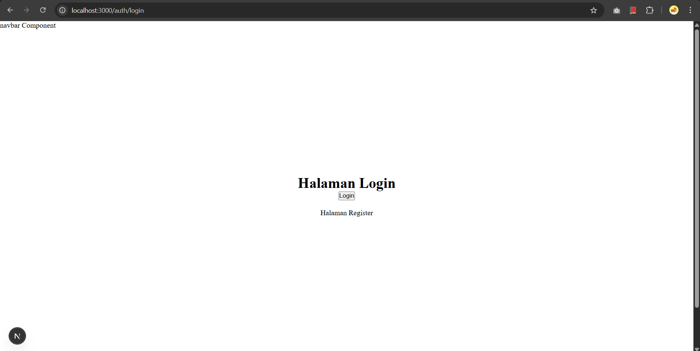

### 4. Styling untuk Components (CSS Module)

### 5. Refactoring Struktur Project (Best Practice)

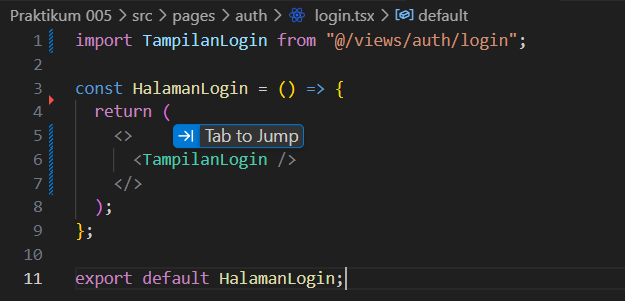

### 6. Inline Styling (CSS-in-JS)

### 7. Kombinasi Global CSS + CSS Module

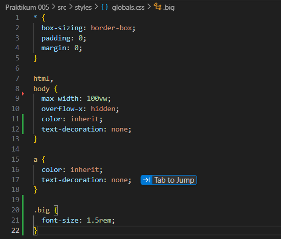

### 8. SCSS (SASS)

### 9. Tailwind CSS

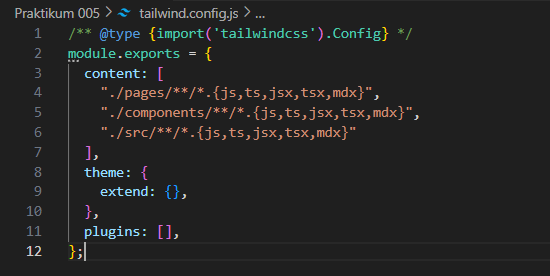

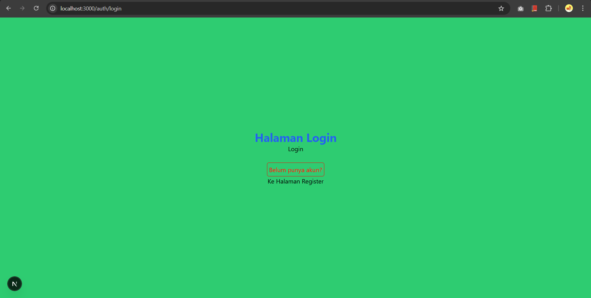

---

## Tugas Mandiri

### Tugas 1

### Tugas 2
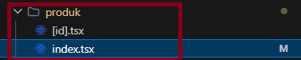

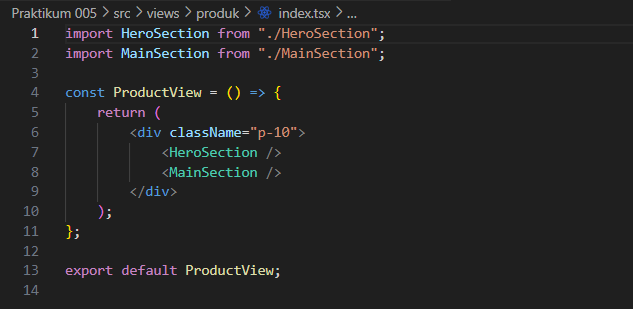

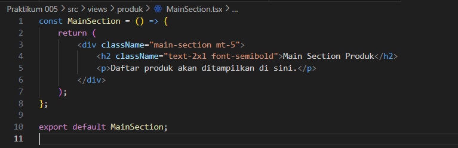

### Tugas 3

---

## F. Pertanyaan Evaluasi

