# Laporan Praktikum 2 - Pemrograman Berbasis Framework

**Nama:** Key Firdausi Alfarel  
**NIM:** 2341729186  

---

## Daftar Isi
- [Langkah-Langkah Praktikum](#langkah-langkah-praktikum)
- [Tugas Mandiri](#tugas-mandiri)
- [F. Pertanyaan Refleksi](#f-pertanyaan-refleksi)

---

## Langkah-Langkah Praktikum

### 1. Menjalankan Project

*run praktikum-006*

*home page UI*

### 2. Membuat Custom Document

*modify document language*

### 3. Pengaturan Title per Halaman

*update title index.tsx*

*hasil pengaturan home page*

### 4. Membuat Custom Error Page (404)

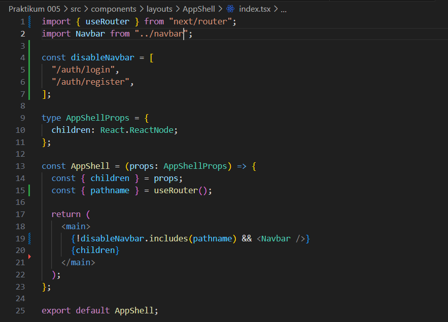
*membuat custom error page*

*membuat kode custom error page*

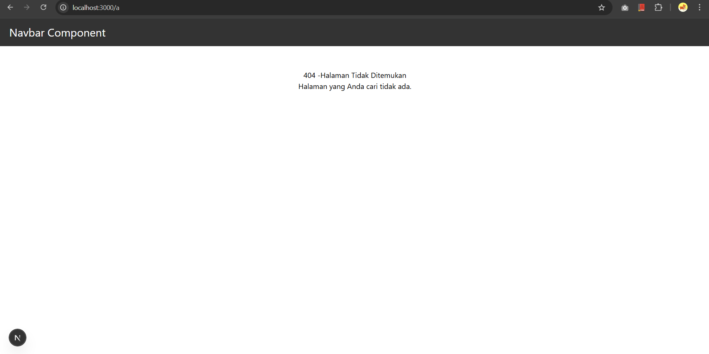
*hasil halaman 404*

### 5. Styling Halaman 404

*membuat custom error style module*

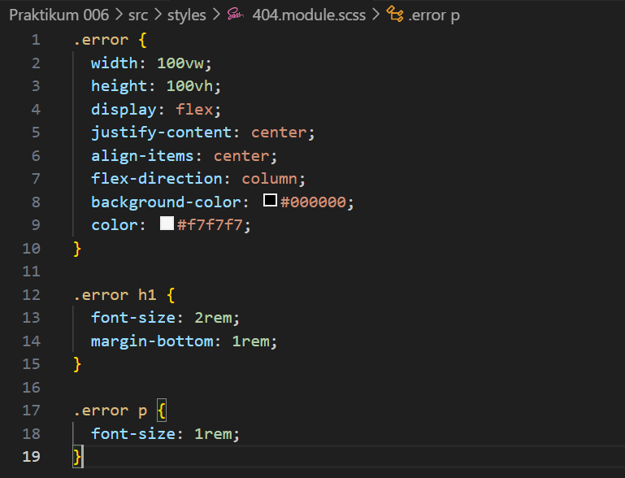
*kode style module*

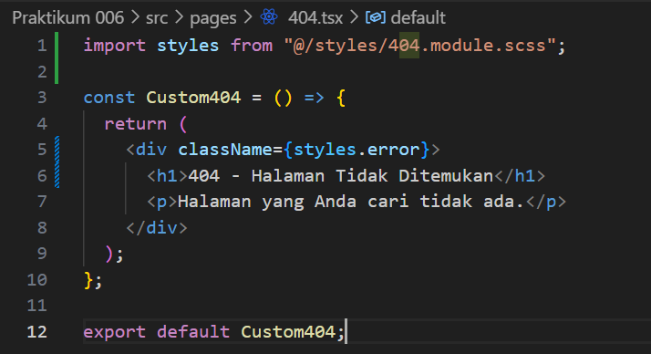
*kode halaman 404*

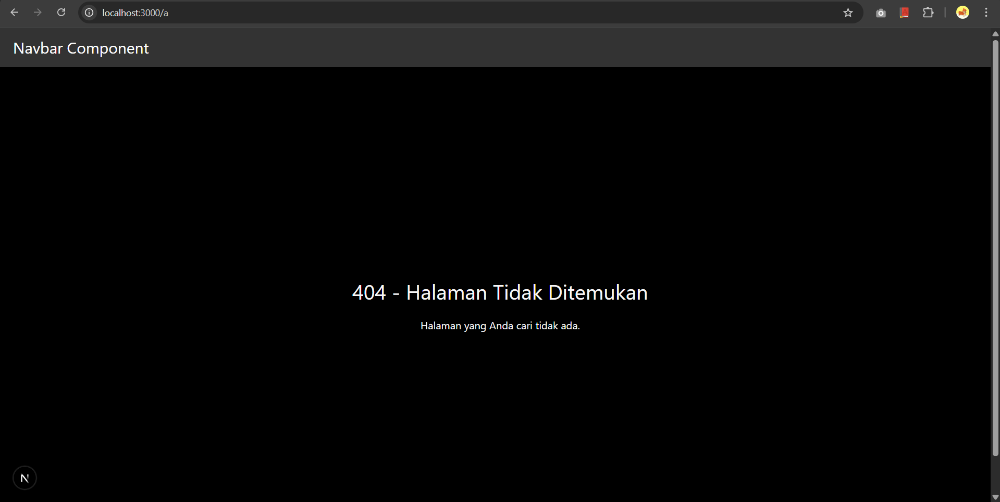
*hasil halaman 404*

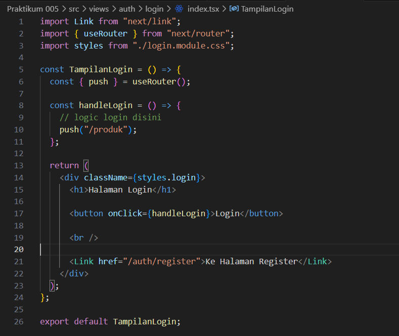
*disable navbar*

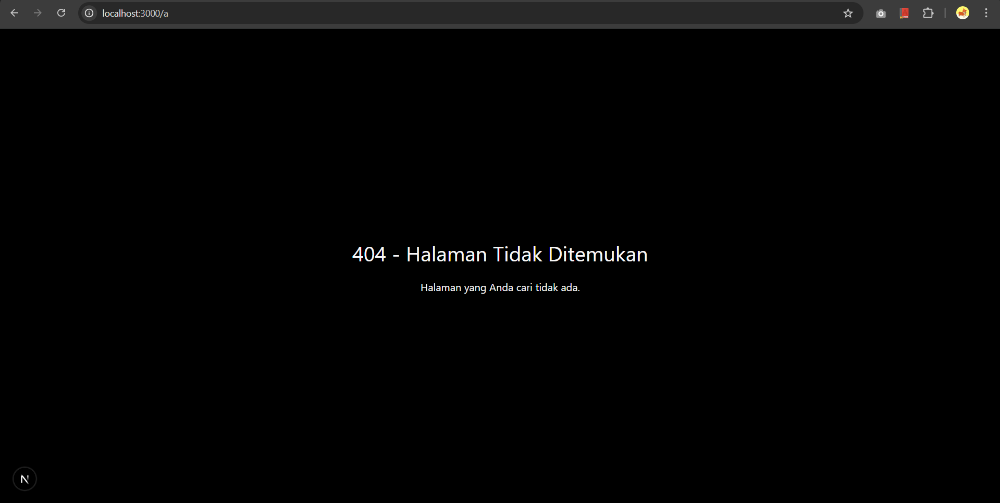
*hasil halaman 404*

### 6. Menampilkan Gambar dari Folder Public

*mengunduh gambar 404*

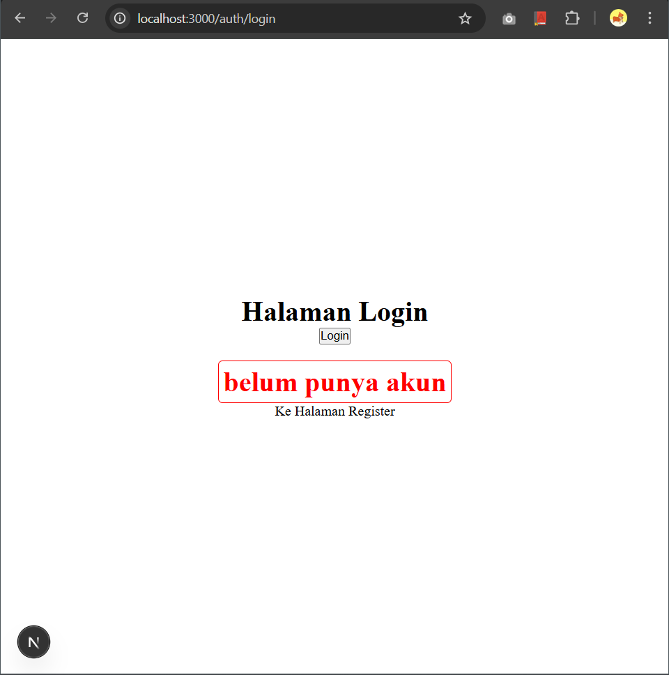
*meletakkan gambar di folder public*

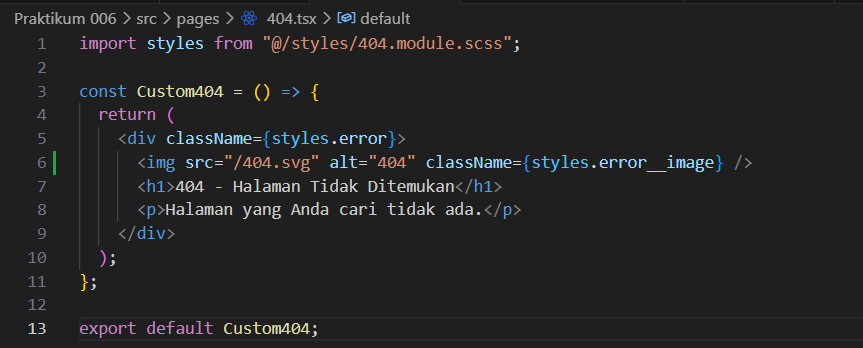
*modifikasi kode custom error page*

*hasil halaman 404*

---

## Tugas Mandiri

### Tugas 1

*mengunduh gambar 404*

*meletakkan gambar di folder public*

*modifikasi kode custom error page*

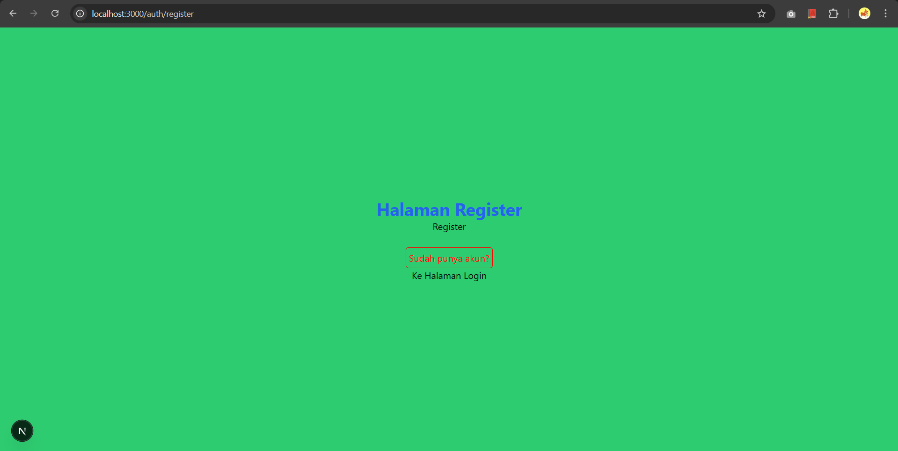
*hasil halaman 404*

### Tugas 2

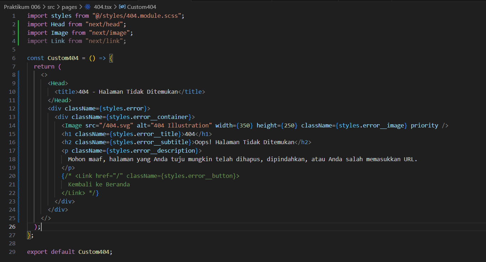
*kode custom error page*

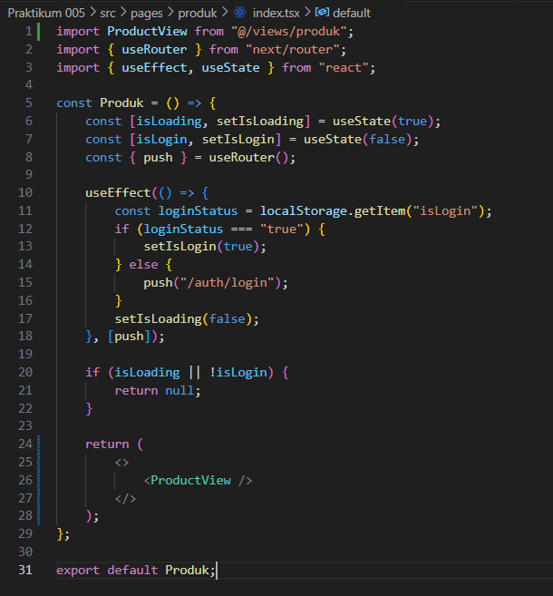
*hasil custom 404*

---

## F. Pertanyaan Refleksi

