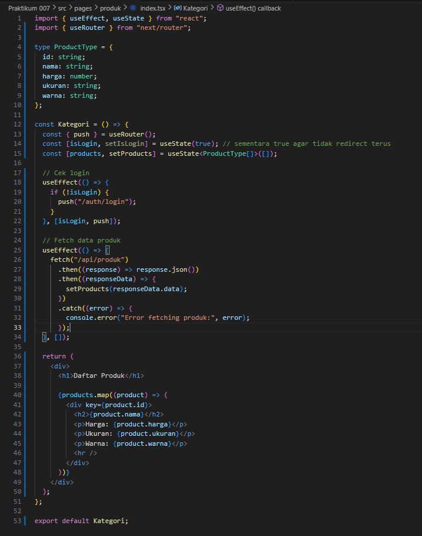

# Laporan Praktikum 6 - Pemrograman Berbasis Framework

**Nama:** Key Firdausi Alfarel  
**NIM:** 2341729186  

---

## Daftar Isi
- [Langkah-Langkah Praktikum](#langkah-langkah-praktikum)
  - [1. Menjalankan Project](#1-menjalankan-project)
- [Tugas Mandiri](#tugas-mandiri)
  - [Tugas 1](#tugas-1)
- [F. Pertanyaan Refleksi](#f-pertanyaan-refleksi)

---

## Langkah-Langkah Praktikum

### 1. Menjalankan Project

*run praktikum-007*

*home page UI*

### 2. Membuat API Produk

*Buat file produk.ts*

*Buat kode api produk*

*Test API*  

### 3. Fetch Data API di Frontend

*Fetch data API*

*Produk page UI*
---

## Tugas Mandiri

### Tugas 1

---

## F. Pertanyaan Refleksi