# Laporan Praktikum 7 - Pemrograman Berbasis Framework

**Nama:** Key Firdausi Alfarel  
**NIM:** 2341729186  

---

## Daftar Isi
- [Langkah-Langkah Praktikum](#langkah-langkah-praktikum)
  - [1. Menjalankan Project](#1-menjalankan-project)
- [Tugas Mandiri](#tugas-mandiri)
  - [Tugas 1](#tugas-1)
- [F. Pertanyaan Refleksi](#f-pertanyaan-refleksi)

---

## Langkah-Langkah Praktikum

### 1. Menjalankan Project

*run praktikum-007*

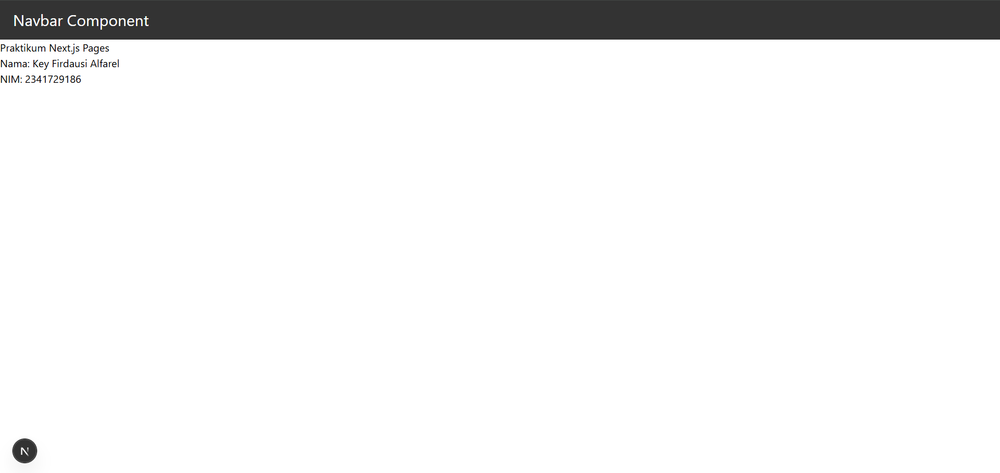
*home page UI*

### 2. Membuat API Produk

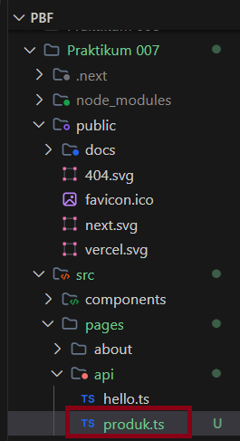
*Buat file produk.ts*

*Buat kode api produk*

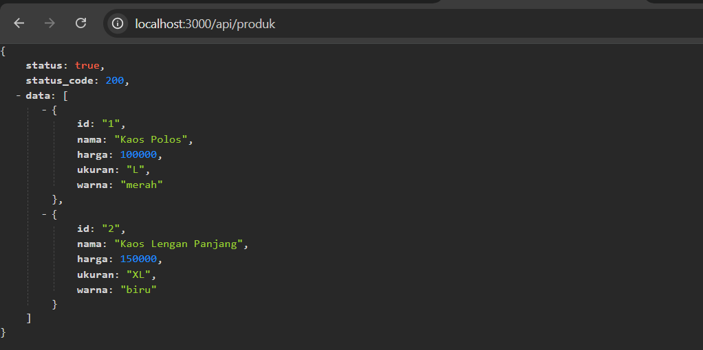
*Test API*  

### 3. Fetch Data API di Frontend

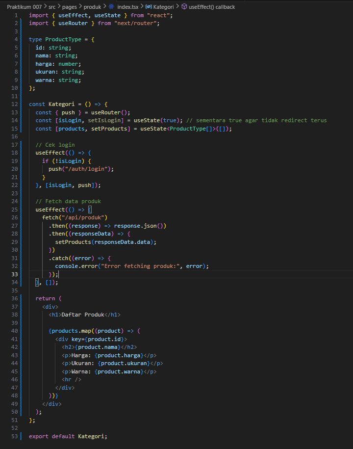
*Fetch data API*

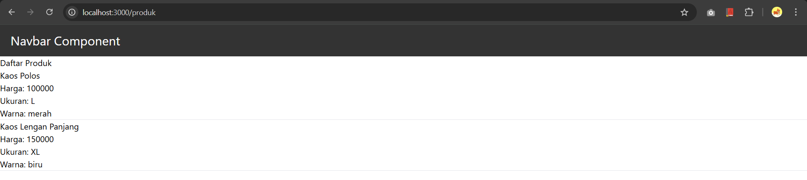
*Produk page UI*

### 5. Setup Firebase

*Go to Firebase Console*

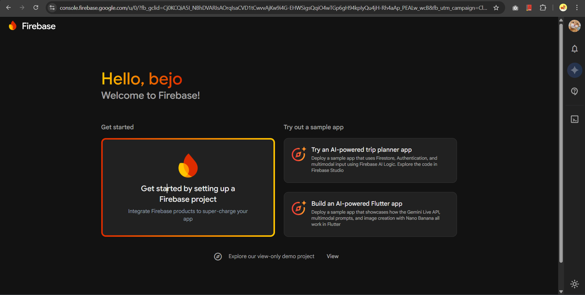
*Get started*

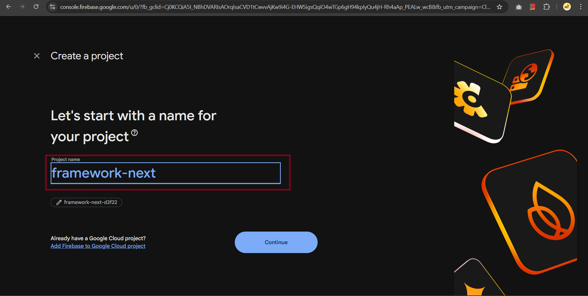
*Create new project*

*Continue Create*

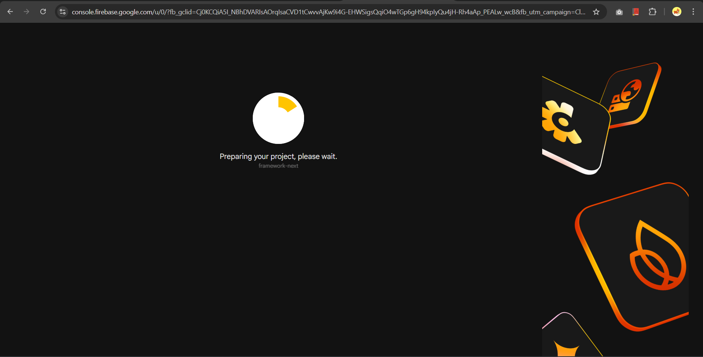
*Loading Firebase Console*

*Complete Create*

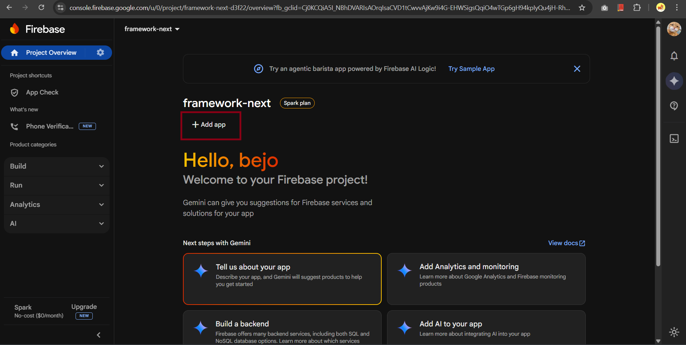
*Add App*

*Naming App*

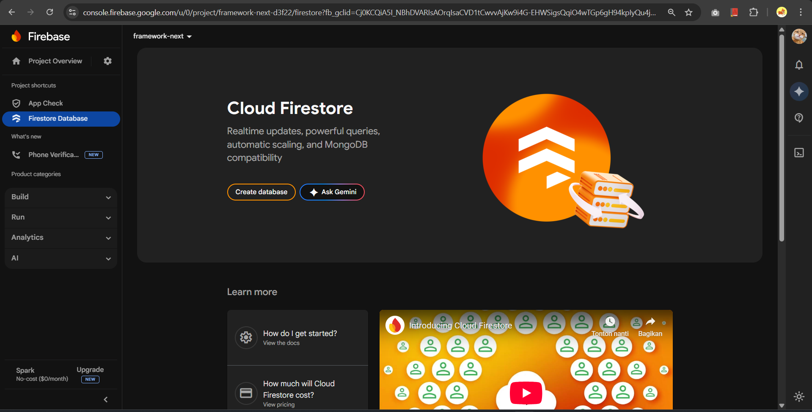
*Back to Console*

*Create database*

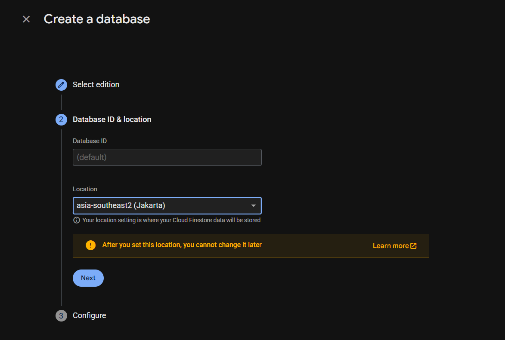
*Select locations*

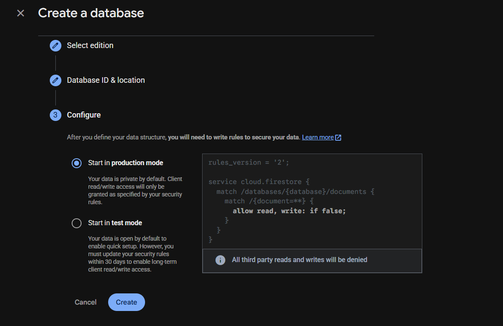
*Confirm Create*

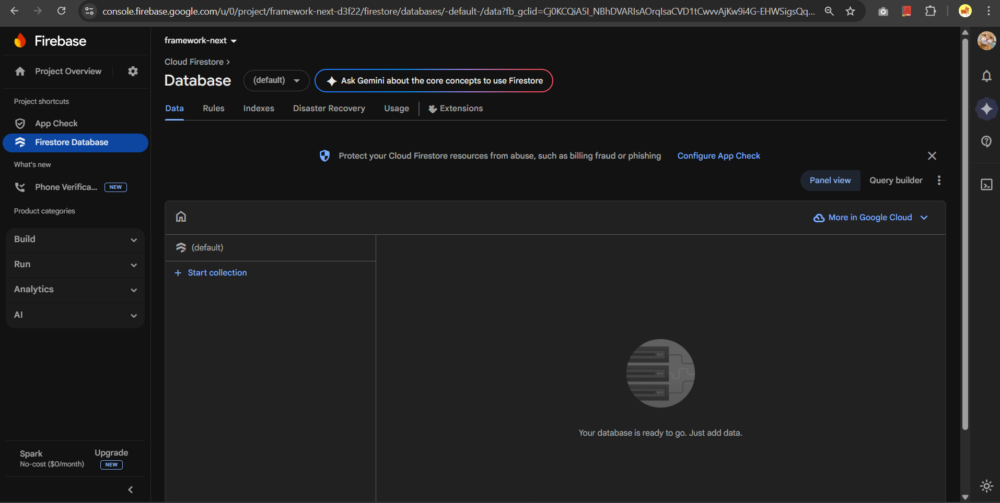
*Firebase Database Console*

*Config rules*

*Create Collections*

*Add Collections*

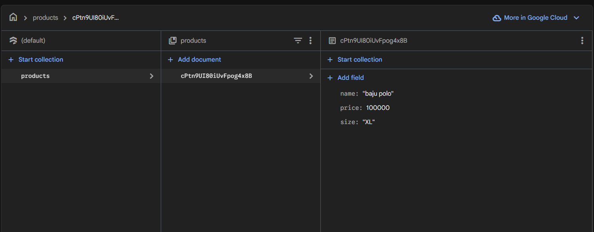
*Collections*

### 6. – Install Firebase

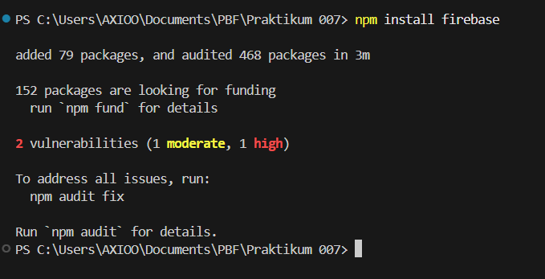

*npm install firebase*

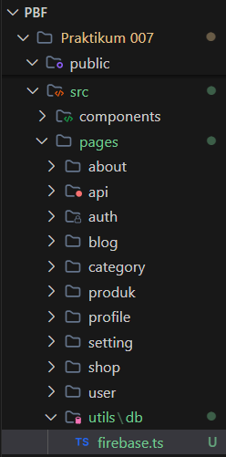

*Buat folder dan file ts pada pages utlis/db/firebase.ts*

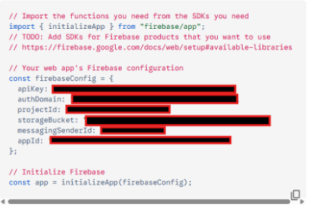

*Copy paste yang ada pada kotak merah ke file firebase.ts*

*Copy paste yang ada pada kotak merah ke file firebase.ts*

### 7. Konfigurasi Environment Variable

*Konfigurasi Environment Variable*

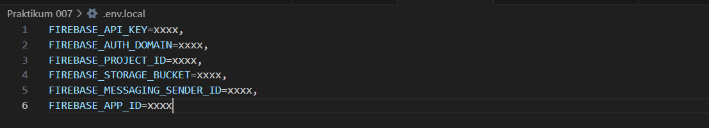

*Konfigurasi Environment Variable*

### 8. Import dan Export Firebase

*Import dan Export Firebase*

---

## Tugas Mandiri

### Tugas 1

---

## F. Pertanyaan Refleksi