# Laporan Praktikum 8 - Pemrograman Berbasis Framework

**Nama:** Key Firdausi Alfarel  
**NIM:** 2341729186  

---

## Daftar Isi

- [Langkah-Langkah Praktikum](#langkah-langkah-praktikum)
- [Tugas Mandiri](#tugas-mandiri)
- [Pertanyaan Evaluasi](#pertanyaan-evaluasi)

---

## Langkah-Langkah Praktikum

### 1. Setup Data Produk

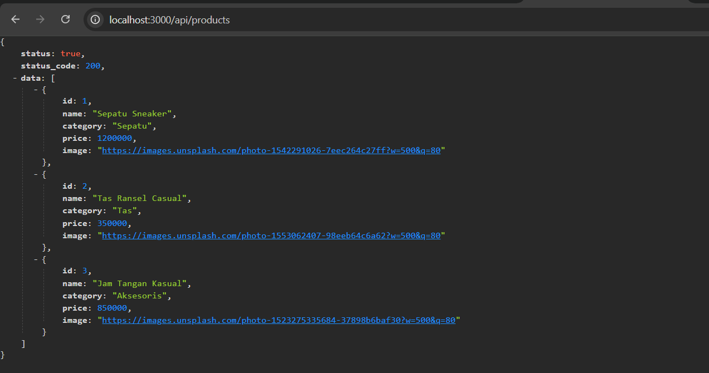  
*membuat file api/products.ts*

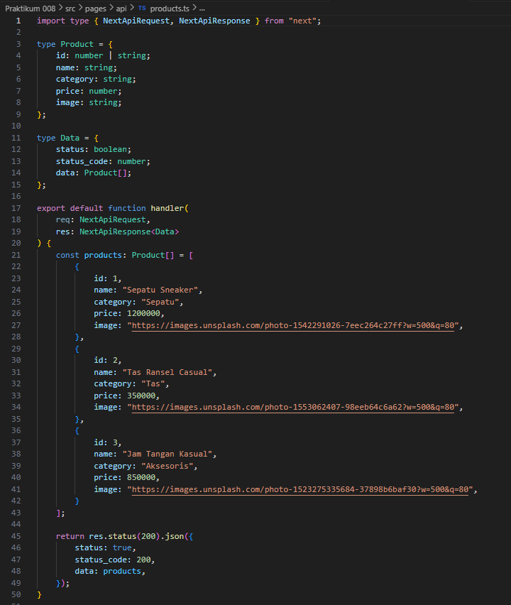  
*cek browser api*

### 2. Implementasi CSR dengan useEffect

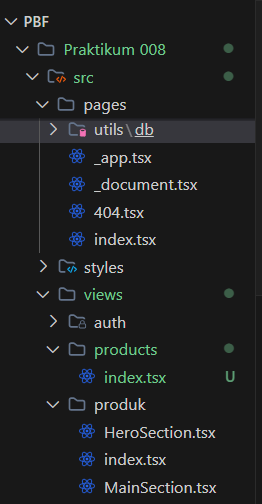  
*membuat file views/products.tsx*

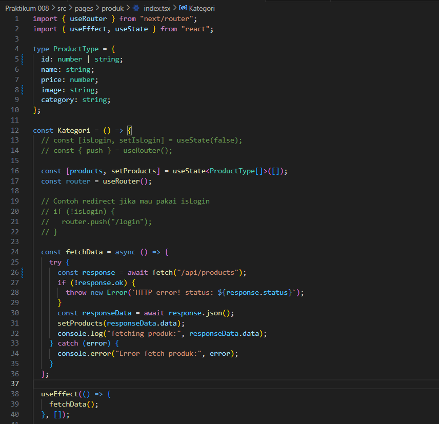  
*kode views/products.tsx*

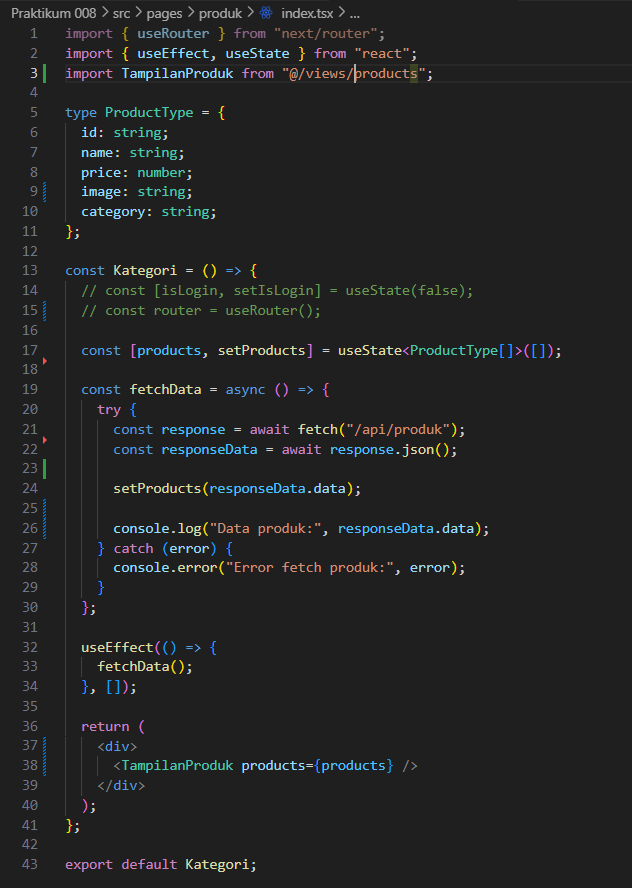  
*membuat file produk/index.tsx*

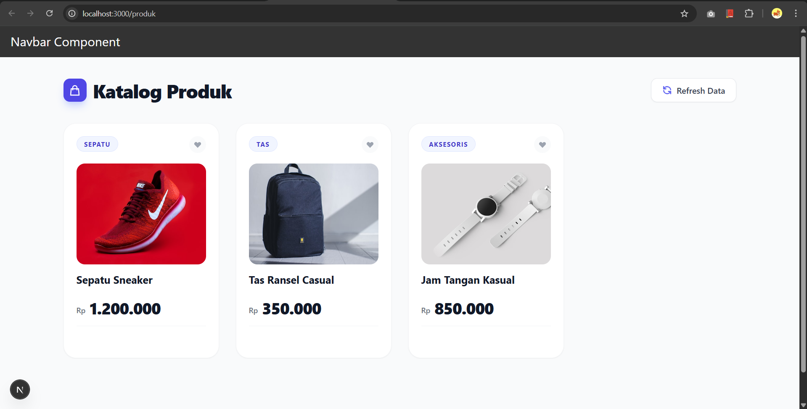  
*tampilan produk*

### 3. Implementasi Skeleton Loading

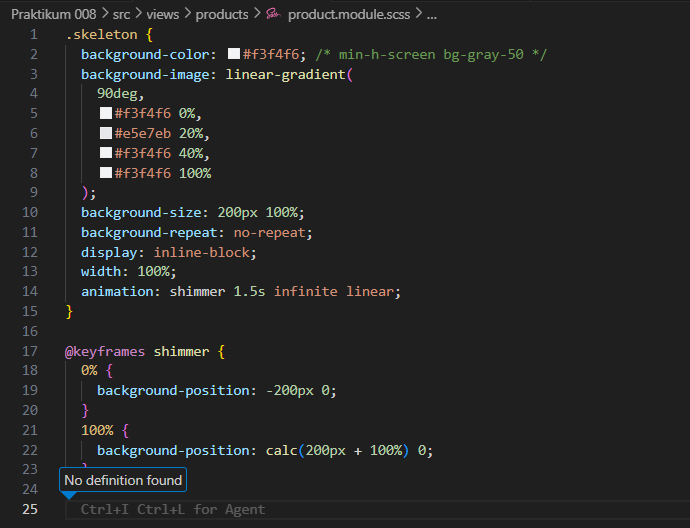  
*kode views/products.tsx*

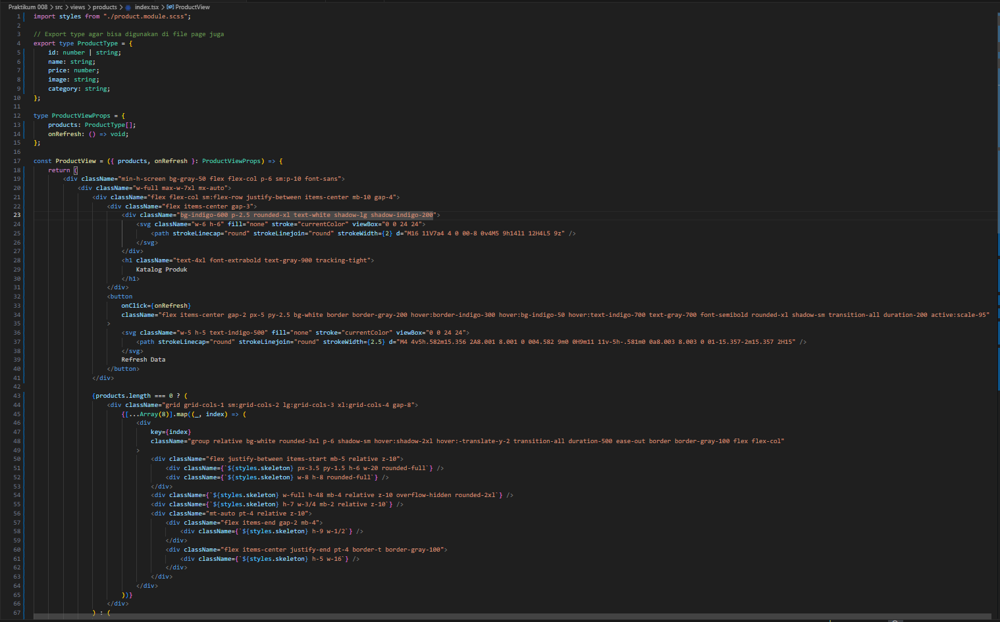  
*kode product.module.scss*

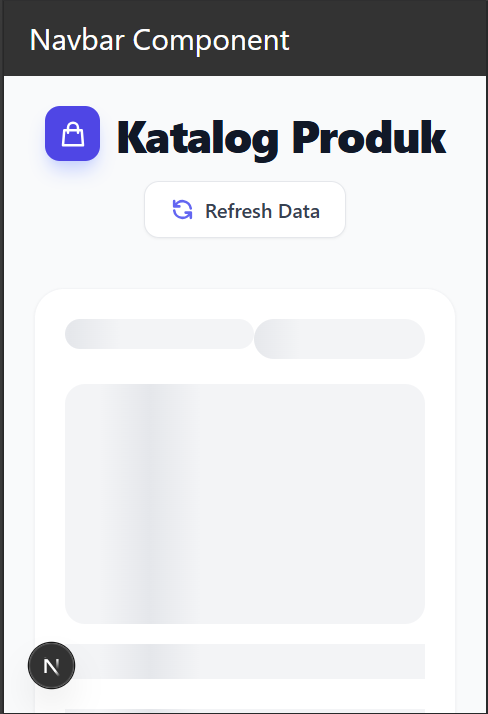  
*tampilan Skeleton Loading*

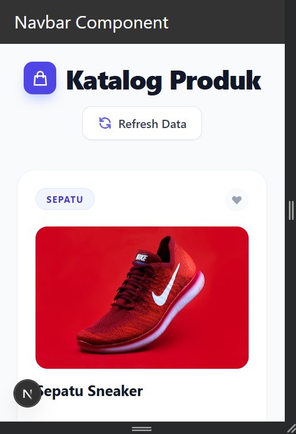  
*tampilan produk*

### 4. Implementasi SWR

  
*membuat file utils/swr/fetcher.ts*

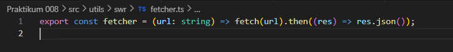  
*kode utils/swr/fetcher.ts*

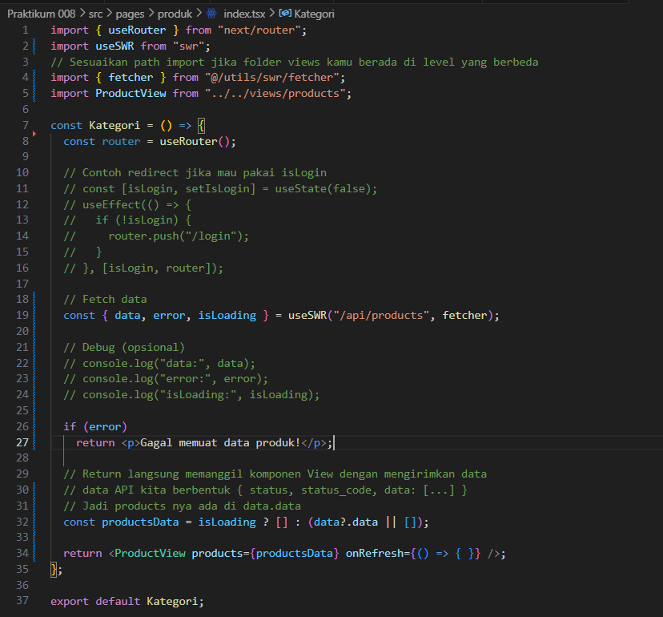  
*modifikasi produk/index.tsx*

**Perbedaan `useEffect` Manual vs SWR:**
- **`useEffect` Manual:** Membutuhkan pengelolaan *state* tambahan yang rumit (seperti `useState` untuk data, status *loading*, dan asinkron *error*). Setiap kali komponen di-*mount*, ia selalu melakukan *fetch* ulang secara naif dari awal yang bisa membebani *server* dan memperlambat *render* jika tidak ditangani dengan baik.
- **SWR (Stale-While-Revalidate):** Pendekatan modern dari Vercel terintegrasi untuk *data fetching*. SWR akan mengembalikan data dari *cache* terlebih dahulu (sehingga *UI* langsung tampil/sangat cepat responsnya), lalu ia mengirimkan *request fetch* secara *background* diam-diam untuk memvalidasi/mendapatkan data terbaru, dan barulah merender ulang *React tree* jika ada pembaruan di server. Kelebihan tambahannya meliputi: validasi ulang saat halaman kembali difokuskan (*revalidate on focus*), penanganan status `isLoading` dan `error` otomatis dalam 1 baris kode (sehingga sangat mengurangi kode *boilerplate*).

---

## Tugas Praktikum

**Tugas Individu**

### **1. Jelaskan perbedaan:**

- **Client Side Rendering (CSR):**
Proses *rendering* antarmuka halaman web sepenuhnya dilakukan di sisi *browser/client* (dengan JavaScript) setelah pengunduhan HTML kosong/minim rampung. 
  - **Kelebihan:** Sangat interaktif bak aplikasi *native* setelah muatan awal (_Single Page Application_), transisi halaman mulus tanpa *reload*.
  - **Kekurangan:** *Initial load* (waktu muat pertama) cenderung lambat karena mengunduh *bundle* JS, kurang optimal untuk SEO jika *crawler* tidak mengeksekusi JS.

- **Server Side Rendering (SSR):**
Proses *rendering* kode HTML dari komponen React dieksekusi setiap kali ada permintaan (request) langsung di server, untuk kemudian *file* HTML utuh yang sudah jadi dikirimkan ke *browser*.
  - **Kelebihan:** *Initial load* cepat (HTML dapat langsung dirender), sangat bagus untuk SEO (*crawler* melihat isi penuh), data yang disajikan selalu terbaru (karena direquest *on-demand*).
  - **Kekurangan:** Pemrosesan bisa membebani unjuk kerja *server* jika *traffic* sangat tinggi karena setiap satu kunjungan/klik tautan memicu respon penyusunan dari awal di *server* (*slower Time to First Byte*).

- **Static Site Generation (SSG):**
Proses *rendering* kode HTML dilakukan **hanya satu kali saat *build time*** (waktu kompilasi project atau *deploy*). HTML statis yang dihasilkan disimpan dan disajikan berulang-kali begitu saja melalui CDN dengan sangat cepat.
  - **Kelebihan:** Performa yang paling cepat dan superior karena HTML sudah siap disajikan lewat *cache* CDN, ramah SEO, *server resource* yang sangat sedikit.
  - **Kekurangan:** Data otomatis bisa menjadi basi (*stale*) karena tidak di-*update* secara *real-time* layaknya SSR. Jika ada konten/data baru, aplikasi harus di-*build* ulang (kecuali menggunakan pendekatan hibrida seperti *Incremental Static Regeneration*/ISR di Next.js).

### **2. Tugas 2**  

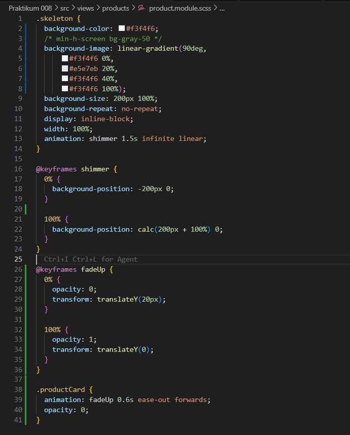  
*kode views/products.tsx*

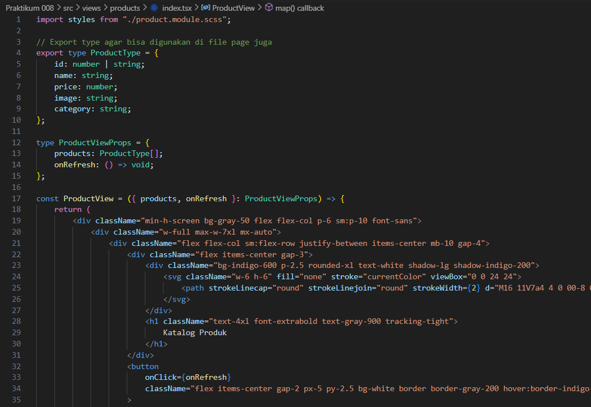  
*kode product.module.scss*

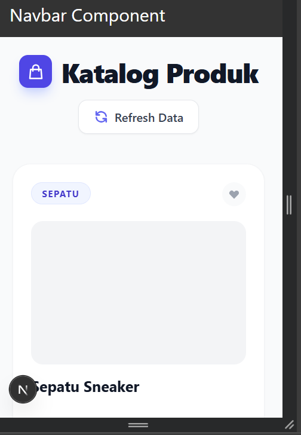  
*tampilan Skeleton Loading*

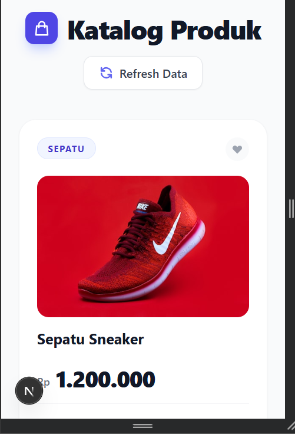  
*tampilan produk*

### **3. Refactor kode dari useEffect menjadi SWR.**

Refactoring manajemen *data fetching* dari penggunaan `useEffect` manual beralih ke *library* pengelolaan data *fetching* reaktif **SWR** (Stale-While-Revalidate). Ini menyederhanakan kode secara drastis (yang awalnya di-_handle_ dengan `useState` dan `useEffect`, kini hanya menjadi 1 baris *destructuring* dari `useSWR`), sekaligus memberikan sistem *caching* dan fitur *revalidate* di layar latar.

  
*membuat file utils/swr/fetcher.ts*

  
*kode utils/swr/fetcher.ts*

  
*modifikasi produk/index.tsx*

  
*tampilan produk*