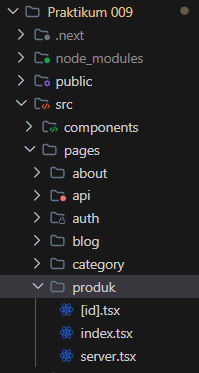
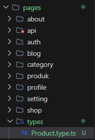
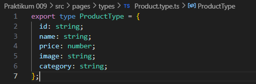
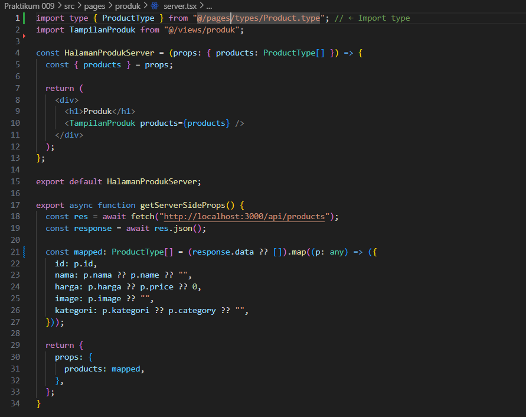

# Laporan Praktikum 8 - Pemrograman Berbasis Framework

**Nama:** Key Firdausi Alfarel  
**NIM:** 2341729186  

---

## Daftar Isi

- [Langkah-Langkah Praktikum](#langkah-langkah-praktikum)
- [Tugas Praktikum](#tugas-praktikum)
---

## Langkah-Langkah Praktikum

### 1. Setup Data Produk

*pages/products/server.tsx*

*http://localhost:3000/produk/server*

*http://localhost:3000/produk*

### 2. Implementasi getServerSideProps pada server.tsx

*http://localhost:3000/produk/server*

*http://localhost:3000/produk*

### 3. Refactor Type ( produk type )

*membuat file types/Product.type.ts*

*http://localhost:3000/produk/server*

*http://localhost:3000/produk*

---

## Tugas Praktikum

### **1. Jelaskan perbedaan:**

