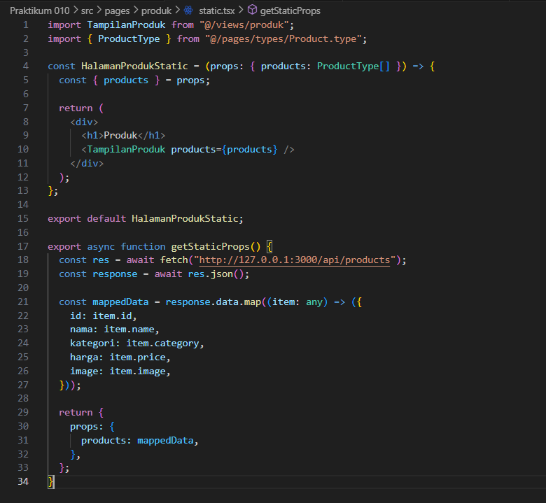
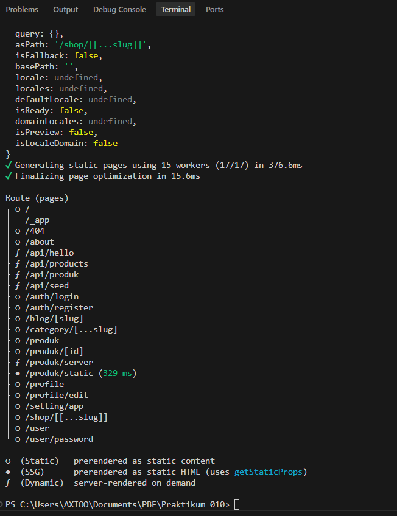
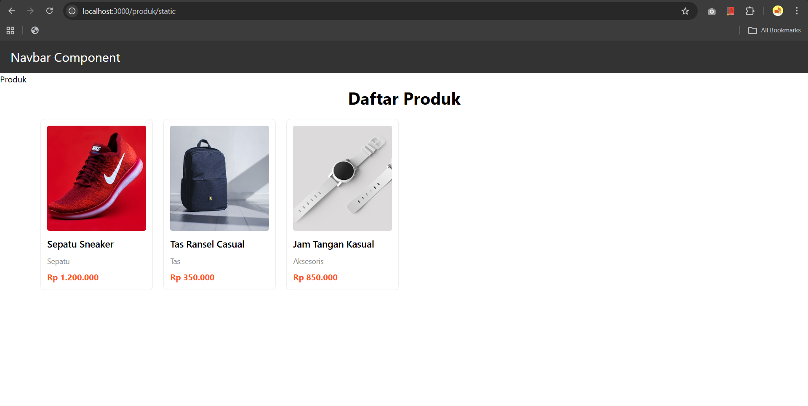

# Laporan Praktikum 10 - Pemrograman Berbasis Framework

**Nama:** Key Firdausi Alfarel  
**NIM:** 2341729186  

---

## Daftar Isi

- [Langkah-Langkah Praktikum](#langkah-langkah-praktikum)
- [E. Studi Analisis](#e-studi-analisis)
---

## Langkah-Langkah Praktikum

### 1. Setup Halaman Static

*Buat file baru pada pages/products/static.tsx*

*Modifikasi file static.tsx*

*Tampilan halaman static*

### 2. Setup Halaman Server

*Memindahkan Halaman*

*npm dev*

*Tampilan npm build*

*Execute npm start*

*Tampilan npm start*

*Tampilan halaman produk/static*

### Uji 1

*Tambah data di firebase*

*Tampilan halaman produk*

*Tampilan halaman produk/server*

*Tampilan halaman produk/static*

---

## E. Studi Analisis

