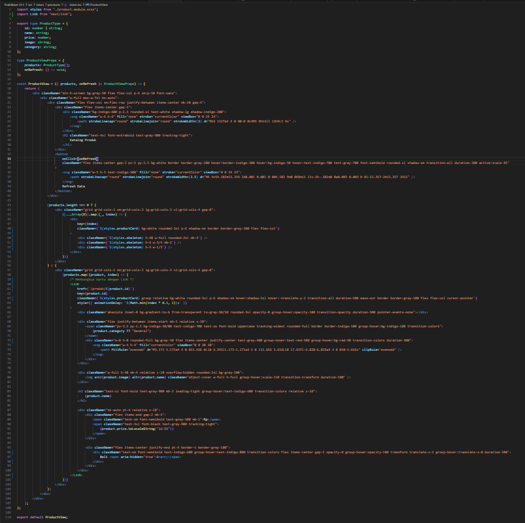
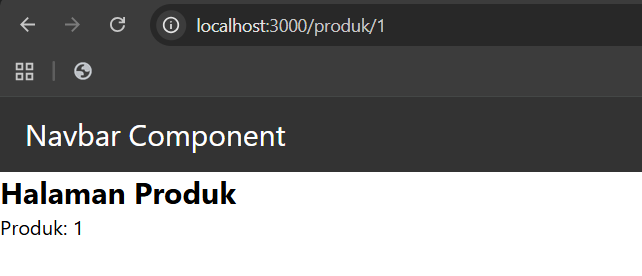
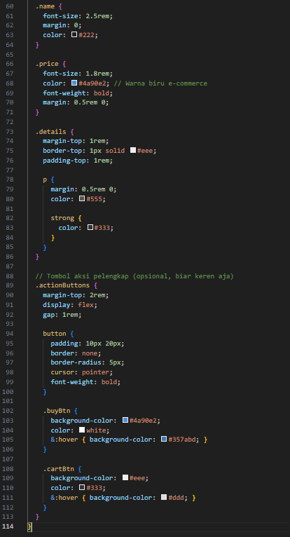
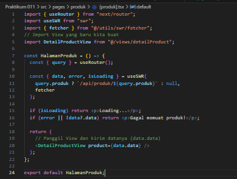

# Laporan Praktikum 11 - Pemrograman Berbasis Framework

**Nama:** Key Firdausi Alfarel  
**NIM:** 2341729186  

---

## Daftar Isi

- [Langkah-Langkah Praktikum](#langkah-langkah-praktikum)

---

## Langkah-Langkah Praktikum

### 1. Membuat Dynamic Route

**Modifikasi view Product**

**Halaman /produk**

### 2. Implementasi CSR (Client Rendering)

![Modifikasi pages/produk/[produk].tsx](public/docs/langkah-2a.png)

**Modifikasi pada file [produk].tsx pada folder src/pages/produk/**

![Modifikasi pages/api/[...produk].tsx](public/docs/langkah-2b.png)

**Pada file produk.ts pada folder pages/api di rename menjadi [[...product]].ts**

![Modifikasi pages/api/[...produk].tsx](public/docs/langkah-2c.png)

**Modifikasi file [[...produk]].ts pada folder pages/api**

**Modifikasi file produk/index.tsx**

**Jalankan browser http://localhost:3000/produk/4TX9oCSf0pWVHEyjjG1P"**

**Ketika alamat tidak ditemukan maka akan menampilkan status kode 404**

**Modifikasi file detailProduct.module.scss pada folder src/views/detailProduct**

![Modifikasi views/pages/produk/[product].tsx](public/docs/langkah-2h.png)

**Modifikasi views/pages/produk/[product].tsx**

**Modifikasi pages/produk/index.tsx**

**Hasil Akhir**

### 3. Implementasi SSR

**Modifikasi pada file server.tsx pada folder src/pages/produk/**

**Hasil Halaman Produk**

**Hasil Halaman Produk detail**

