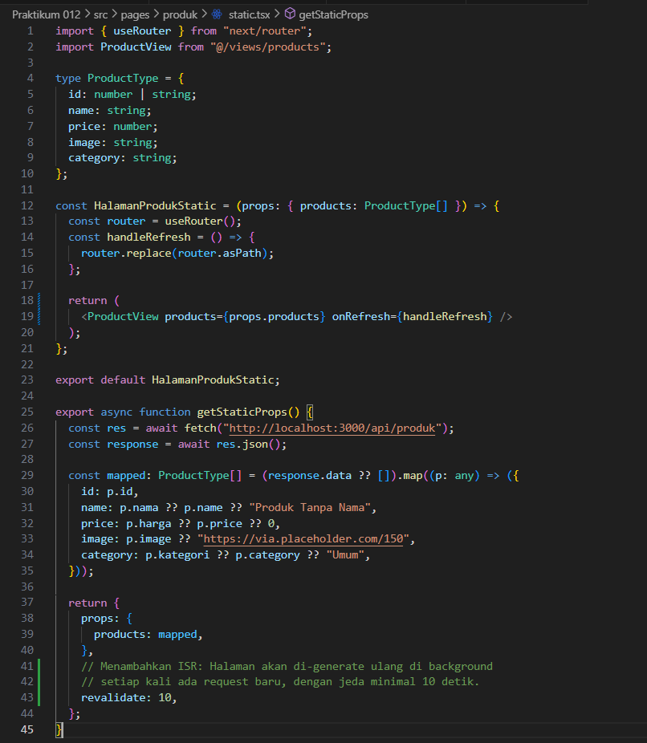
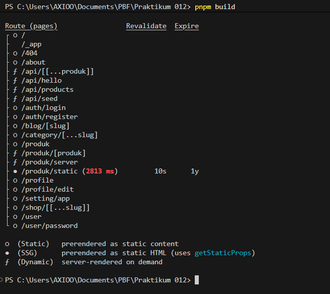
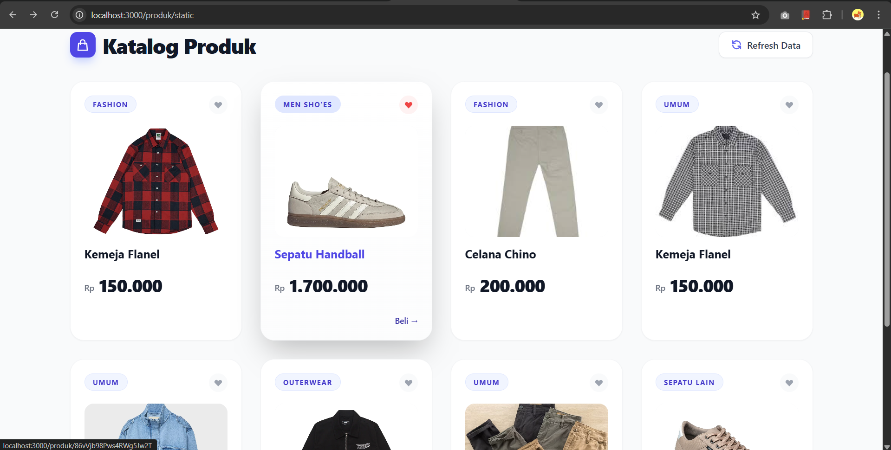
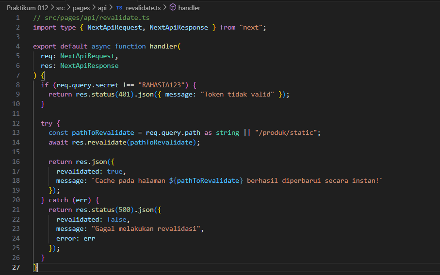
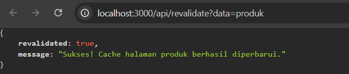
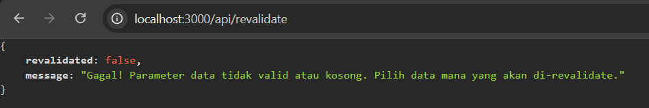

# Laporan Praktikum 12 - Pemrograman Berbasis Framework

**Nama:** Key Firdausi Alfarel  
**NIM:** 2341729186  

---

## Daftar Isi

---

## Langkah-Langkah Praktikum

### 1. Tambahkan revalidate

*Menambah revalidate*

### 2. Pengujian ISR

*npm build*

*Menambah data baru di firebase*

*Sebelum 10 detik*

*Setelah 10 detik dan direfresh*

### 3. Buat API Revalidate

*Buat API Revalidate*

### 4. Tambahkan Parameter Data

**Modifikasi API Revalidate**

**Revalidate Berhasil**

**Revalidate Gagal**