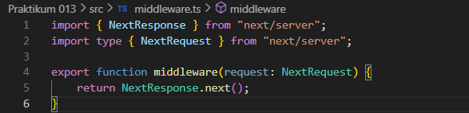
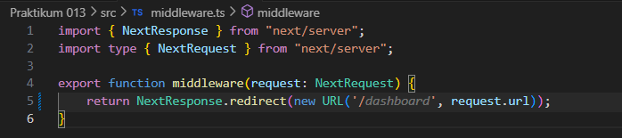
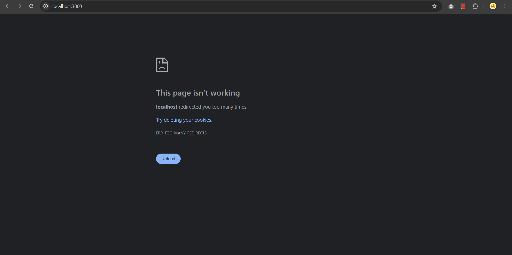
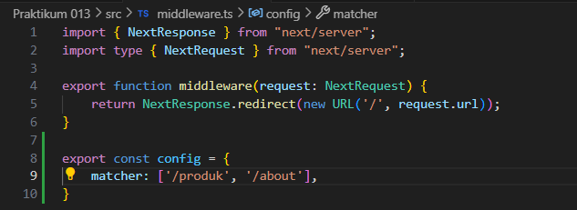
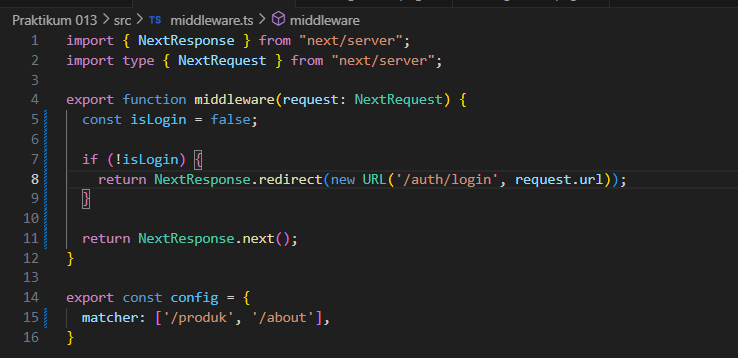

# Laporan Praktikum 12 - Pemrograman Berbasis Framework

**Nama:** Key Firdausi Alfarel  
**NIM:** 2341729186  

---

## Daftar Isi

- [Langkah-Langkah Praktikum](#langkah-langkah-praktikum)

---

## Langkah-Langkah Praktikum

### 1. Membuat Middleware

*Modifikasi pages/index.tsx*

*Menambah file src/middleware.ts*

### 2. Struktur Dasar Middleware

*Memodifikasi file middleware.ts*

### 3. Redirect Sederhana

*Redirect ke dashboard*

*Error to many request*

### 4. Batasi Route Tertentu

*Membatasi produk dan about page*

### 5. Simulasi Sistem Login

*Menambah kode simulasi login*