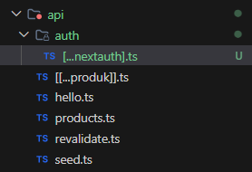

# Laporan Praktikum 13 - Pemrograman Berbasis Framework
# Laporan Praktikum 13 - Pemrograman Berbasis Framework

**Nama:** Key Firdausi Alfarel  
**NIM:** 2341729186  

---

## Daftar Isi

- [Langkah-Langkah Praktikum](#langkah-langkah-praktikum)
  - [1. Membuat Middleware](#1-membuat-middleware)
  - [2. Struktur Dasar Middleware](#2-struktur-dasar-middleware)
  - [3. Redirect Sederhana](#3-redirect-sederhana)
  - [4. Batasi Route Tertentu](#4-batasi-route-tertentu)
  - [5. Simulasi Sistem Login](#5-simulasi-sistem-login)
- [Pengujian](#pengujian)
  - [Uji 1](#uji-1)
  - [Uji 2](#uji-2)
  - [Uji 3](#uji-3)
- [G. Pertanyaan Analisis](#g-pertanyaan-analisis)

---

## Langkah-Langkah Praktikum

### 1. Membuat Middleware

*Modifikasi pages/index.tsx*

*Menambah file src/middleware.ts*

### 2. Struktur Dasar Middleware

*Memodifikasi file middleware.ts*

### 3. Redirect Sederhana

*Redirect ke dashboard*

*Error to many request*

### 4. Batasi Route Tertentu

*Membatasi produk dan about page*

### 5. Simulasi Sistem Login

*Menambah kode simulasi login*

## Pengujian

### Uji 1

*Akses Produk*

*Redirect ke login*

### Uji 2

*Modifikasi isLogin menjadi true*

*Tampilan Halaman Produk*

### Uji 3

*Modifikasi isLogin false*

*Akses /about*

*Redirect ke login*

---

## G. Pertanyaan Analisis

1. **Mengapa middleware lebih aman dibanding useEffect?**  
   Middleware berjalan di sisi server (Edge runtime) sebelum request dari pengguna mencapai halaman. Karena itu, pengecekan seperti autentikasi akan dilakukan sebelum halaman di-render dan dikirim ke browser. Sebaliknya, `useEffect` berjalan di sisi klien (browser) setelah halaman di-render, yang memungkinkan pengguna mematikan JavaScript untuk melewati pengecekan keamanan. Selain itu, dengan `useEffect`, logika autentikasi bisa terekspos di sisi klien.

2. **Mengapa middleware tidak menimbulkan glitch?**  
   Middleware melakukan pengalihan (redirect) secara langsung di sisi server sebelum halaman atau respon dikirim ke browser. Akibatnya, browser akan langsung memuat dan me-render halaman tujuan baru tanpa memuat halaman yang dibatasi terlebih dahulu. Ini berbeda dengan `useEffect`, karena pada `useEffect` klien akan merender halaman yang dibatasi secara singkat terlebih dahulu baru dialihkan, yang menimbulkan efek kedipan (*glitch* atau *Flash of Unstyled Content*).

3. **Apa risiko jika semua halaman diproteksi tanpa pengecualian?**  
   Risiko utamanya adalah memicu *infinite redirect loop* (pengalihan yang terjadi terus-menerus). Misalnya, jika pengguna belum login dan semua halaman diproteksi, middleware akan mengarahkannya ke halaman `/login`. Namun, karena `/login` juga diproteksi, middleware akan mengarahkannya lagi ke `/login` tanpa henti, menyebabkan error pada browser seperti `ERR_TOO_MANY_REDIRECTS`. Selain itu, file publik seperti CSS, JavaScript, dan gambar juga berpotensi terblokir.

4. **Kapan middleware tidak diperlukan?**  
   Middleware tidak diperlukan jika kita membuat aplikasi web statis sederhana (seperti company profile atau portofolio) yang tidak memiliki sistem autentikasi dan sesi pengguna. Selain itu, jika aksi yang dilakukan murni berkaitan dengan interaksi UI setelah proses render halaman di klien, penggunaan *hook* React standar seperti `useEffect` jauh lebih sesuai.

5. **Apa perbedaan middleware dan API route?**  
   - **Middleware:** Berjalan sebelum sebuah request mencapai rute tujuan (biasanya di *Edge Runtime*). Fungsi utamanya adalah menerima request lebih awal untuk melakukan tugas global seperti *redirect*, modifikasi header, dan otorisasi sebelum request diproses oleh halaman atau API.
   - **API Route:** Berfungsi sebagai *endpoint backend* yang berada di sisi server (biasanya di *Node.js Runtime*). Fungsi utamanya adalah memproses logika bisnis terdedikasi, berinteraksi dengan sebuah *database*, dan memberikan respon balikan ke pada klien berupa data berformat spesifik (*misalnya JSON*).
