# Laporan Praktikum 13 - Pemrograman Berbasis Framework
# Laporan Praktikum 13 - Pemrograman Berbasis Framework

**Nama:** Key Firdausi Alfarel  
**NIM:** 2341729186  

---

## Daftar Isi

- [Langkah-Langkah Praktikum](#langkah-langkah-praktikum)
- [Pengujian](#pengujian)
- [G. Pertanyaan Analisis](#g-pertanyaan-analisis)

---

## Langkah-Langkah Praktikum

### 1. Membuat Middleware

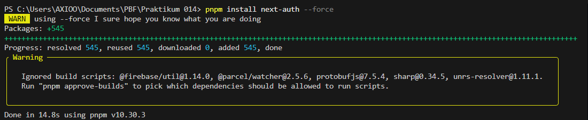

*install next-auth*

### 2. Konfigurasi API Auth

![Membuat file /api/auth/[...nextauth].ts](public/docs/langkah-2a.png)

*Membuat file /api/auth/[...nextauth].ts*

![Modifikasi kode /api/auth/[...nextauth].ts](public/docs/langkah-2b.png)

*Modifikasi kode /api/auth/[...nextauth].ts*

### 3. Tambahkan Secret

*Generate secret base64*

*Menambahkan secret di .env.local*

### 4. Tambahkan SessionProvider

*Menambahkan session provider di _app.tsx*

### 5. Tambahkan Tombol Login & Logout

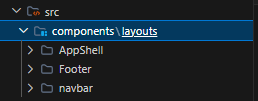

*Buka file /components/layouts/navbar/index.tsx*

*Modifikasi file /components/layouts/navbar/index.tsx*

*Modifikasi file styles/navbar.module.css*

*Buka halaman /**

*Tampilan Halaman Login*

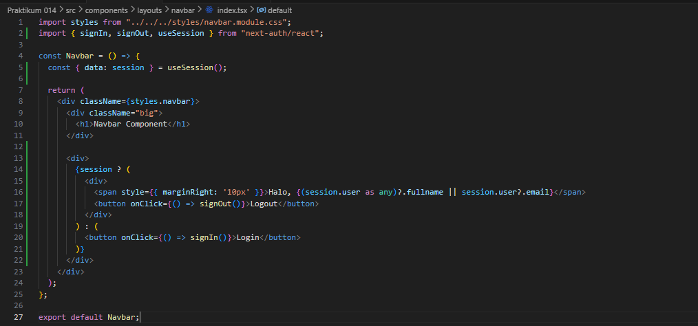

*Menambahkan session di file /components/layouts/navbar/index.tsx*

*Coba login*

*Tampilan home page*

*Logout*

### 6. Menambahkan Data Tambahan (Full Name)

![Modifikasi file /pages/api/auth/[...nextauth].ts](public/docs/langkah-6a.png)

*Modifikasi file /pages/api/auth/[...nextauth].ts*

*Modifikasi file styles/navbar.module.css*

*Modifikasi file /components/layouts/navbar/index.tsx*

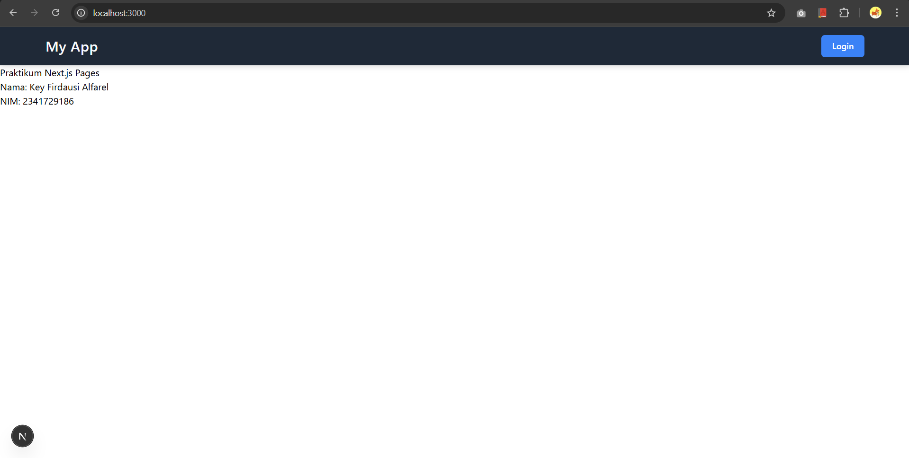

*Buka halaman /**

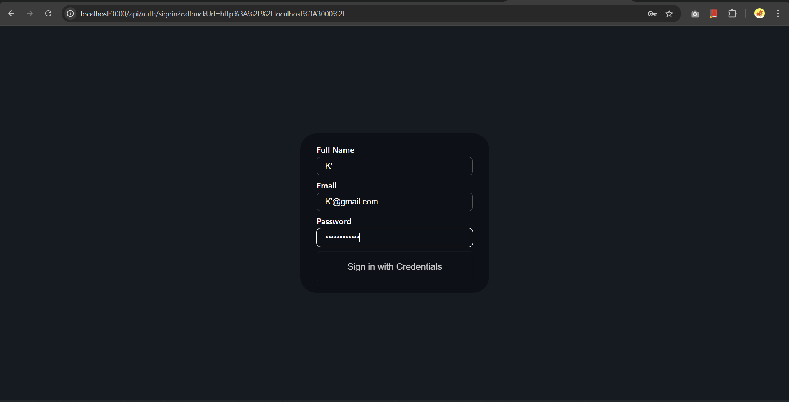

*Login*

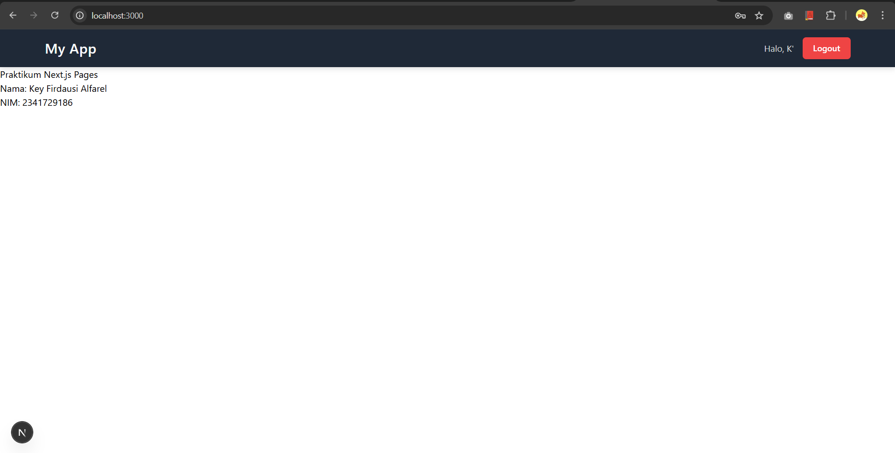

*Home Page*

### 7. Proteksi Halaman Profile

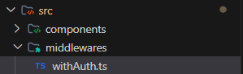

*Buat file middleware/withAuth.ts*

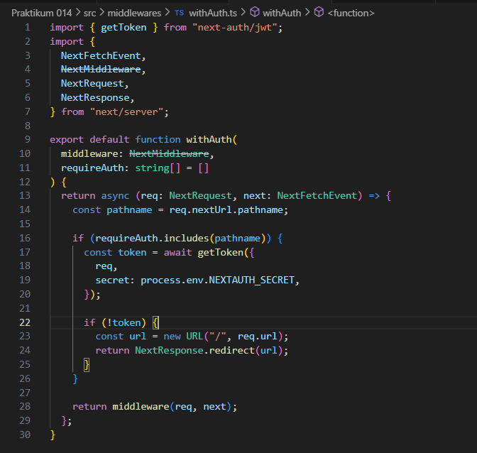

*Modifikasi file middleware/withAuth.ts*

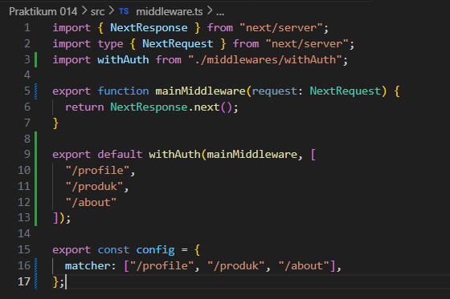

*Modifikasi file middleware.ts*

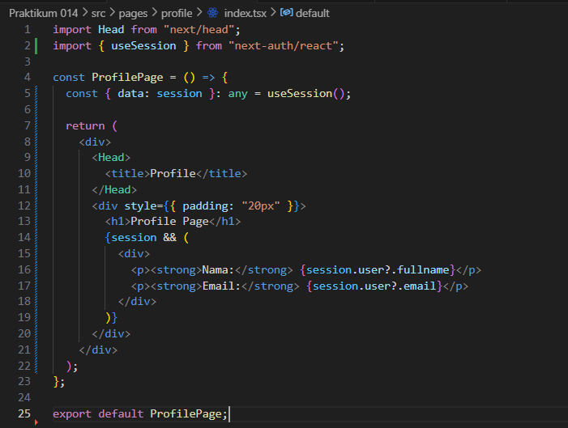

*Modifikasi file pages/profile/index.tsx*

*Login dan akses /profile page*

## Pengujian

### Uji 1

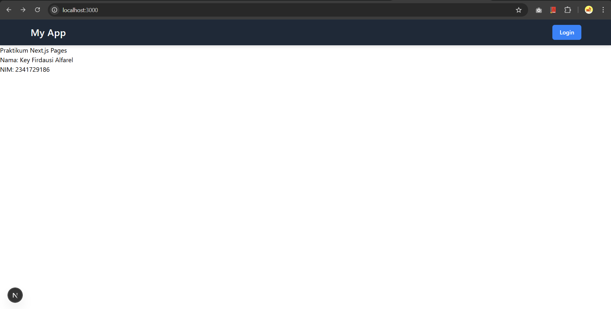

*Sebelum Login*

### Uji 2

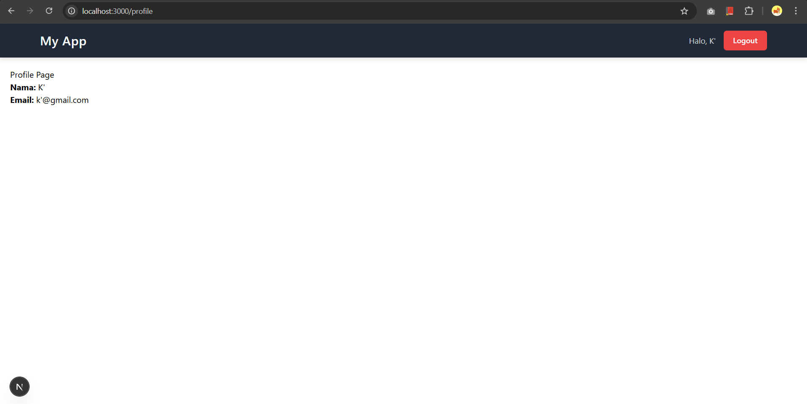

*Setelah Login*

### Uji 3

*Setelah Logout*

