# Laporan Praktikum 14 - Pemrograman Berbasis Framework

**Nama:** Key Firdausi Alfarel  
**NIM:** 2341729186  

---

## Daftar Isi

- [Langkah-Langkah Praktikum](#langkah-langkah-praktikum)
- [Pengujian](#pengujian)
- [Pertanyaan Analisis](#pertanyaan-analisis)

---

## Langkah-Langkah Praktikum

### 1. Membuat Register View

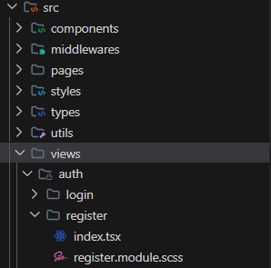

*Buka views/auth/register*

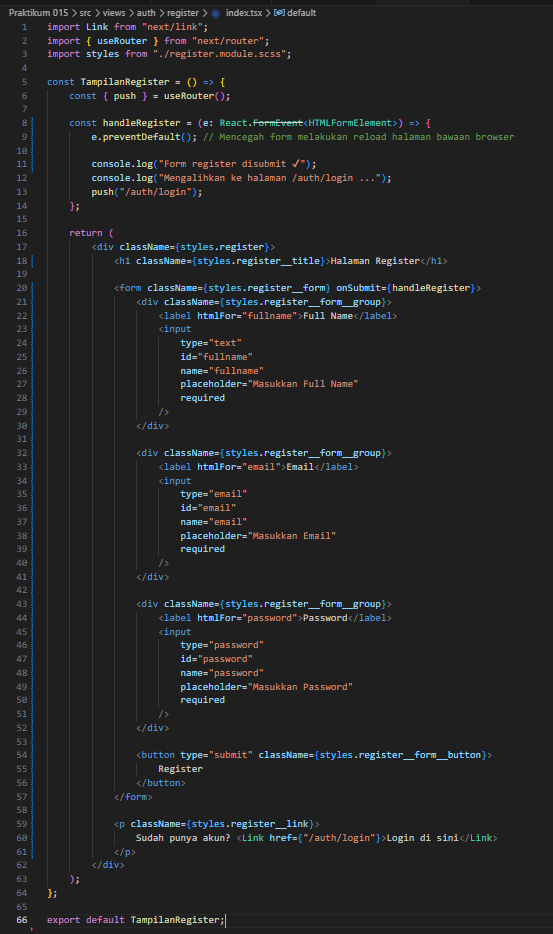

*Modifikasi views/auth/register/index.tsx*

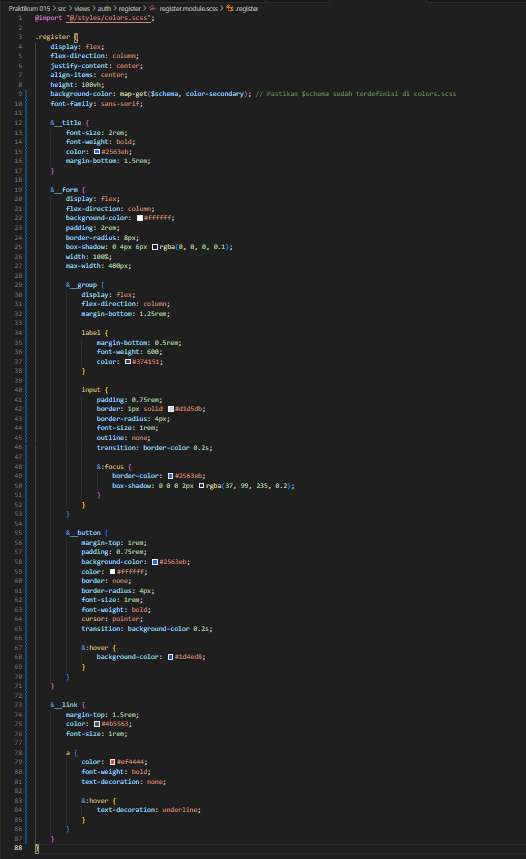

*Modifikasi views/auth/register/register.module.scss*

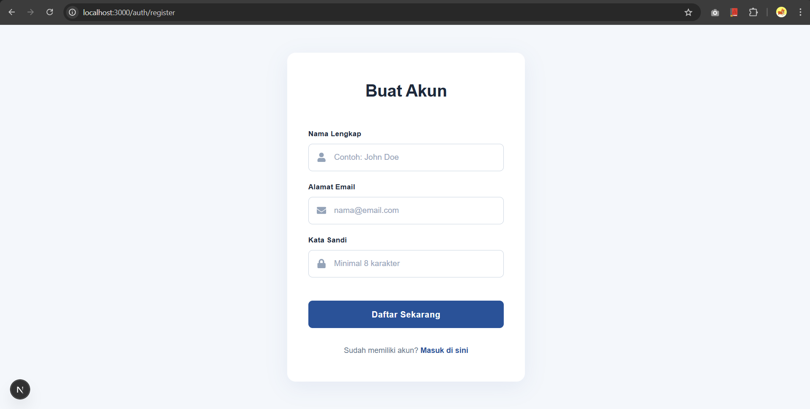

*Tampilan Halaman Register*

### 2. Membuat API Register

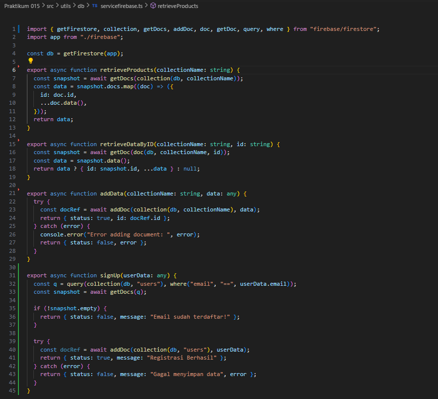

*menambah dan memodifikasi pages/api/register.ts*

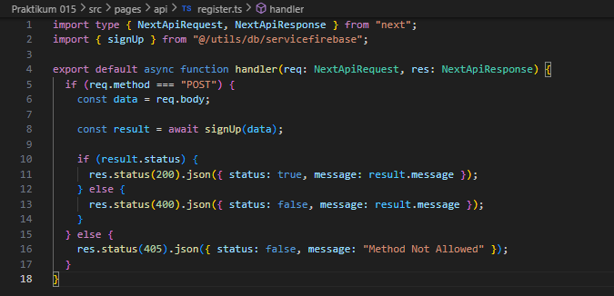

*Modifikasi utils/db/servicefirebase.ts*

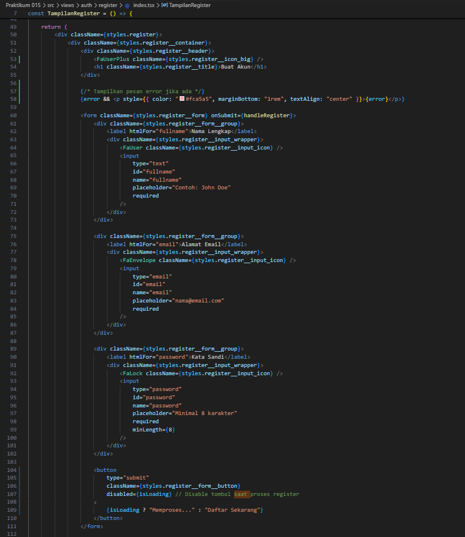

*Modifikasi views/auth/register/index.tsx*

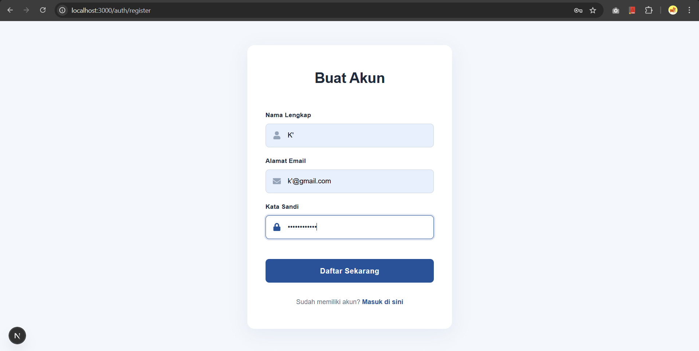

*Mengisi form register*

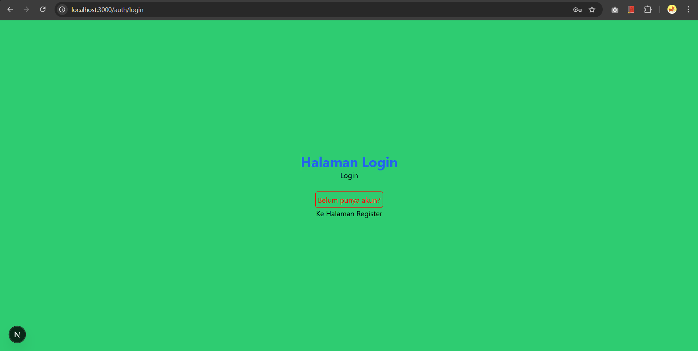

*Register berhasil dan mengarah ke halaman login*

### 3. Install bcrypt

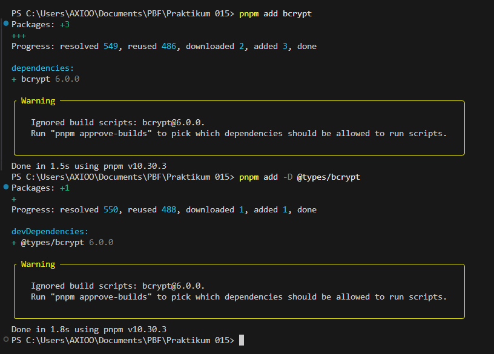

*install bcrypt*

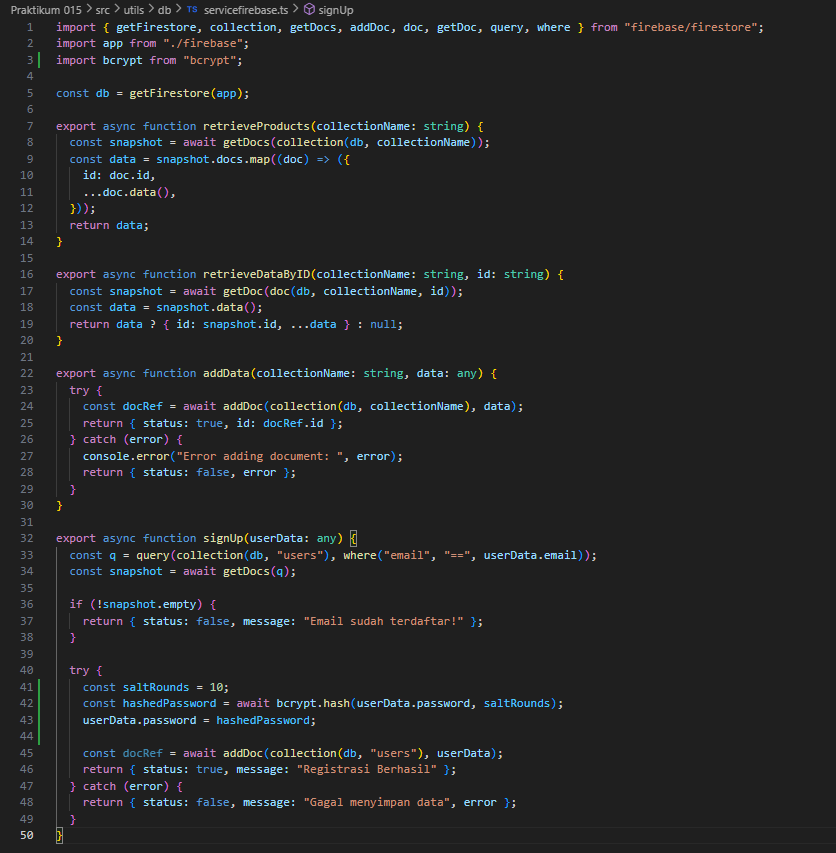

*Modifikasi utils/db/servicefirebase.ts*

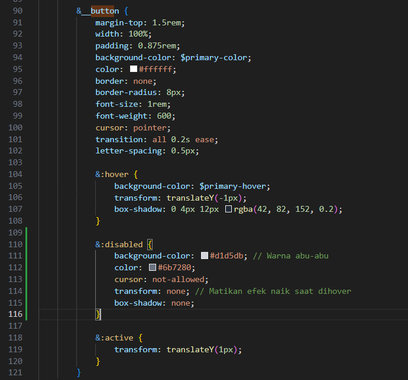
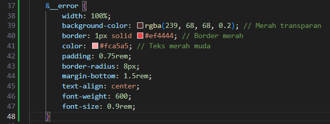

*Modifikasi views/auth/register/register.module.scss*

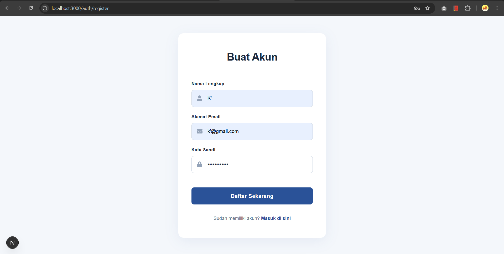

*Test register dengan akun belum terdaftar*

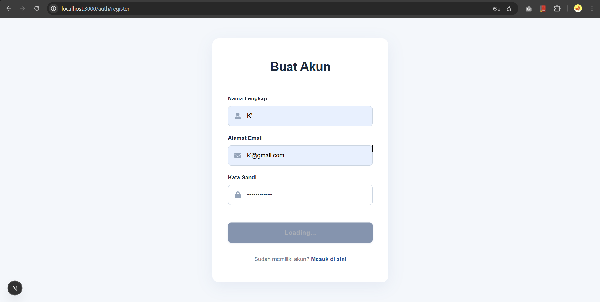

*Proses registrasi ditandai dengan loading*

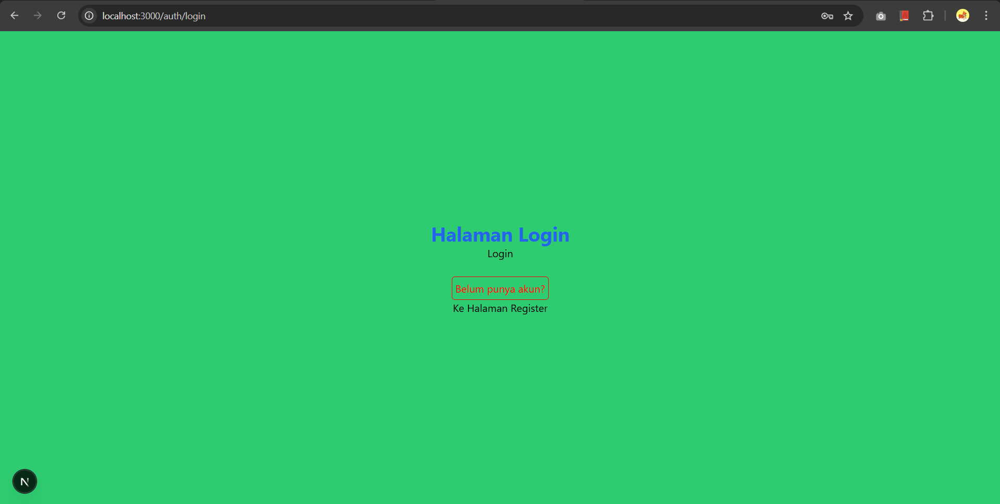

*Register berhasil dan mengarah ke login page*

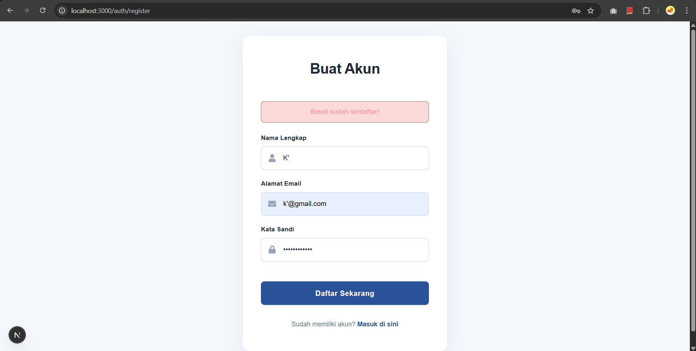

*Register gagal karena akun sudah terdaftar*

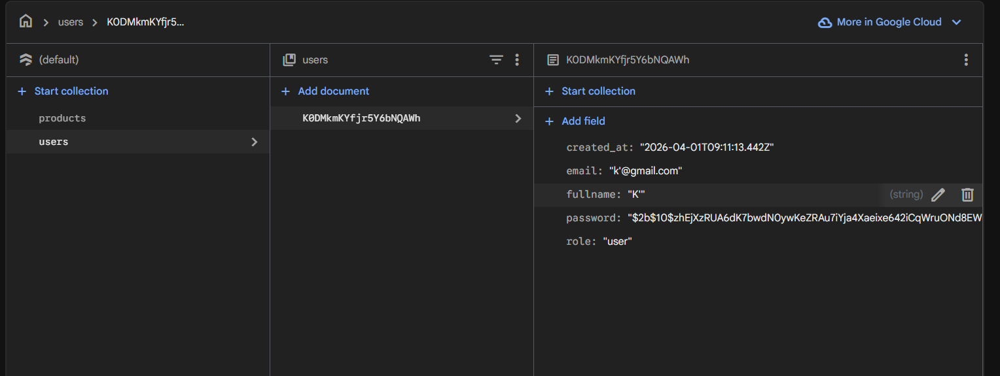

*Data yang tersimpan di firestore*

## Pengujian

### Uji 1 - Register Baru

*Test register dengan akun belum terdaftar*

*Proses registrasi ditandai dengan loading*

*Register berhasil dan mengarah ke login page*

*Data yang tersimpan di firestore*

### Uji 2 - Email Sudah Ada

*Register gagal karena akun sudah terdaftar*

### Uji 3 - Method GET

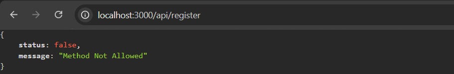

*Method GET not allowed*