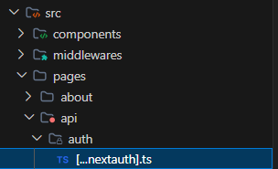
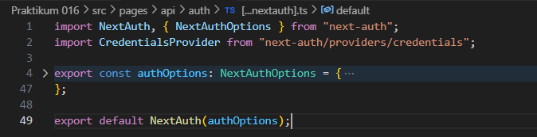

# Laporan Praktikum 15 - Pemrograman Berbasis Framework

**Nama:** Key Firdausi Alfarel  
**NIM:** 2341729186  

---

## Daftar Isi

- [Langkah-Langkah Praktikum](#langkah-langkah-praktikum)
  - [1. Membuat Register View](#1-membuat-register-view)
  - [2. Membuat API Register](#2-membuat-api-register)
  - [3. Install bcrypt](#3-install-bcrypt)
- [Pengujian](#pengujian)
  - [Uji 1 - Register Baru](#uji-1---register-baru)
  - [Uji 2 - Email Sudah Ada](#uji-2---email-sudah-ada)
  - [Uji 3 - Method GET](#uji-3---method-get)
- [Pertanyaan Analisis](#pertanyaan-analisis)
  - [1. Mengapa password harus di-hash?](#1-mengapa-password-harus-di-hash)
  - [2. Apa perbedaan addDoc dan setDoc?](#2-apa-perbedaan-adddoc-dan-setdoc)
  - [3. Mengapa perlu validasi method POST?](#3-mengapa-perlu-validasi-method-post)
  - [4. Apa risiko jika email tidak dicek unik?](#4-apa-risiko-jika-email-tidak-dicek-unik)
  - [5. Apa fungsi role pada user?](#5-apa-fungsi-role-pada-user)

---

## Langkah-Langkah Praktikum

### 1. Membuat Register View

*Buka views/auth/register*

*Modifikasi views/auth/register/index.tsx*

*Modifikasi views/auth/register/register.module.scss*

*Tampilan Halaman Register*

### 2. Membuat API Register

*menambah dan memodifikasi pages/api/register.ts*

*Modifikasi utils/db/servicefirebase.ts*

*Modifikasi views/auth/register/index.tsx*

*Mengisi form register*

*Register berhasil dan mengarah ke halaman login*

### 3. Install bcrypt

*install bcrypt*

*Modifikasi utils/db/servicefirebase.ts*

*Modifikasi views/auth/register/register.module.scss*

*Test register dengan akun belum terdaftar*

*Proses registrasi ditandai dengan loading*

*Register berhasil dan mengarah ke login page*

*Register gagal karena akun sudah terdaftar*

*Data yang tersimpan di firestore*

## Pengujian

### Uji 1 - Register Baru

*Test register dengan akun belum terdaftar*

*Proses registrasi ditandai dengan loading*

*Register berhasil dan mengarah ke login page*

*Data yang tersimpan di firestore*

### Uji 2 - Email Sudah Ada

*Register gagal karena akun sudah terdaftar*

### Uji 3 - Method GET

*Method GET not allowed*

## Pertanyaan Analisis

### 1. Mengapa password harus di-hash?
Password perlu di-hash untuk keamanan data. Jika database bocor, password asli pengguna tidak akan terbaca karena sudah diubah menjadi teks acak. Hal ini akan mencegah orang tidak bertanggung jawab untuk login dan menyalahgunakan akun tersebut.

### 2. Apa perbedaan addDoc dan setDoc?
- `addDoc`: Digunakan untuk menambahkan dokumen baru ke dalam koleksi, di mana Firestore akan membuatkan ID secara otomatis.
- `setDoc`: Digunakan untuk membuat dokumen baru atau menimpa (overwrite) dokumen yang sudah ada menggunakan ID yang kita tentukan sendiri secara manual.

### 3. Mengapa perlu validasi method POST?
Validasi method POST diperlukan karena proses registrasi mengirimkan data penting seperti password dan menambahkan data ke database. Method POST memastikan data dikirim lebih aman (salah satunya tidak terlihat di URL), berbeda dengan method GET yang peruntukannya hanya untuk mengambil data.

### 4. Apa risiko jika email tidak dicek unik?
Jika tidak dicek, satu email bisa dipakai untuk mendaftar banyak akun yang berbeda. Hal ini akan membuat data di database menjadi ganda (redundan), yang nantinya akan menyulitkan pengguna saat login atau reset password karena sistem bingung akun mana yang harus digunakan.

### 5. Apa fungsi role pada user?
Role (seperti 'admin' atau 'member') berfungsi untuk mengatur hak akses pengguna di dalam aplikasi. Dengan adanya role, kita bisa menentukan halaman atau fitur apa saja yang bisa diakses user, misalnya halaman dashboard admin hanya bisa diakses oleh admin dan tidak bisa diakses oleh member biasa.
