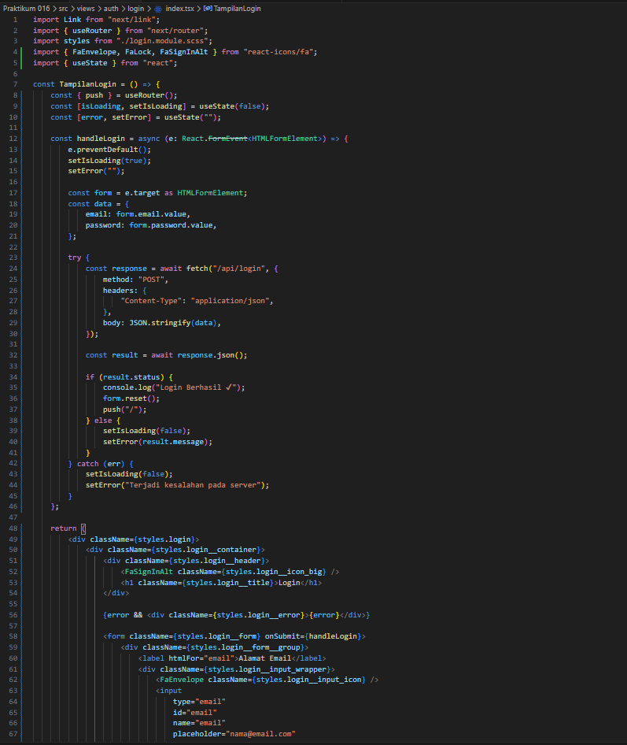
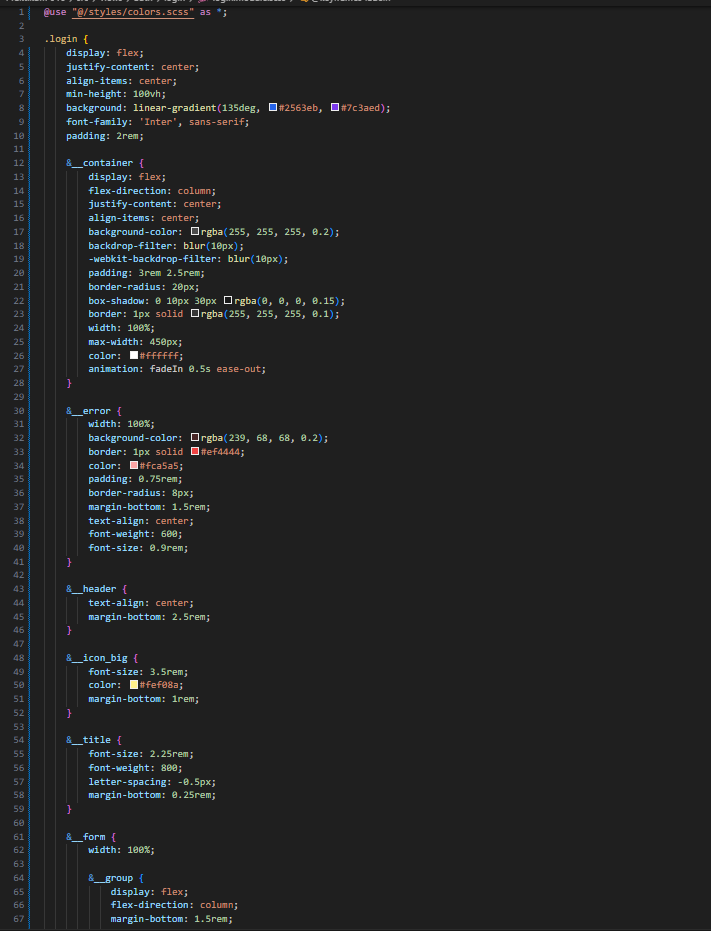
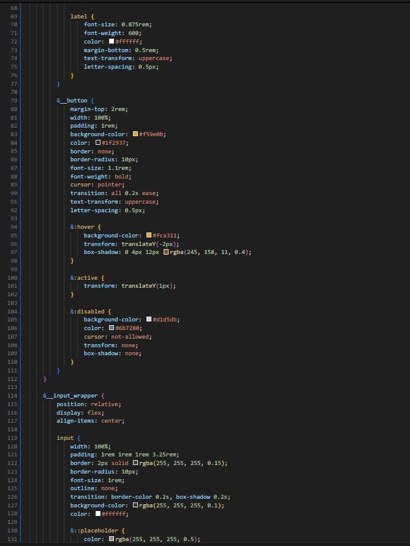
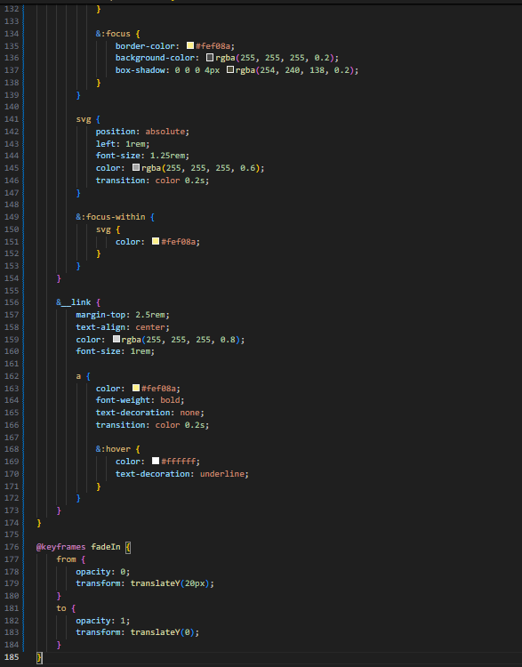
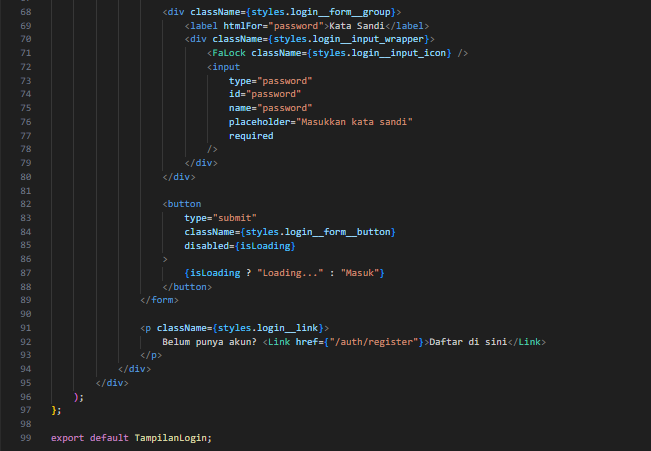
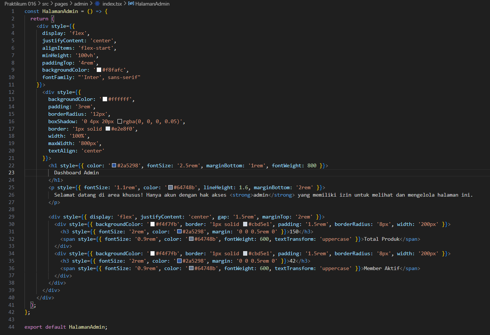
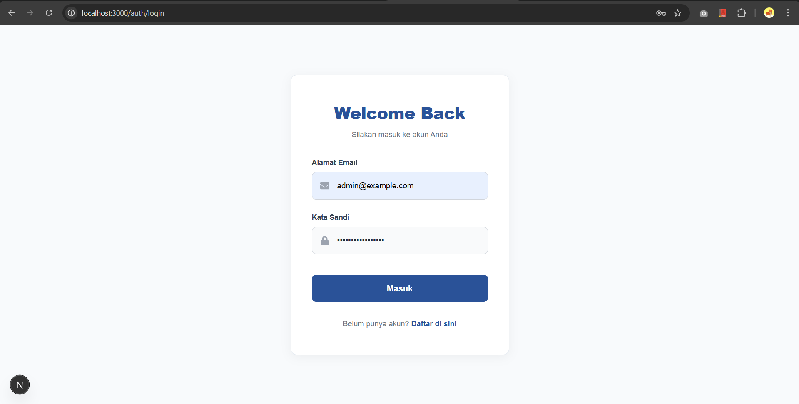
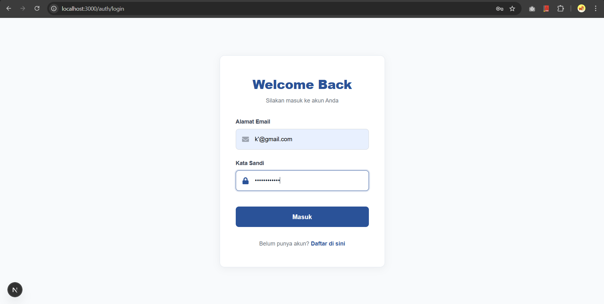
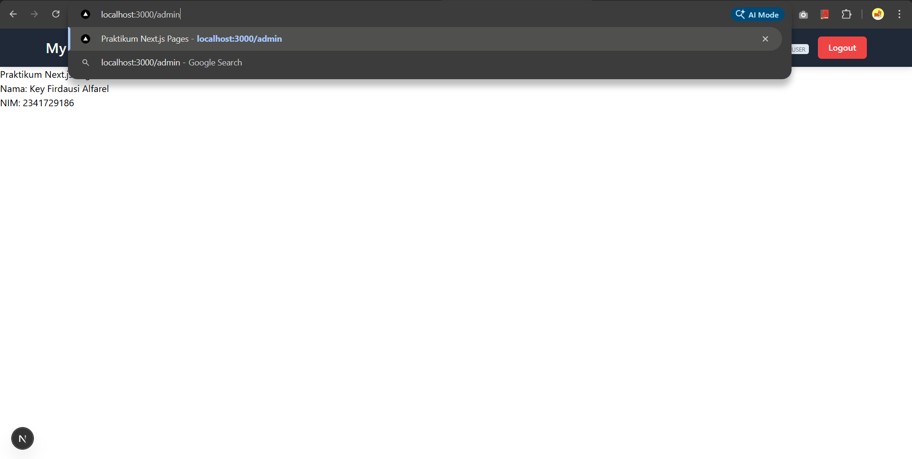

# Laporan Praktikum 16 - Pemrograman Berbasis Framework

**Nama:** Key Firdausi Alfarel  
**NIM:** 2341729186  

---

## Daftar Isi

- [Langkah-Langkah Praktikum](#langkah-langkah-praktikum)
- [Pengujian](#pengujian)
- [Pertanyaan Analisis](#pertanyaan-analisis)

---

## Langkah-Langkah Praktikum

### 1. Custom Login Page

![Buka pages/api/auth/[..nextauth].ts](public/docs/langkah-1a.png)

*Buka pages/api/auth/[..nextauth].ts*

![Modifikasi pages/api/auth/[..nextauth].ts](public/docs/langkah-1b.png)

*Modifikasi pages/api/auth/[..nextauth].ts*

### 2. Handle Login di Frontend

*Modifikasi view/auth/login/login.tsx*

*Modifikasi view/auth/login/login.module.scss*

*Tampilan halaman login*

*Modifikasi file utils/db/servicefirebase.ts*

### 3. Authorize di NextAuth (Database Login)

*Modifikasi file utils/db/servicefirebase.ts*

### 4. Tambahkan Role ke Token

![Modifikasi pages/api/auth/[..nextauth].ts](public/docs/langkah-4a.png)

*Modifikasi pages/api/auth/[..nextauth].ts*

*Modifikasi view/auth/login/login.tsx*

*Isi form login*

*Loading login*

*Login berhasil dan masuk ke halaman utama*

### 5. Callback URL Logic

*Modifikasi middleware/withAuth.ts*

### 6. Callback URL Logic

*Buat file pages/admin/index.tsx*

*Modifikasi pages/admin/index.tsx*

*Modifikasi middleware/withAuth.ts*

*Tambah admin di firestore users*

*Login dengan kredensial admin*

*Berhasil masuk ke dashboard admin*

## Pengujian

### Uji 1 – Login Valid

*Login dengan kredensial user*

*Login berhasil sebagai user*

### Uji 2 – Password Salah

*Password salah*

### Uji 3 – Akses Admin sebagai User

*Login dengan kredensial user*

*Login berhasil sebagai user*

*Akses halaman /admin*

*Diredirect ke halaman home*

### Uji 4 – Akses Admin sebagai Admin

*Data admin di firestore*

*Login dengan kredensial admin*

*Berhasil masuk ke dashboard admin*