# Laporan Praktikum 17 - Pemrograman Berbasis Framework

**Nama:** Key Firdausi Alfarel  
**NIM:** 2341729186  

---

## Daftar Isi

- [Langkah-Langkah Praktikum](#langkah-langkah-praktikum)
- [Pengujian](#pengujian)
- [Pertanyaan Analisis](#pertanyaan-analisis)

---

## Langkah-Langkah Praktikum

### 1. Masuk ke Google Cloud Console Buka:

*Buka https://console.cloud.google.com/apis/credentials*

### 2. Buat Project Baru

*Menambah project MyAppNext*

*Projek berhasil dibuat*

*Buka project MyAppNext*

### 3. Konfigurasi OAuth Consent Screen

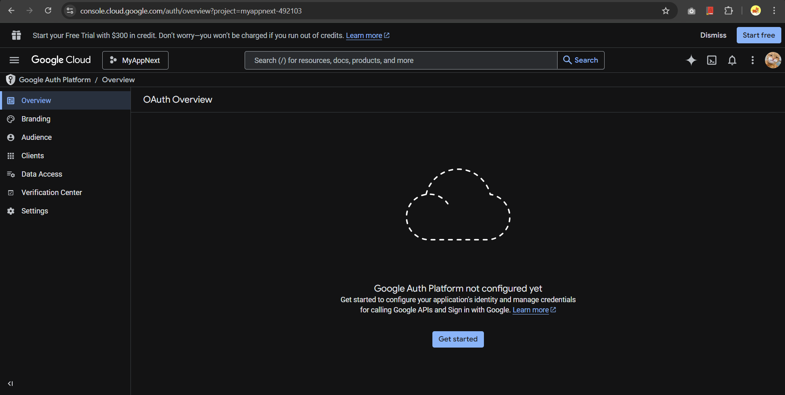

*Buka OAuth consent screen*

*Isi App Information*

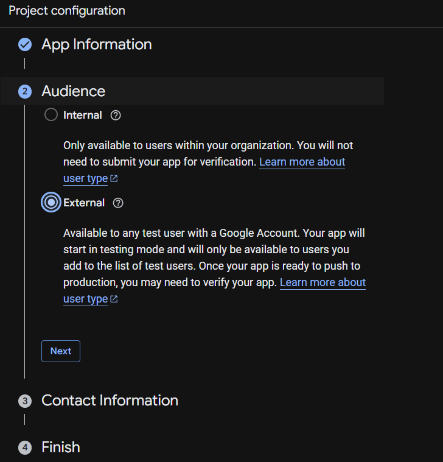

*Isi Audience*

*Isi Contact Information*

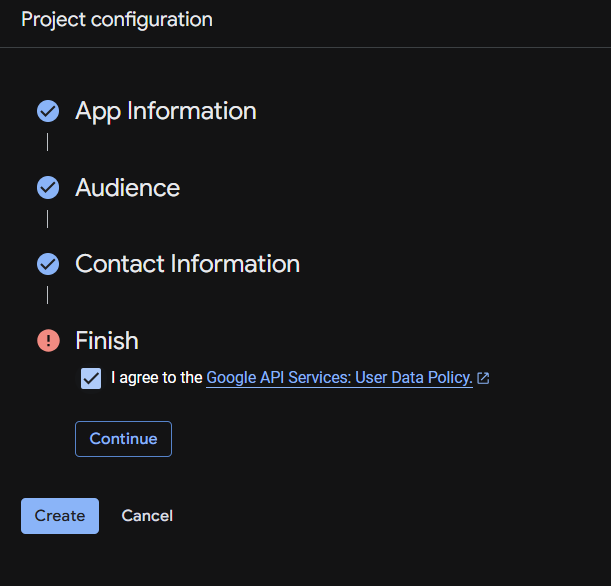

*Finish*

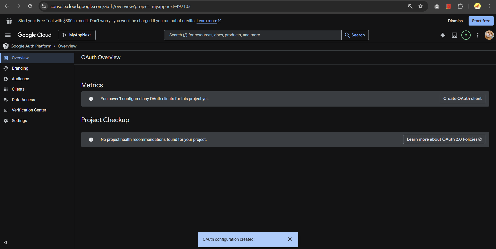

*Tampilan OAuth Consent Screen*

### 4. Buat OAuth Credentials

*Bukan Credentials*

*Isi OAuth Client ID*

*Detail OAuth Client ID*

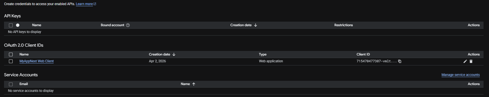

*Tampilan Client ID dan Client Secret*

### 5. Tambahkan Environment Variables

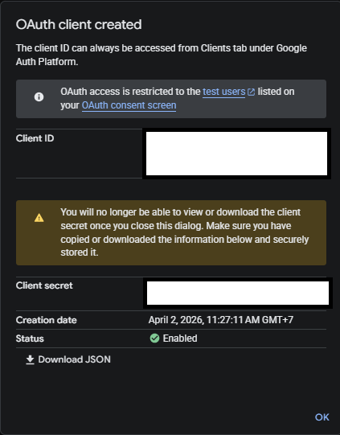

*Detail OAuth Client ID*

*Menambah Environment Variables*

### 6. Konfigurasi Google Provider di NextAuth dan Handle Callback JWT & Session

![Modifikasi file src/pages/api/auth/[...nextauth].ts](public/docs/langkah-6a.png)

*Modifikasi file src/pages/api/auth/[...nextauth].ts*

### 7. Tambahkan Button Login Google

![Modifikasi file src/pages/api/auth/[...nextauth].ts](public/docs/langkah-7a.png)

*Modifikasi file src/pages/api/auth/[...nextauth].ts*

*Modifikasi file src/views/login/index.tsx*

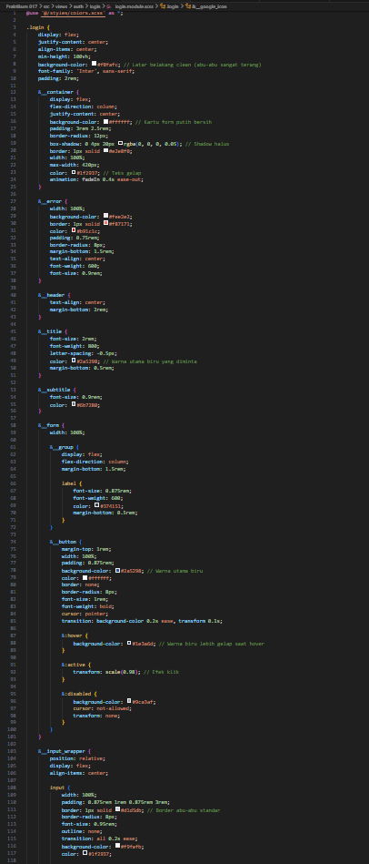
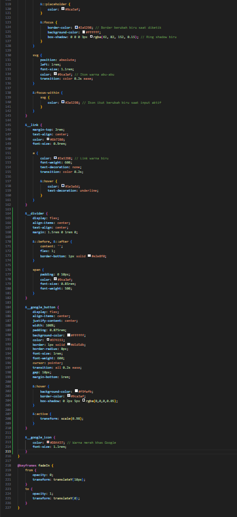

*Modifikasi file src/views/login/login.module.css*

*Modifikasi file src/components/layout/navbar/index.tsx*

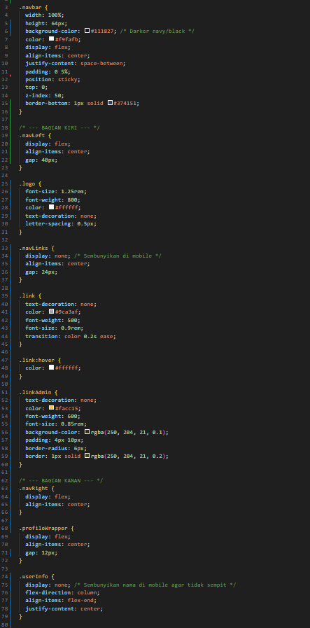
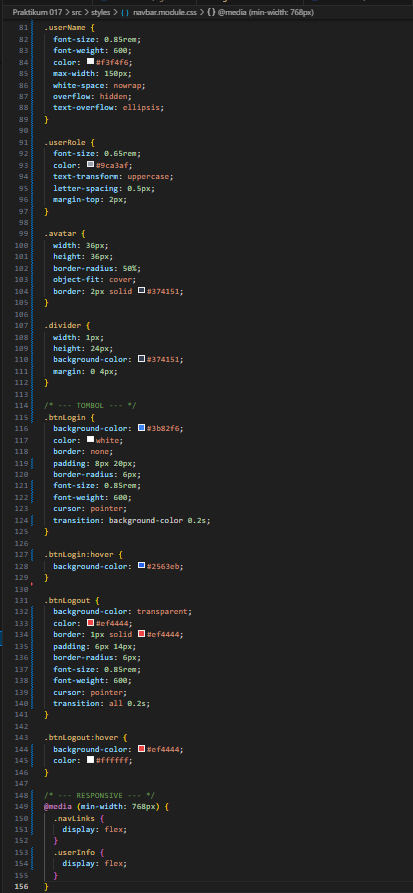

*Modifikasi file src/styles/navbar.module.css*

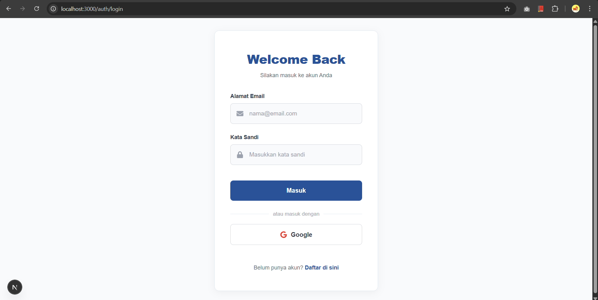

*Halaman Login*

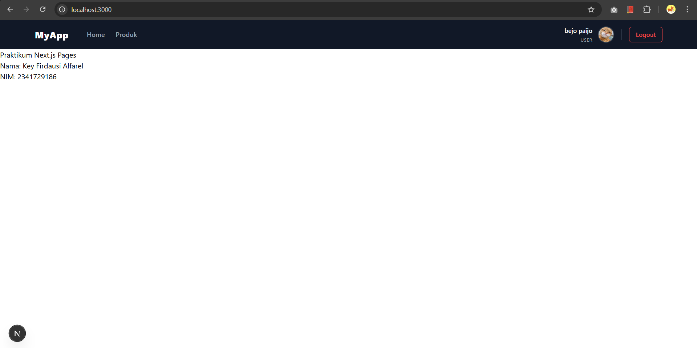

*Login berhasil dengan akun google*

### 8. Simpan Data Google ke Database

![Modifikasi file src/pages/api/auth/[...nextauth].ts](public/docs/langkah-8a.png)

*Modifikasi file src/pages/api/auth/[...nextauth].ts*

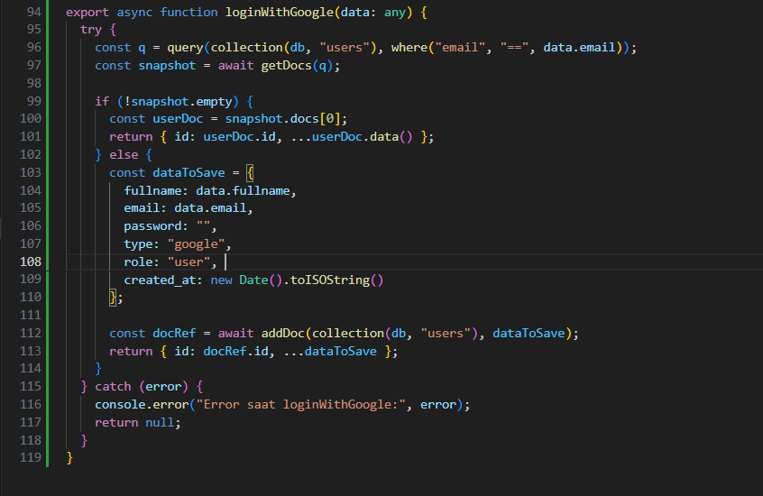

*Modifikasi file src/utils/db/servicefirebase.ts*

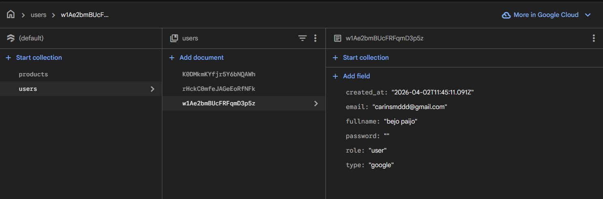

*User berhasil tersimpan di firebase*