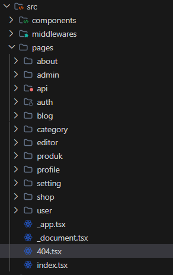
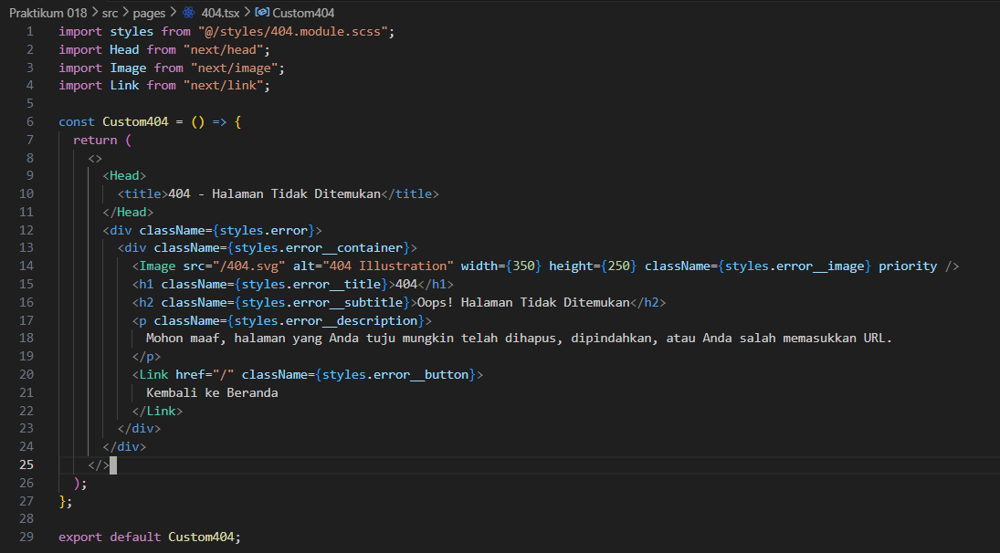
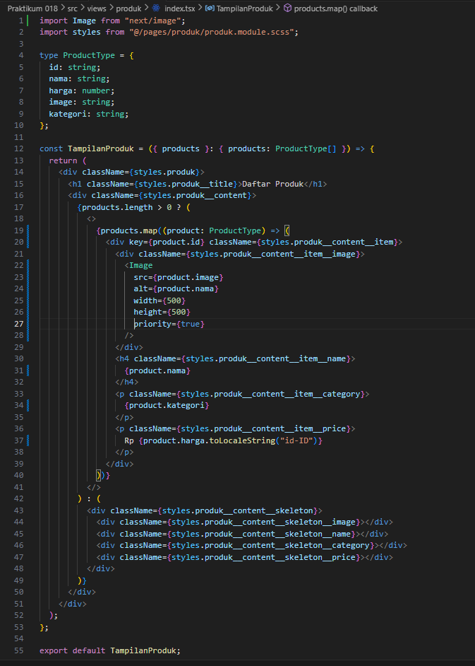
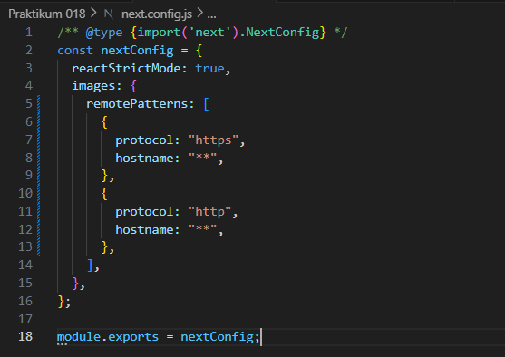

# Laporan Praktikum 18 - Pemrograman Berbasis Framework

**Nama:** Key Firdausi Alfarel  
**NIM:** 2341729186  

---

## Daftar Isi

- [Langkah-Langkah Praktikum](#langkah-langkah-praktikum)
- [Pertanyaan Analisis](#pertanyaan-analisis)
---

## Langkah-Langkah Praktikum

### 1. Optimasi Gambar Lokal (Public Folder)

*Buka file src/pages/404.tsx*

*Modifikasi kode pada file src/pages/404.tsx*

### 2. Optimasi Gambar Remote (External URL)

*Buka file src/pages/404.tsx*

*Modifikasi kode pada file src/pages/404.tsx*

