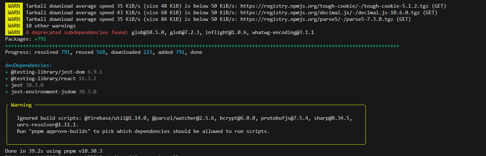
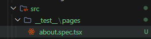
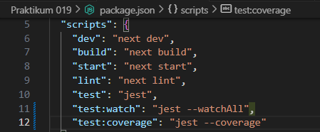
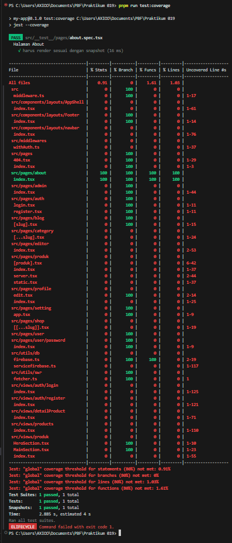
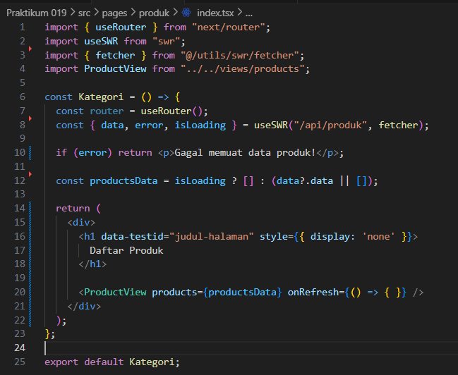

# Laporan Praktikum 18 - Pemrograman Berbasis Framework

**Nama:** Key Firdausi Alfarel  
**NIM:** 2341729186  

---

## Daftar Isi

- [Langkah-Langkah Praktikum](#langkah-langkah-praktikum)
  - [1. Optimasi Gambar Lokal (Public Folder)](#1-optimasi-gambar-lokal-public-folder)
  - [2. Optimasi Gambar Remote (External URL)](#2-optimasi-gambar-remote-external-url)
  - [3. Menggunakan next/font](#3-menggunakan-nextfont)
  - [4. Menggunakan next/script](#4-menggunakan-nextscript)
  - [5. Optimasi Avatar dengan next/image](#5-optimasi-avatar-dengan-nextimage)
- [Tugas Praktikum](#tugas-praktikum)
  - [1. Optimasi semua image di project menggunakan next/image](#1-optimasi-semua-image-di-project-menggunakan-nextimage)
  - [2. Gunakan minimal 1 font dari next/font](#2-gunakan-minimal-1-font-dari-nextfont)
  - [3. Tambahkan script Google Analytics menggunakan next/script](#3-tambahkan-script-google-analytics-menggunakan-nextscript)
  - [4. Terapkan dynamic import pada minimal 1 komponen](#4-terapkan-dynamic-import-pada-minimal-1-komponen)
  - [5. Dokumentasikan perubahan performa (screenshot Lighthouse)](#5-dokumentasikan-perubahan-performa-screenshot-lighthouse)
- [Pertanyaan Analisis](#pertanyaan-analisis)
  - [1. Mengapa `` biasa tidak optimal?](#1-mengapa-img-biasa-tidak-optimal)
  - [2. Apa perbedaan font CDN dan next/font?](#2-apa-perbedaan-font-cdn-dan-nextfont)
  - [3. Mengapa script bisa membuat website lambat?](#3-mengapa-script-bisa-membuat-website-lambat)
  - [4. Kapan harus menggunakan dynamic import?](#4-kapan-harus-menggunakan-dynamic-import)
  - [5. Apa dampak bundle size terhadap UX?](#5-apa-dampak-bundle-size-terhadap-ux)
---

## Langkah-Langkah Praktikum

### 1. Optimasi Gambar Lokal (Public Folder)

*Buka file src/pages/404.tsx*

*Modifikasi kode pada file src/pages/404.tsx*

### 2. Optimasi Gambar Remote (External URL)

*Buka file src/pages/404.tsx*

*Modifikasi kode pada file src/pages/404.tsx*

### 3. Menggunakan next/font

*Buka file src/components/layouts/AppShell/index.tsx*

*Hasil inspect font*

### 4. Menggunakan next/script

*Modifikasi file src/components/layouts/navbar/index.tsx*

### 5. Optimasi Avatar dengan next/image

*Modifikasi file src/components/layouts/navbar/index.tsx*

*Modifikasi file next.config.js*

## Tugas Praktikum

### 1. Optimasi semua image di project menggunakan next/image

*Optimasi semua image di project*

### 2. Gunakan minimal 1 font dari next/font

*Menggunakan font roboto di app shell*

### 3. Tambahkan script Google Analytics menggunakan next/script

*Menambahkan script google analytics*

### 4. Terapkan dynamic import pada minimal 1 komponen

*Terapkan dynamic import pada navbar*

### 5. Dokumentasikan perubahan performa (screenshot Lighthouse)

*Dokumentasi lighthouse http://localhost:3000/produk*

## Pertanyaan Analisis

### 1. Mengapa `` biasa tidak optimal?
   Tag `` HTML biasa tidak memiliki fitur optimasi bawaan seperti *lazy loading* (memuat gambar hanya saat akan masuk layar), pengaturan performa gambar otomatis sesuai resolusi perangkat (*responsive sizes*), pencegahan layout yang bergeser (*Cumulative Layout Shift*), maupun kompresi ke format gambar modern (seperti WebP secara otomatis). Akibatnya, *browser* harus selalu memuat gambar dalam ukuran aslinya yang bisa saja sangat membebani jaringan (*network bandwidth*) dan berdampak memperlambat *loading* halaman.

### 2. Apa perbedaan font CDN dan next/font?
   Font CDN (seperti Google Fonts melalui tag `<link>`) memuat *font* dengan cara mengirim *request* HTTP tambahan ke server eksternal setiap kali sebuah halaman mulai dimuat, yang berisiko tertunda (menyebabkan *Flash of Unstyled Text* atau layar patah-patah). Di sisi lain, `next/font` secara otomatis mengunduh *font* ke direktori lokal pada tahap *build time*, serta menghostingnya lokal bersama sekumpulan berkas aset tĩnh (*static assets*) lainnya. Hal ini mencegah *network request* tambahan ke *luar*, sehingga font termuat nyaris instan dan mempertahankan *layout* dengan stabil tanpa pergeseran sekecil apa pun.

### 3. Mengapa script bisa membuat website lambat?
   Jika suatu kode JavaScript eksternal dideklarasikan secara klasik di baris awal pembacaan (seperti dalam `<head>`), *browser* akan menangguhkan (*blocking*) proses membaca dan memvisualisasikan HTML sampai ia selesai mengambil dan mem-*parsing* file *script* tersebut (*render-blocking*). Terlebih jika ukurannya besar, eksekusi ini akan memonopoli *main thread* (jalur komputasi utama CPU), menyebabkan pengguna melihat layar putih untuk waktu yang lama dengan situs yang "membeku" tak merespons atau terasa *nge-lag*.

### 4. Kapan harus menggunakan dynamic import?
   Sangat disarankan memakai *import* yang dinamis (*dynamic import*) hanya untuk memuat komponen, *library*, atau fitur bongsor yang tidak mendesak tampil di layar mula-mula (*initial view*). Sebagai contoh pragmatis, kotak dialog (*modal/popup*), fitur kolom *chatting*, sistem komputasi laporan ke PDF, menu pelacakan peta berat, maupun komponen di *footer* jauh. Karena mereka baru difungsikan atau dilihat saat pengguna men- *scroll* ke bawah atau menekan tombol tertentu, maka mengimpornya sejak awal membebani *load* tak bermakna. Memuatnya dinamis akan *me-lazy-load* *bundling* sehingga meringankan bobot kode permulaan.

### 5. Apa dampak bundle size terhadap UX?
   Beban ukuran gabungan aset skrip (*bundle size*) yang membengkak menuntut peramban (*browser*) pengguna untuk mentransfer *byte* porsi lebih besar. Khususnya pada perangkat ponsel dengan jaringan terhambat sinyal, hal ini secara langsung mengerem waktu *loading* atau TTI (*Time to Interactive*)-nya. Setelah usai diunduh, masa perakitan di memori juga semakin berat. Bagi pengakses, kelambanan ini mencerminkan *User Experience* (UX) yang melelahkan karena situs tampak tersendat (*stuttering*), berputar tanpa aksi, atau terasa lamban, yang ujungnya membuat sebal hingga memancing lonjakan peninggalan situs (*bounce rate*).
