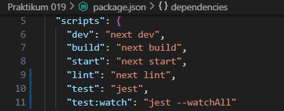
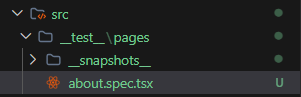
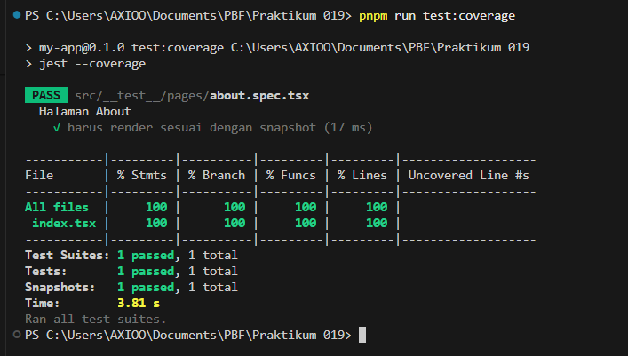

# Laporan Praktikum 19 - Pemrograman Berbasis Framework

**Nama:** Key Firdausi Alfarel  
**NIM:** 2341729186  

---

## Daftar Isi

- [Langkah-Langkah Praktikum](#langkah-langkah-praktikum)
- [Tugas Praktikum](#tugas-praktikum)
- [Pertanyaan Analisis](#pertanyaan-analisis)

---

## Langkah-Langkah Praktikum

### 1. Setup Jest di Next.js

*Buka terminal dan install dependencies jest*

*Buat file jest.config.mjs*

*Konfigurasi jest.config.mjs*

*Konfigurasi package.json*

### 2. Struktur Folder Testing

*Struktur folder testing*

### 3. Testing Halaman About

*Membuat file about.spec.tsx*

*Modifikasi file about.spec.tsx*

*Hasil testing*

*Snapshot folder*

### 4. Coverage Report

*Konfigurasi package.json*

*Jalankan command test:coverage*

*Direktori hasil coverage*

*Buka index.html dari folder coverage*

### 5. Konfigurasi Coverage Lengkap

*Konfigurasi jest.config.mjs*

*Jalankan command test:coverage*

*Hasil coverage*

### 6. Testing dengan getByTestId

### 7. Testing Page dengan Router (Mocking)

### 8. Menangani Undefined Data

## Tugas Praktikum

### 1. Buat unit test untuk Halaman Product

### 2. Gunakan 1 Snapshot test, 1 toBe(), 1 getByTestId()

### 3. Buat coverage minimal 50%

### 4. Lakukan mocking untuk router

### 5. Dokumentasikan hasil coverage

