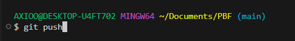
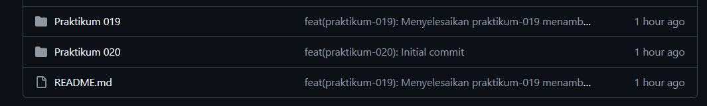

# Laporan Praktikum 20 - Pemrograman Berbasis Framework

**Nama:** Key Firdausi Alfarel  
**NIM:** 2341729186  

---

## Daftar Isi

- [Langkah-Langkah Praktikum](#langkah-langkah-praktikum)
- [Tugas Praktikum](#tugas-praktikum)
- [Pertanyaan Analisis](#pertanyaan-analisis)

---

## Langkah-Langkah Praktikum

### 1. Membuat Repository GitHub

*Cek username dan email*

*git add .*

*git commit -m "feat(praktikum-020): Initial commit"*

*git push -u origin main*

### 2. Deployment ke Vercel

### 3. Menambahkan Environment Variable di Vercel

### 4. Konfigurasi Google OAuth Production

### 5. Pengujian Setelah Deployment

