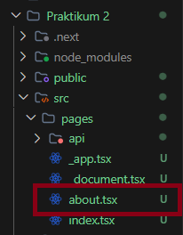
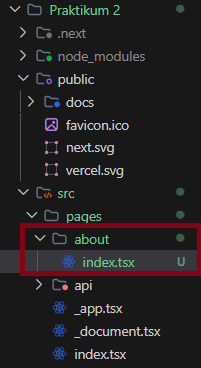
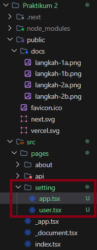
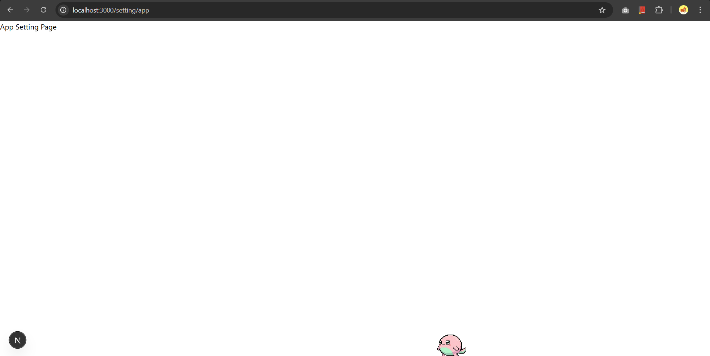
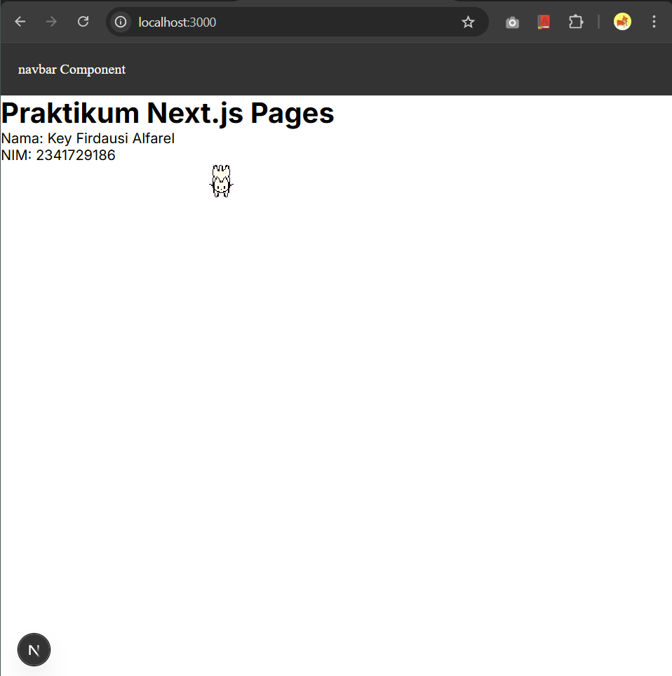
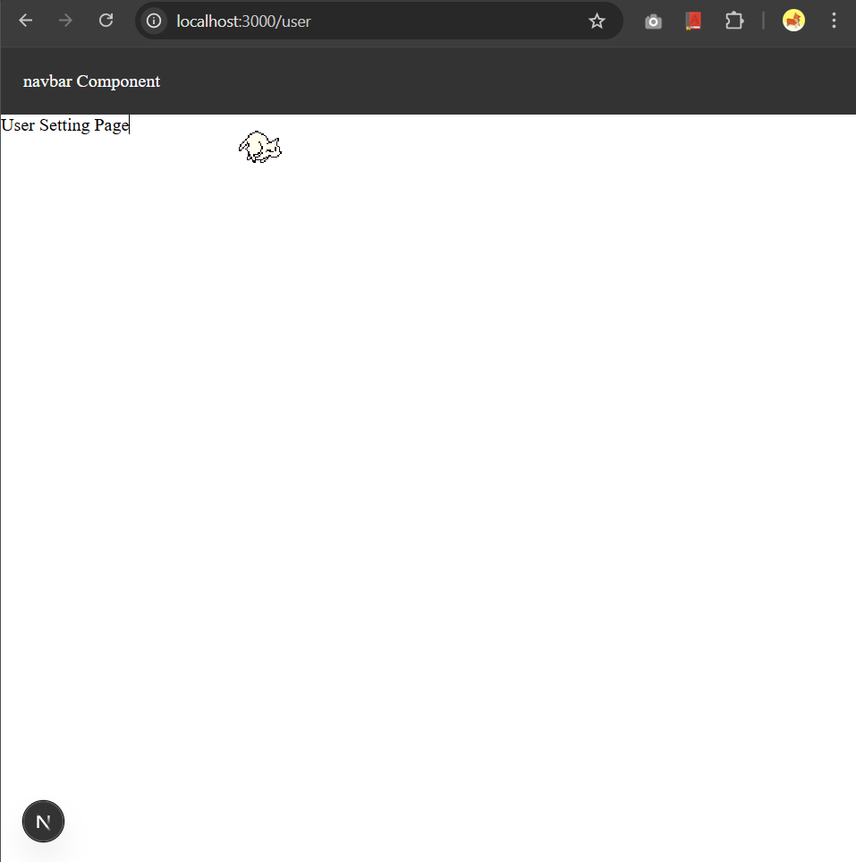

## Dokumentasi Praktikum 2

### 1. Routing Dasar

### 2. Routing Menggunakan Folder

### 3. Nested Routing

### 4. Dynamic Routing

### 5. Membuat Komponen Navbar

### 6. Membuat Layout Global (App Shell)

