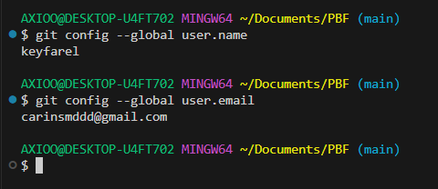
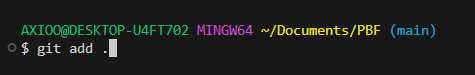
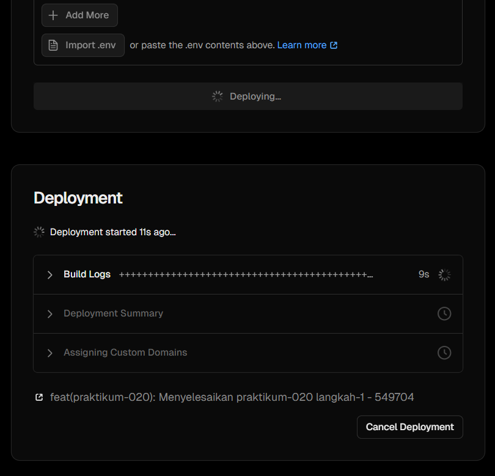
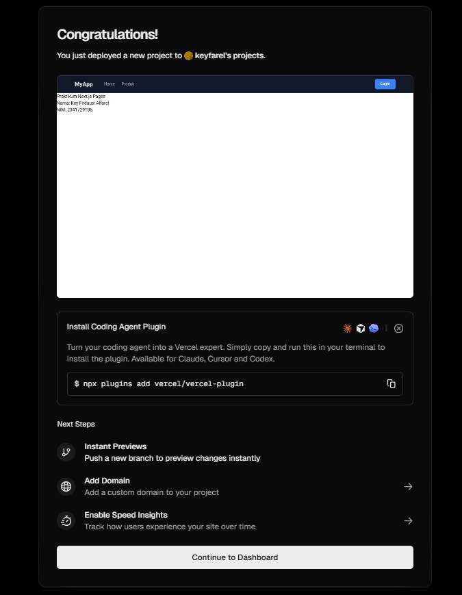
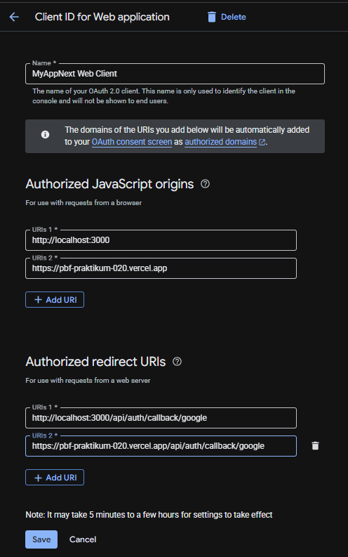
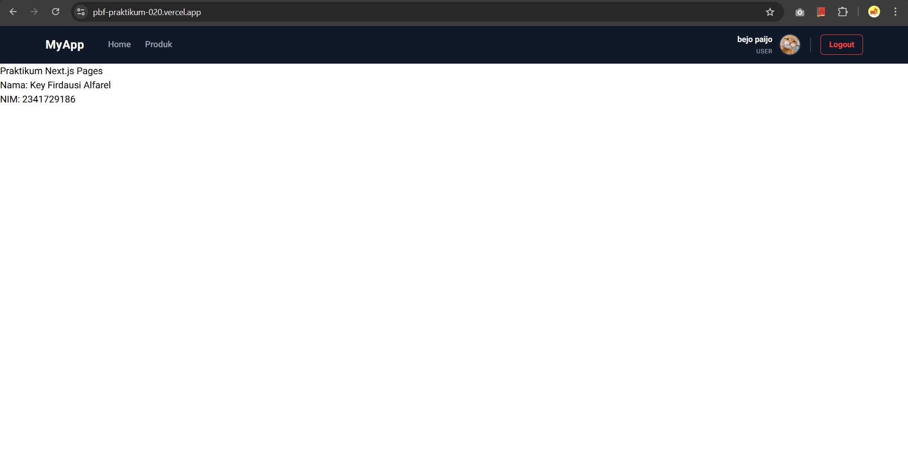
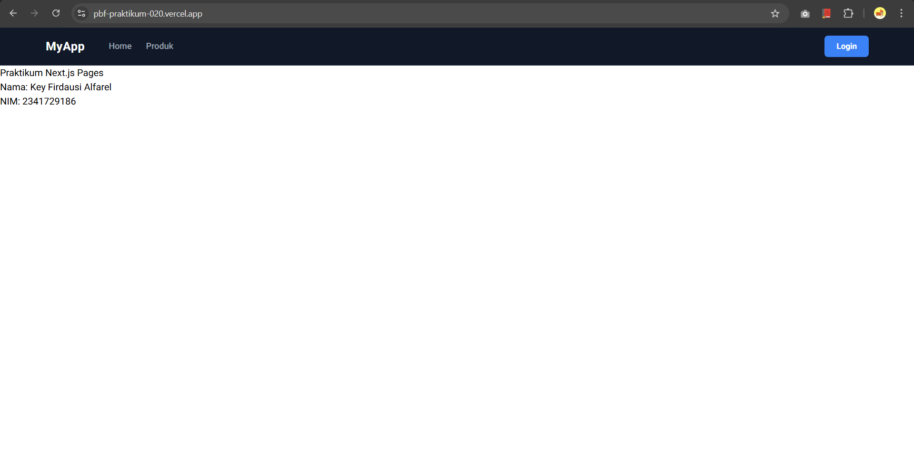
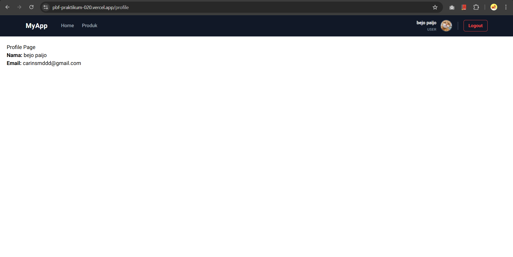
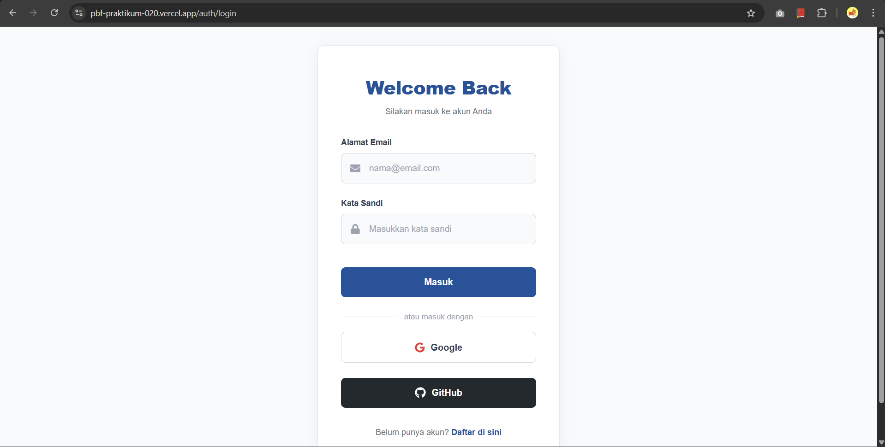
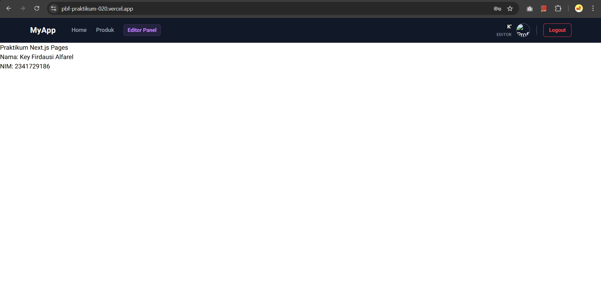

# Laporan Praktikum 20 - Pemrograman Berbasis Framework

**Nama:** Key Firdausi Alfarel  
**NIM:** 2341729186  

---

## Daftar Isi

- [Langkah-Langkah Praktikum](#langkah-langkah-praktikum)
- [Tugas Praktikum](#tugas-praktikum)
- [Pertanyaan Analisis](#pertanyaan-analisis)

---

## Langkah-Langkah Praktikum

### 1. Membuat Repository GitHub

*Cek username dan email*

*git add .*

*git commit -m "feat(praktikum-020): Initial commit"*

*git push -u origin main*

### 2. Deployment ke Vercel

*Pilih repository*

*Konfigurasi deployment*

*Comment src/pages/produk/static.tsx*

![Modifikasi src/pages/produk/[produk].tsx](public/docs/langkah-2e.png)

*Modifikasi src/pages/produk/[produk].tsx*

*Modifikasi src/pages/produk/server.tsx*

### 3. Menambahkan Environment Variable di Vercel

*Menambahkan Environment Variable*

*Redeploy*

*Deploy berhasil*

### 4. Konfigurasi Google OAuth Production

*Ubah Google OAuth untuk production*

*Modifikasi kode dan redeploy*

*Login dengan google*

*Login berhasil*

### 5. Pengujian Setelah Deployment

*Akses halaman https://pbf-praktikum-020.vercel.app/*

*Akses halaman https://pbf-praktikum-020.vercel.app/about*

*Akses halaman https://pbf-praktikum-020.vercel.app/produk*

*Akses halaman https://pbf-praktikum-020.vercel.app/profile*

*Login dengan google*

*Berhasil login dengan google*

*Login dengan kredensial*

*Berhasil login dengan kredensial*